#
# 基础篇

## 1.Ajax-Fetch-Axios三者有什么区别?

> 三者都是用于网络请求，只不过维度不同
> 
> Ajax(Asynchronous Javascript and XML),一种技术统称；
> 
> Fetch,一个具体的API
> 
> Axios(阿克硕死)，第三方库https://axios-http.com/
> 

```js
 function ajax1(method,url){
    const xhr = new XMLHttpRequest()
    xhr.open(method,url);
    xhr.onreadystatechange= () => {
        if(xhr.readystate !==4) return;
        if(xhr.status > 200 && xhr.status < 300){
            console.log("获取成功的数据=",xhr.response);
        }
    }
    xhr.send()
 }
 function ajax2(url){
    fetch(url).then((response)=>{
        console.log("获取成功的数据=",response)
    })
 }
```

## 2.防抖和节流有什么区别，分别用于什么场景-防抖

!> debounce和throttling 各有特点，在不同 的场景要根据需求合理的选择策略。<br>
如果事件触发是高频但是有停顿时，可以选择debounce； <br>
在事件连续不断高频触发时，只能选择throttling，因为debounce可能会导致动作只被执行一次，界面出现跳跃。

>防抖：限制执行次数，多次执行次数，只执行一次；
>
>代码实现重在清零 clearTimeout。防抖可以比作等电梯，只要有一个人进来，就需要再等一会儿。
>
>业务场景: 
>
>避免登录按钮多次点击的重复提交;
>
>调整浏览器窗口大小时，resize 次数太多，造成计算太多，此时需要——防抖

```js
function debounce (fn,wait=200){
 let timer
 return ()=>{
      clearTimeout(timer)
      timer= setTimeout(()=>{
            fn.apply(this, arguments)
       },wait)
     }
   }    
```
>节流：限制执行频率，有节奏的执行；
>
>代码实现重在开锁关锁 timer=timeout; timer=null。节流可以比作过红绿灯，每等一个红灯时间就可以过一批。
>
>业务场景：
>
>scoll事件，每隔一秒计算一下位置信息等；
>
>浏览器播放事件，每个一秒计算下进度信息等;
>

```js
function throttle (fn,wait=100){
 let timer
 return ()=>{
     if(timer) return 
      timer= setTimeout(()=>{
            fn.apply(this, arguments)
            timer=null
       },wait)
     }
   }    
```

## 3.什么时候不能使用箭头函数

>有什么缺点？
>
>什么时候不能用箭头函数？

### 1.箭头函数有什么缺点？
>没有arguments
>
>无法通过apply,call,bind 来改变this;(因为箭头函数的this都是父级作用域的this)
>

### 2.不适用的情况

>1.对象方法

```js
const obj = {
  name:'test',
  getName:()=>{
    return this.name
  }
}
console.log(obj.getName()) //报错
```
>2.原型方法

```js
const obj = {
  name:'test',
}
obj._proto_.getName=()=>{
  return this.name
}
console.log(obj.getName()) //报错
```

>3.构造函数
```js
const Foo=(name,city)=>{
  this.name=name
  this.city=city
}
const f=new Foo('test','北京')
```
>4.动态上下文的回调函数

```js
const btn1=document.getElementById('btn1')
btn1.addEventListener('click',()=>{
  //console.log(this==window)
  this.innerHTML='clicked'
})
```
>5.Vue生命周期和method
>
>因为vue本质其实是对象
>
>class里面可以使用箭头函数

## 4.请描述TCP三次握手和四次挥手

> 握手就是TCP连接
> 
> 三次握手就是建立TCP连接
> 
> client 发-> server 收
> 
> server 发-> client 收
> 
> client 发-> server 收
> 
> 挥手就是TCP断开
> 
> 四次挥手就是关闭连接
>
> client 发-> server 收
> 
> server 发-> client 收
>
> server 发-> client 收
>
> client 发-> server 收

## 5.JS中for-in和for-of有什么区别

>区别一
>for...in遍历得到key
>
>for...of遍历得到value

```js
const arr=[10,20,30]
for(let key in arr){
  console.log(key) //0,1,2
}
function foo(){
  for(let arg of arguments){
    console.log(arg)//100，200，'aaa'
  }
}
foo(100,200,'aaa')
```
>区别二
>
>遍历对象：for...in可以，for...of不可以(会报错！)
>
>遍历Map Set:for...of可以，for...in不可以（没有结果！）
>
>遍历generator：for...of可以，for...in不可以（没有结果！）
```js
const set = new Set([10,20,30])
for(let item of set){
  console.log(item)//10,20,30
}

const map=new Map([[0,'aa'],[1,'bb']])
for(let item of map){
  console.log(item)
  // [0, 'aa']
  // [1, 'bb']
  }
```

?> **可枚举vs可迭代**<br/>
 for...in用于可枚举数据，如对象、数组、字符串<br/>
 for...of用于可迭代数据，如数组、字符串、Map、Set;

## 6.连环问for await...of 有什么作用？
>用于遍历多个promise对象，相当于Promise.all的替代品

```js
function createPromise(data) {
  return new Promise((resolve,reject)=>{
    setTimeout(()=>{
      resolve(data)
    },1000)
  })
}
(async function () {
  const p1 = createPromise(100)
  const p2 = createPromise(200)
  const p3 = createPromise(300)
  const res1 = await p1
  const res2 = await p2
  const res3 = await p3
  const list=[p1,p2,p3]
  Promise.all(list).then=>(
    res=>console.log(res)
  )
  for await(let res of list){
    console.log(res)
  }
  //上部分是并发，想要一个一个串行，就是什么时候用什么时候去创建
  const res1=await createPromise(100)
  const res2=await createPromise(200)
  const res3=await createPromise(300)
})()
```
>业务场景：
>用户批量上传图片，一次性并发上传就用上面的，一个一个上传就用下面的

## 7.offsetHeight-scrollHeight-clientHeight 盒子模型概念

>**盒子模型概念**
>
>width/height/padding/border/margin/box-sizing:border-box
>设置了box-sizing 实际内容content width=初始设置的-border*2-padding*2
>
>计算规则：
>
>offsetHeight/offsetWidth border+padding+content
>
>clientHeight/clientWidth padding+content
>
>scrollHeight/scrollWidth padding+实际的内容尺寸


## 8.HTMLCollection和NodeList有什么区别？

> HTMLCollection是Element的集合；
>
> NodeList是Node的集合；
>
>两者不是数组而是类数组；
>
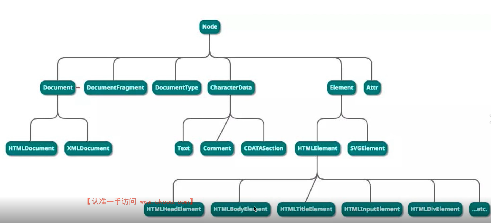 
>

?>类数组转换成数组<br>
const arr1=Array.from(list);<br>
const arr2=Array.prototype.slice.call(list)<br>
const arr3=[...list]

## 9.Vue中computed和watch有什么区别?

!> 两者用途不同<br>
computed 用于计算产出新的数据；<br>
watch 用于监听现有的数据；<br>
computed有缓存而watch是没有的；<br>

## 10.Vue组件通讯方式

### 1.通讯汇总：
>props和$emit
>
>自定义事件
>
>$attrs 是props和$emit的候补 dom上挂载属性跟是不是唯一节点有关系；可以用 v-bind="$attrs" 来实现层级透传；
>
>$parent 需要在mounted 去进行调用
>
>$refs 需要在mounted 去进行调用
>
>provide/inject  动态获取 provide需要用computed声明函数并且返回想要传递的数据
>
>```js
> //传递静态数据
> provide:{info:'aaa'}
> //传递响应式数据
> provide(){
>  return {
>    info: computed(()=>this.name)
>   }
> }
>```
>
>vuex

### 2.不同场景

* 父子组件
* 上下级组件（跨多级）通讯
* 全局组件

## 11.action和mutation有什么区别

>mutation 原子操作；必须同步代码
>
>action 可包含多个mutation;可包含异步代码；

## 12.JS严格模式有什么特点？

>'use strict' 全局或者函数引入
>
>全局变量必须先声明
>
>禁止使用with
>
>禁止this指向window
>
>创建eval作用域
>
>函数参数不能重名


## 13.HTTP跨域时为何要发送options请求?

### 跨域请求

* 浏览器同源策略
* 同源策略一般限制Ajax网络请求，不能跨域请求server
* 不会限制 `<link><scrip><iframe>` 加载第三方资源

### 解决跨域的方法

#### I.JSONP -script 标签去请求

#### II.CORS（靠丝） -设置请求头允许跨域

!>总结
options请求，是跨域请求之前的预检查；<br>
浏览器自行发起的，无需我们干预；<br>
不会影响实际功能；<br>

# 深度篇——原理

## 1.JS内存垃圾回收用什么算法
>
>垃圾回收：函数已经执行完了 再也用不到的一些对象和数据
>
>引用计数（之前） 循环引用出现一些缺陷， 引用次数为0则被清除
>
>标记清除（现代）从js的根（window）下逐步遍历，只要能找到的就保留，没有找到就清除

### I.【连环问】JS闭包是内存泄漏吗
>
>闭包不是内存泄漏，但是闭包的数据不会被垃圾回收

### II.如何检测JS内存泄漏
>
>泄漏的情况就是一直上升，正常的情况是锯齿上升下降高低形状
>
>可使用 Chrome devTools 的Performance 和 Memory 工具来检测 js 内存

 


### III.JS内存泄漏的场景有哪些(Vue为例) 
>
>被全局变量、函数引用，组件销毁时未清除 (window定义的变量和函数 要去销毁 赋值为 null)
>
>被全局事件、定时器引用，组件销毁时未清除 (setInterval ,clearInterval,window.addEventListen,window.removeEventListener)
>
>被自定义事件引用，组件销毁时未清除 (event)

### IV.WeakMap WeakSet 
> 弱引用 ，weakMap的key 只能是引用类型
> 
> 没有length,size ,也不能用foreach 只能用get去控制；
> 
> 不会影响垃圾回收，也不会带来内存泄漏的风险

## 2.浏览器和nodejs事件循环（EventLoop）有什么
> js 是单线程的（无论在浏览器还是nodejs）
> 
> 浏览器中js执行和DOM渲染共用一个线程
> 
>异步

`浏览器异步——宏任务和微任务`

* 宏任务，如 setTimeout setInterval 网络请求
* 微任务，如 promise async/await
* 微任务在下一轮`DOM渲染`之前执行，宏任务在之后执行

```js
console.log('start')
setTimeout(()=>{
  console.log('timeout')
})
Promise.resolve().then(()=>{
  console.log('Promise then')
})
console.log('end')
//start end  Promise then  timeout
//队列先进先出，宏任务队列（MarcoTask Queue） 微任务队列（MicroTask Queue）
```
`nodejs异步——宏任务和微任务`
* Nodejs同样使用ES语法，也是单线程，也需要异步
* 异步任务也分：宏任务 + 微任务
* 但是，它的宏任务和微任务，分不同`类型`，有`不同优先级


>nodejs `宏任务`类型和优先级(高到低)
>
>Timers - setTimeout setInterval
>
>V/O callbacks - 处理网络、流、TCP 的错误回调
>
>Idle, prepare- 闲置状态（nodejs 内部使用）
>
>Poll 轮询 -执行 poll 中的I/0队列
>
>Check 检查 - 存储 setimmediate 回调
>
>Close callbacks - 关闭回调，如 socket.on('close' )


>nodejs `微任务`类型和优先级
>
>包括：promise, async/await, process.nextTick
>
>注意，process.nextTick 优先级最高
>

?>`nodejs event loop` <br/>
• 执行同步代码 <br/>
• 执行微任务（process.nextTick 优先级更高）<br/>
• 按顺序执行 6 个类型的宏任务（ 每个结束时都执行当前的微任务）<br/>

!>`注意事项` <br/>
• 推荐使用 setImmediate 代替 process.nextTick* <br/>
• 本文基于nodejs 最新版本。nodejs 低版本可能会有不同 <br/>
```js
    console.info('start')
    setImmediate(() => {
      console.info("setImmediate')
    })
    setTimeout(()=>
      console.info("timeout)
    })
    Promise.resolve().then(()=> 
      console.info("promise then')
    })
    process.nextTick(()=>{
      console.info(nextTick)
    })
    console.info("end" )

//start end nextTick  promise then timeout setImmediate
```
## 3.vdom真的很快？

* Virtual DOM ，虚拟DOM
* 用JS对象模拟DOM节点数据
* 由React最先推广的
* Vue React 数据驱动视图这是比较核心的;只关注业务数据，而不用再关心DOM的变化

>vdom 并不快，js直接操作DOM才是最快的
>
>但“数据驱动视图”要有合适的技术方案，不能全部DOM重建
>
>vdom就是目前最合适的技术方案（并不是因为它快，而是合适）
>
>svelte 组件编译更准确，像外科手术式操作DOM,像JQuery那样操作Dom,但没有Vue、React稳定

## 4.遍历数组，for 和 forEach 哪个快？

>时间复杂度都是O(n)
>
>但是for比forEach更快一些
>
>forEach 每次都要创建一个函数来调用，而for不会创建函数
>
>函数需要独立的作用域，会有额外的开销

!>越`低级`的代码，性能往往越好 <br/>
日常开发别只考虑性能，forEach 代码可读性更好

## 5.nodejs如何开启多进程，进程如何通讯-进程和线程的,使用child_process或者cluster(集群)

!>`进程`**process** vs `线程` **thread** <br/>
• 进程，OS(操作系统) 进行资源分配和调度的最小单位，有独立内存空间；线程，OS 进行运算调度的最小单位，共享进程内存空间 <br/>
• 一个进程包含多个线程，进程之间是独立的
• JS是单线程的，但可以开启多进程执行，如 WebWorker <br/>

!>`为何需要多进程？`  <br/>
• 多核CPU，更适合处理多进程，内存较大，多个进程才能更好的利用（单进程有内存上限,内存利用不高，资源浪费），总之，“压榨〞机器资源，更快，更节省！ <br/>

>**nodejs**开启多进程可以使用开启子进程 child_process.fork 和 cluster.fork,使用send和on传递消息 
>
>实际工作中可以使用PM2插件帮助我们做进程守护

?>**使用 child_process 的方式**
```js
//主进程-process-fork
const http = require('http')
const fork = require('child_process').fork

const server = http.createServer((req,res)=>{
  if(req.url === 'get_sum'){
    console.info('主进程 id',process.pid)

    //开启子进程
    const computeProcess = fork('./compute.js')
    computeProcess.send('开始计算')

    computeProcess.on('message',data=>{
      console.info('主进程接受到的信息：',data)
      res.send('sum is '+data)
    })

     computeProcess.on('close',data=>{
      console.info('子进程因报错而退出')
      computeProcess.kill()
      res.send('error ')
    })
  }
})
server.listen(3000,()=>{
  console.info('localhost:3000')
})
```

```js
  //子进程-compute
  function getSum(){
    let sum = 0
    for(let i = 0;i < 10000;i++){
      sum += i
    }
    return sum
  }

  process.on('message',data=>{
      console.info('子进程 id',process.pid)
      console.info('子进程接受到的信息：',data)

      const sum = getSum()
      //发送消息给主进程
      process.send(sum)
    })
```
?>`打印的结果` <br/>
>localhost:3000
>
>主进程 id 80780
>
>子进程 id 80781
>
>子进程接受到的信息：开始计算
>
>主进程接受到的信息：49995000
>
?>**使用 cluster 的方式** <br/>

```js
  const http = require('http')
  const cpuCoreLength = require('os').cpus().length
  const cluster = require('cluster')

  if(cluster.isMaster){
    for(let i=0;i<cpuCoreLength;i++){
      cluster.fork() //开启子进程
    }
  cluster.on('exit',worker=>{
    console.log('子进程退出')
    cluster.fork() //进程守护
  })
  }else{
    //多个进程会共享一个TCP连接，提供一份网络服务
    const server =  http.createServer((req,res)=>{
    res.writeHead(200)
    res.end('done')
    })
    server.listen(3000)
  }

```
## 6.js-bridge的实现原理

?>小游戏： chrome://dino/
`JS Bridge常用的实现方式`
* 注册全局API (简单的封装)
* URL Scheme (推荐)

```js
//封装JS-bridge
const sdk = {
    invoke(url, data = {}, onSuccess, onError) {
      const iframe = document.createElement("iframe") 
      iframe.style.visibility ='hidden'
      document.body.appendChild(iframe)
      iframe.onload = () => {
          const content = iframel.contentWindow.document.body.innerHTML
          onSuccess(JSON.parse(content))
          iframe.remove()
      }
      iframe.onerror = () => {
      onError()
      iframe.remove()
      iframe.src= `my-app-name://$(url}?data=${JSON.stringify(data)}`
      }
    }
    fn1(data, onSuccess, onError) {this. invoke('api/fn1', data, onSuccess, onError)}
    fn2(data, onSuccess, onError) {this.invoke('api/fn2', data,onSuccess, onError)}
}
  sdk.fn1()

```
## 7.requestIdleCallback  和 requestAnimationFrame 区别
> requestAnimationFrame 每次渲染完都会执行，高优
> requestIdleCallback 空闲时才会执行，低优 
> 都是宏任务
> 

```html
<html>
<body>
  <button id='btn1'>change</button>
  <div id="box"></div>
<script>
    const box = document.getElementById( 'box' )
    
    document.getElementById('btn1').addEventListener('click',()=>{
        let curWidth = 100
        const maxwidth= 400
        function addwidth(){
        curWidth = curWidth + 3
        box.style.width =
        `${curwidth}px`
            if (curwidth < maxWidth) {
              //requestIdleCallback实现效果一样
            window.requestAnimationFrame(addwidth)//时间不用自己控制
            }
        }
        addwidth()
    })
</script>
</body>
</html>
```

?>执行先后顺序


```js
//执行顺序：start end timeout requestAnimationFrame requestIdleCallback 
    window.onload = () => {
      console.info("start')
      setTimeout(() => {
      console.info('timeout )
      })
      window.requestIdleCallback(()=>
      {
        console.info('requestIdleCallback")
      })
      window.requestAnimationFrame(()=>
      {
        console.info('requestAnimationFrame")
      })
      console.info("end')
    }
```
## 8.vue生命周期

?>`beforeCreate` <br/>* 创建一个空白的Vue实例<br/>* data method 尚未被初始化，不可使用<br/>`create` <br/>* Vue实例初始化完成，完成响应式绑定<br/>* data method 都已经初始化完成，可调用<br/>* 尚未开始渲染模板`beforeMount` <br/>* 编译模板，调用render 生成vdom<br/>* 还没有开始渲染DOM<br/>`mounted` <br/>* 完成DOM渲染<br/>* 组件创建完成<br/>* 开始由“创建阶段”进入“运行阶段”<br/>`beforeUpdate` <br/>* data发生变化之后<br/>* 准备更新DOM(尚未更新DOM)<br/>
`updated` <br/>* data发生变化,且DOM更新完成<br/>* （不要在updated中修改data,可能会导致死循环）<br/>
`beforeUnmount` <br/>* 组件进入销毁阶段（尚未销毁，可正常使用）<br/>* 可移除、解绑一些全局事件、自定义事件<br/>
`unmounted` <br/>* 组件被销毁了<br/>* 所有子组件也都被销毁了<br/>
`补充说明——keep-alive组件`<br/>* onActivated缓存组件被激活<br/>* onDeactivated缓存组件被隐藏<br/>

!>Vue什么时候操作DOM比较合适
* mounted和updated都不能保证子组件全部挂载完成
* 使用$nextTick渲染DOM

```js
mounted(){
  this.$nextTick(function(){
    //仅在整个试图都被渲染之后才会运行的代码
  })
}
```
!>Ajax应该在哪个生命周期？
* created和mounted
* 推荐mounted
## 9.Vue2 Vue3 React 三者diff算法有什么区别？

?>Vue2-双端比较<br/>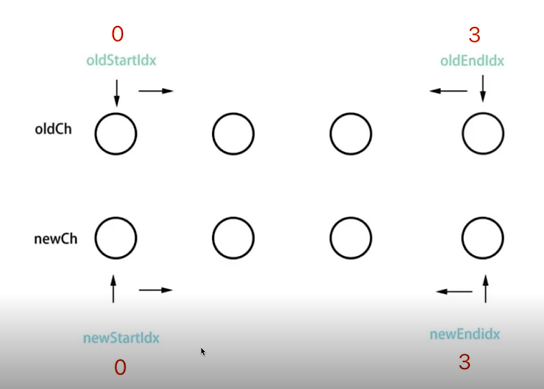 <br/>Vue3-最长递增子序列<br/>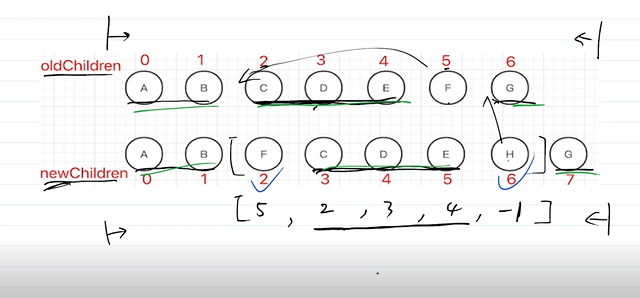 <br/>React-仅右移<br/> 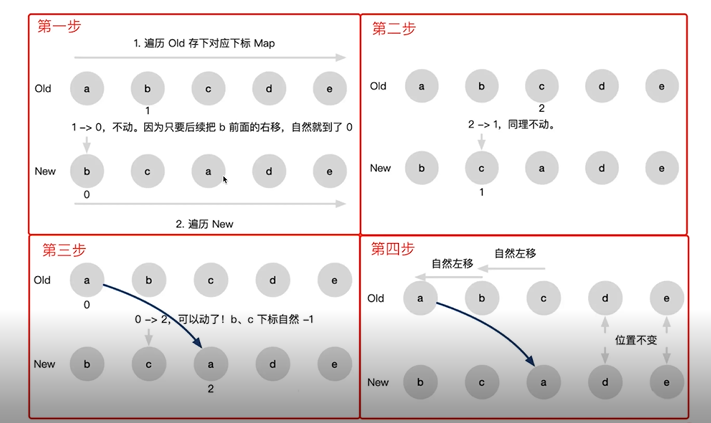


`Vue React 为何循环时必须使用 key?`
* vdom diff 算法会根据 key 判断元素是否要删除
* 匹配了 key ，则只移动元素 -性能较好
* 未匹配key ，则删除重建-性能较差

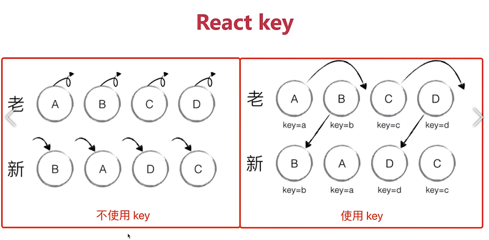 

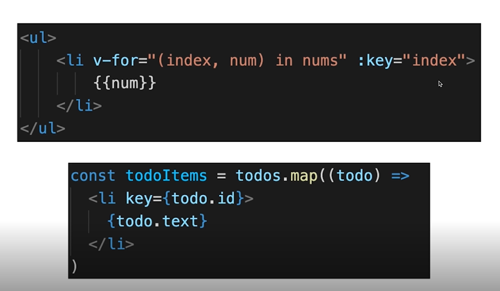 

`介绍diff 算法`
* diff 算法很早就有
* diff 算法应用广泛，例如 github 的Pull Request 中的代码 diff
* 如果要严格 diff 两棵树 ，时间复杂度 O（n^3)，不可用

`Tree diff 的优化——时间复杂度降到O(n)`
* 只比较同一层级，不跨级比较tag 不同则删掉重建（不再去比较内部的细节）
* 子节点通过 key 区分（key 的重要性）
## 10.Vue-router-MemoryHistory(abstract')？

?>Vue-router 三种模式<br/>`Hash` <br/>* location.hash->带 # <br/>`WebHistory`<br/> * history. pushState<br/> * window. onpopstate<br>`MemoryHistor`（ V4 之前叫做 abstract history)<br/> * 页面渲染正常，没有路由映射（就是IP+端口号），没有前进和后退<br/>`扩展：React-router 也有相同的 3 种模式`


# 广度篇 #
## 1.移动端H5点击有300ms延迟，该如何解决
> 背景：double tap to zoom (轻点两下缩放)
> fastclick (初期解决方案)
> width = device-width (标准协议解决，要做响应式 所以没有必要做300ms延迟)

fastclick实现及原理

```js
window.addEventListener('load',function(){
  FastClick.attach(document.body)
},false)

//FastClick原理
//监听touchend事件（touchstart touchend 会先于click 触发）
//使用自定义DOM事件模拟一个click事件
//把默认的click事件（300ms之后触发）禁止掉

```
## 2.HTTP请求中token和cookie有什么区别
>
>cookie:HTTP标准，跨域限制，配合session使用
>
>token:无标准，无跨域限制，用于JWT

?>**cookie**<br>
HTTP无状态，每次请求都要带cookie,以帮助识别身份<br>
服务端也可以向客户端set-cookie,cookie大小限制4kb<br>
默认有跨域限制：不可跨域共享、传递cookie(withCredentials允许跨域传递)<br>
HTML5之前cookie常被用于本地存储<br>
HTML5之后推荐使用localStorage和sessionStorage<br>
现代浏览器开始禁止第三方cookie,打击第三方广告，保护个人隐私，新增SameSite:Strict/Lax/none<br/>
cookie+session是常用的登录验证解决方案；


?>**token**<br>
cookie是HTTP规范，而token是自定义传递<br>
cookie会默认被浏览器存储，而token需自己存储<br>
token默认没有跨域限制<br>
`JWT(JSON Web TOken)`<br>
请求头带着token信息<br>

!>如有严格管理用户信息的需求（保密、快速封禁）推荐Session<br/>
如没有特殊要求，则使用JWT(如创业初期的网站)


`实现单点登录（SSO）`

1.cookie (主域名相同，可实现cookie传递，校验ticket)
2.OAuth 2.0 (第三方授权) 

## 3.HTTP协议和UDP协议有什么区别
>
>HTTP协议在应用层
>
>TCP UDP协议在传输层
>
>TCP有连接，有断开，稳定传输
>
>UDP无连接，无断开，不稳定传输，但效率高
>
>严格来说，应该拿TCP和UDP进行比较

>TCP协议
* 有连接（三次握手）
* 有断开（四次挥手）
* 稳定传输

>TCP协议
* 无连接无断开
* 不稳定传输，但效率高
* 如视频会议，语音通话

>HTTP协议1.0 1.1 2.0有什么区别
* HTTP协议1.0: 最基础的HTTP协议，支持基本的GET、POST方法
* HTTP协议1.1：缓存策略cache-control E-tag等；支持长连接Connection:keep-alive,一次TCP连接多次请求；支持断点续传，状态码206；支持新的方法PUT DELETE等，可用Restful API
* HTTP协议2.0：可压缩header,减少体积；多路复用，一次TCP连接中可以多个HTTP并行请求；服务端推送；

## 4.HTTPS中间人攻击，如何预防？

> HTTPS加密传输

* HTTP明文传输
* HTTPS加密传输，HTTPS+TLS/SSL;对称加密和非对称加密

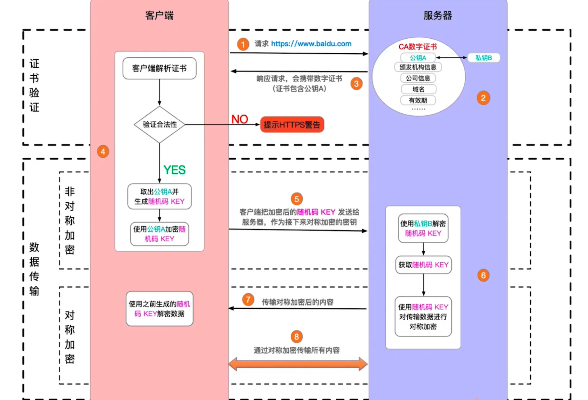 

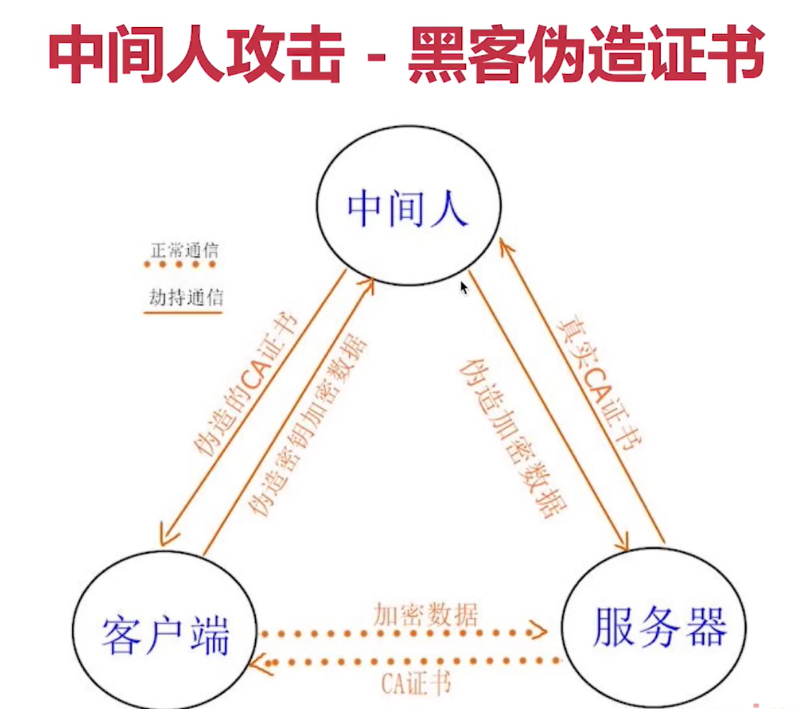 

## 5.script标签的defer和async有什么区别?

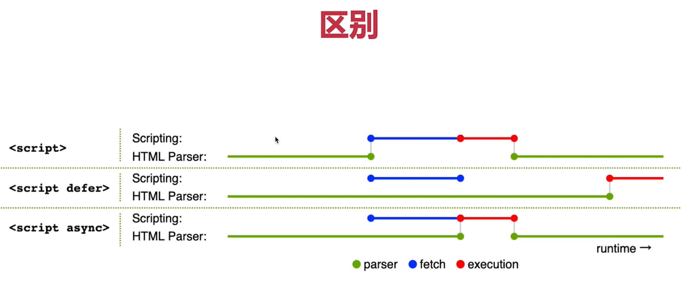 

>无：HTML暂停解析，下载JS,执行JS,再继续解析HTML
>
>defer：HTML继续解析，并行下载JS,HTML解析完再执行JS
>
>async：HTML继续解析，并行下载JS,执行JS,再解析HTML
>
>执行JS不能并行但是下载JS支持并行
>

?>prefetch和dns-prefetch <br/>
* prefetch 是资源预获取（和preload相关）
* dns-prefetch是DNS预查询（和preconnect相关）

>preload 资源在当前页面使用，会优先加载
>
>prefetch 资源在末来页面使用，空闲时加载
>
```html
<head>
<!--preload -->
<link rel="preload" href="style.css" as="style">
<link rel="preload" href="main.js" as="script">
<!--prefetch -->
<link rel="prefetch" href="other.js" as="script">
<!--引用 css-->
<link rel="stylesheet" href="style.css">
</head>
<body>
<!--引用 css-->
<script src="main.js" defer></script>
</body>
```

>dns-prefetch 即 DNS 预查询
>
>preconnect 即 DNS 预连接
>
```html
<html>
  <head>
      <link rel="dns-prefetch" href="https://fonts.gstatic.com/">
      <link rel="preconnect" href="https://fonts.gstatic.com/" crossorigin>
  </head>
  <body>
  </body>
</html>
```
## 6.前端攻击手段有哪些，该如何预防?
>XSS
* Cross Site Script跨站脚本攻击
* 手段：黑客将JS代码插入到网页内容中，渲染时执行JS代码
* 预防：特殊字符替换（前端或者后端）
* vue中用v-html会发生XSS攻击，其他的vue不会

>CSRF
* Cross Site Request Forgery 跨站请求伪造
* 手段：黑客诱导用户去访问另一个网站的接口，伪造请求
* 预防：严格的跨域限制+验证码机制

>点击劫持
* Click jacking
* 手段：诱导界面上蒙一个透明的iframe,诱导用户点击
* 预防：让iframe不能跨域加载（X-frame-options:sameorigin）

>DDoS
* Distribute denial-of-service 分布式拒绝服务
* 手段：分布式的、大规模的流量访问，使服务器瘫痪
* 预防：软件层不好做，需要硬件预防（如阿里云WAF）

>SQL注入
* 手段：黑客提交内容时写入SQL语句，破坏数据库
* 预防：处理输入的内容，替换特殊字符看，

## 7.WebSocket和HTTP协议的区别?

>webSocket
* 支持端对端通讯
* 可以由client发起，也可以由server发起
* 用于：消息通知，直播间讨论区，聊天室，协同编辑

>WebSocket连接过程
* 先发送一个HTTP请求
* 成功之后再升级到WebSocket协议，再通讯

>WebSocket和HTTP协议的区别
* WebSocket协议名是ws://，可双端发起请求
* WebSocket没有跨域限制
* 通过send和onmessage通讯（HTTP通过req和res）

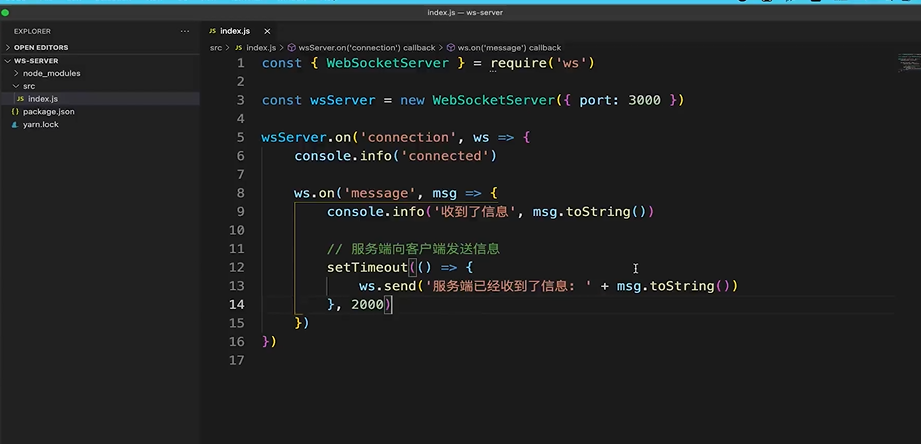 

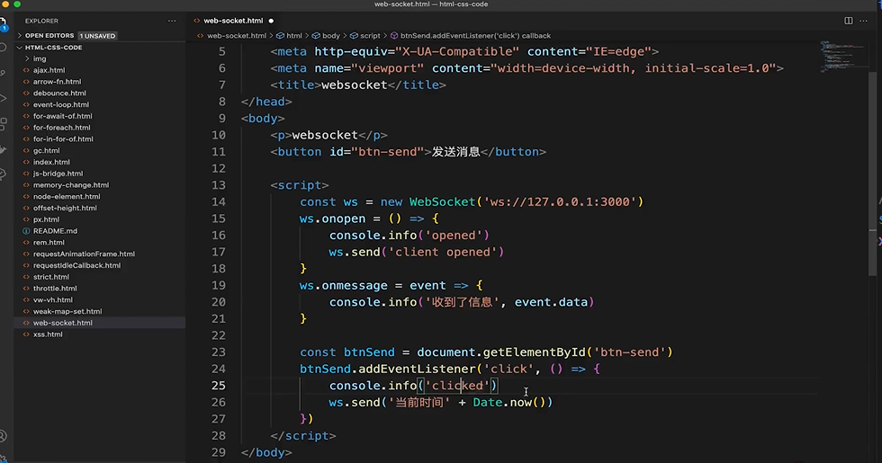 

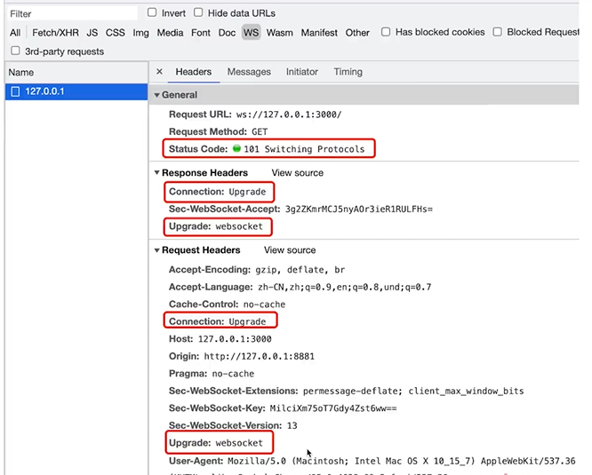 

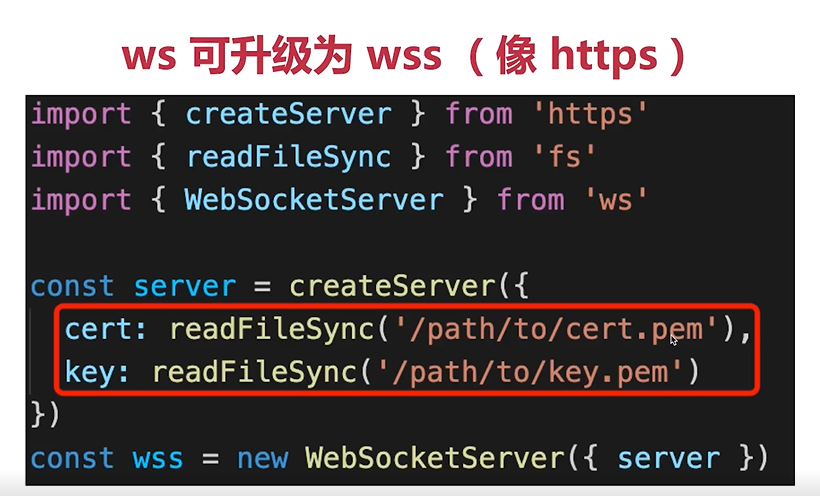 

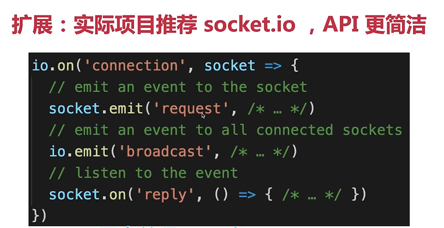 

>WebSocket和HTTP长轮询的区别
* HTTP长轮询：客户端发起请求，服务端阻塞，不会立即返回，需要处理timeout机制，处理完timeout之后重新发送请求；
* WebSocket:客户端可发起请求，服务端也可发起请求

# 8.从输入URL 到网页显示的完整过程


# 算法篇 #

!> 算法复杂度-程序执行时需要的计算量和内存空间，复杂度是数量级（颗粒度粗） <br>前端通常`重时间轻空间`<br>
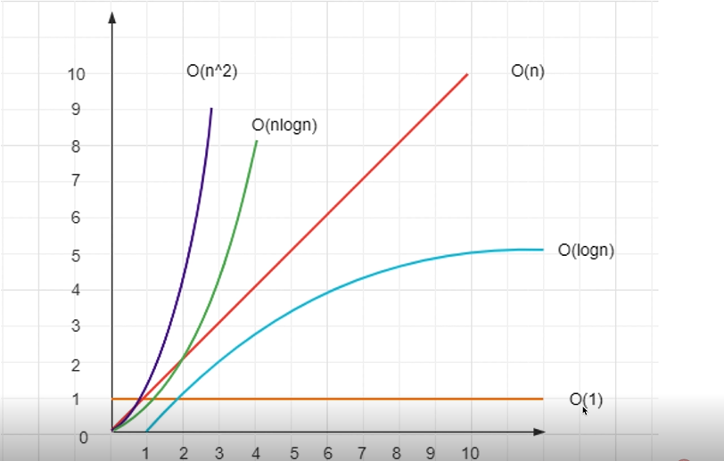 
>**时间复杂度数量级**：
>
>O(1) 一次就够
>
>O(logn)数据量的对数(二分的思想)
>
>O(n)和传输的数量级一样(循环)
>
>O(nlogn)数据量*数据量的对数 (循环嵌套二分)
>
>O(n^2)数据量的平方 (嵌套循环)


>**空间复杂度数量级**:
>O(1) (定义简单数据类型？？？)
>O(n) (定义复杂数据类型？？？)

## 1.把一个数组旋转k步

>题目：
>
>输入一个数组[1,2,3,4,5,6,7]
>
>k=3 即旋转3步
>
>输出[5,6,7,1,2,3,4]
>
>思路一：末尾元素pop,再unshift放到数组前面来
>
>思路二：数组切分后拼接concat到一起
>

`方法一：pop/unshift`
```js
function rotate1(arr:number[],k:number):number[]{
  const length=arr.length
  if(!k||length === 0)return arr
  const step = Math.abs(k%length) //abs 取绝对值
  //O(n^2)
  for(let i=0;i<step;i++){
    const n  = arr.pop()
    console.log(n)
    if(n){
      arr.unshift(n)//O(n)
    }
  }
  return arr
}
```
`方法二：concat`

```js
function rotate2(arr:number[],k:number):number[]{
  const length=arr.length
  if(!k||length===0)return arr
  const leftArr=arr.slice(0,length-k)
  const rightArr=arr.slice(-k)
  //O(1)
  const newArr=rightArr.concat(leftArr)
  return newArr
}
```

!>jest进行单元测试

```js
//测试一些些伪代码 详见jest
import {rotate1} from '../文件'
describe('数组旋转',()=>{
  it('正常情况',()=>{
    const arr=[1,2,3,4,5,6,7]
    const k=3
    const res=rotate1(arr,k)
    expect(res).toEqual([5,6,7,1,2,3,4])//断言 测试结果是否符合
  })
})
```
!>思路1：时间复杂度O(n^2),空间复杂度O(1) <br>
思路2：时间复杂度O(1),空间复杂度O(n) <br>

>**性能测试**
```js
const arr1=[]
for(let i=0;i<100000;i++){
  arr1.push(i)
}
console.time('rotate1')
rotate1(arr1,9*10000)  //800多ms
console.timeEnd('rotate1')

const arr2=[]
for(let i=0;i<100000;i++){
  arr2.push(i)
}
console.time('rotate2')
rotate2(arr2,9*10000) //1ms
console.timeEnd('rotate2')

```

!>**因为时间复杂度方案二更快一些，所以最优解为方案二**

## 2.判断一个字符串是否括号匹配

###　**知识点**　

>先进后出
>
>API:push pop length
>

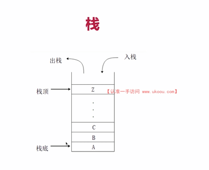 

>栈VS数组
>

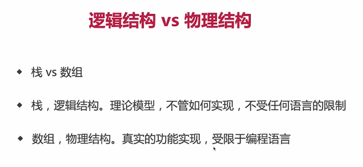 


**解题思路：**

>1.遇到左括号{([就压栈
>
>2.遇到右括号})]就判断栈顶，匹配则出栈
>
>最后判断length是否为0
>

```js
/**
 * @description 括号匹配
 * 
 * */
/**
 * 判断左右括号是否匹配
 * @param left 左括号
 * @param right 右括号
 * */
function isMatch(left:string,right:string):boolean{
  if(left==='{'&&right==='}') return true
  if(left==='['&&right===']') return true
  if(left==='('&&right===')') return true
  return false
}
/**
 * 判断是否括号匹配
 * @param str str
 * */
function matchBracket(str:string):boolean{
  const length=str.length
  if(length === 0) return true;
  const stack= [] 
  const leftSymbols='{[('
  const rightSymbols='}])'
  for(let i of str){
    if(leftSymbols.includes(i)){
      stack.push(i)
    }else if(rightSymbols.includes(s)){
      const top=stack[stack.length-1]
      if(isMatch(top,s)){
        stack.pop()
      }else{
        return false
      }
    }
  }
  return stack.lenght==0
}

//功能测试
const str= '{a[b(c)d]e}f'
console.info(matchBracket(str))
```
!>jest进行单元测试

```js
//测试一些些伪代码 详见jest
import {matchBracket} from '../文件'
describe('括号匹配',()=>{
  it('正常情况',()=>{
    const str='{a[b(c)d]e}f'
    const res=matchBracket(arr,k)
    expect(res).toBe(false)
  })
})
```

**性能分析：**
>时间复杂度O(n)
>
>空间复杂度O(n)
>

## 3.用两个栈实现一个队列

>栈先进后出 队列先进先出
>
>API都是add delete length
>

 


```js
/**
 * 两个栈 - 一个队列
 * 
 * */
class MyQueue{
  private stack1:number[]=[]
  private stack2:number[]=[]
  /*
  *入队
  */
 add(n:number){
   this.stack1.push(n)
 }
 /*
 *出队
 **/
delete():number||null{
   let res
   const stack1=this.stack1
   const stack2=this.stack2
   //将stack1所有元素移动到stack2中
   while(stack1.length){
     const n=stack1.pop()
     if(n !=null){
       stack2.push(n)
     }
   }
   //stack pop
   res=stack2.pop()
   //将stack2所有元素还给stack1
    while(stack2.length){
     const n=stack2.pop()
     if(n !=null){
       stack1.push(n)
     }
   }
   return res||null
}
get length():number{
return this.stack1.length
}
}
```

!>jest进行单元测试

```js
//测试一些些伪代码 详见jest
import {MyQueue} from '../文件'
describe('两个栈一个队列',()=>{
  it('add and length',()=>{
    const q=new MyQueue()
    expect(q.length).toBe(0)
    q.add(100)
    q.add(200)
    q.add(300)
    expect(q.length).toBe(3)
  })
  it('delete',()=>{
    const q=new MyQueue()
    expect(q.delete()).toBe(null)
    q.add(100)
    q.add(200)
    q.add(300)
    expect(q.delete()).toBe(100)
    expect(q.length).toBe(2)
    expect(q.delete()).toBe(200)
    expect(q.length).toBe(1)
  })
})
```


**性能分析：**
>时间复杂度:add O(1);delete O(n)
>
>空间复杂度,整体是O(n)
>

## 4.使用JS反转单向链表-什么是链表

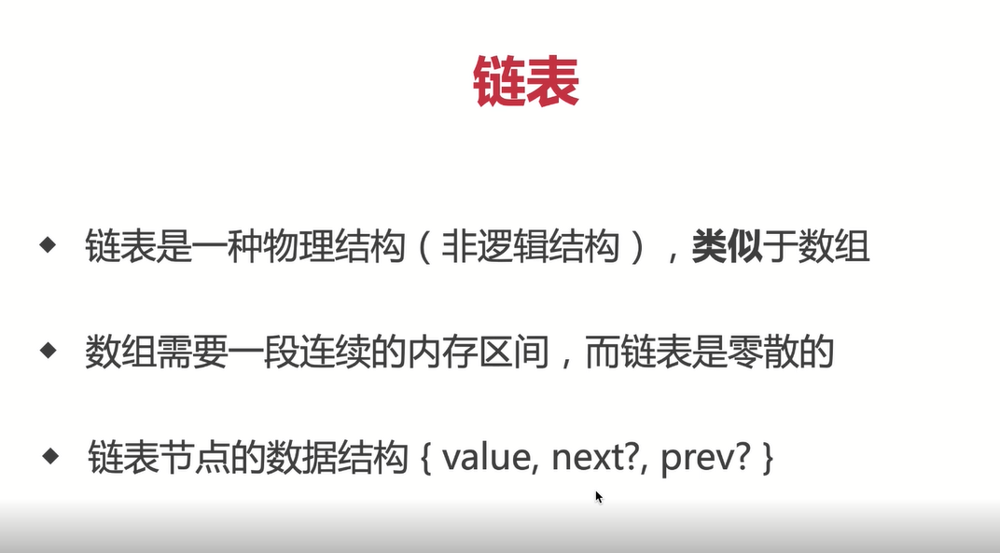 

>链表vs数组

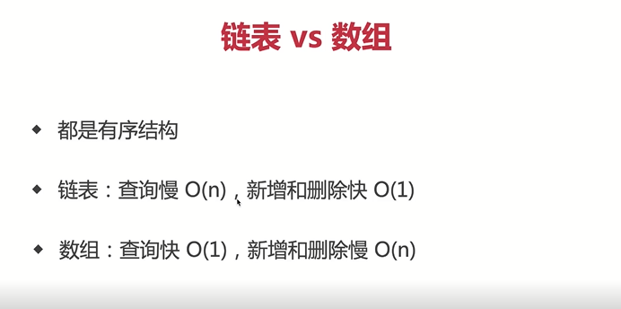 

>解题思路：
* 反转，即节点next指向前一个节点
* 但这很容易造成nextNode 的丢失
* 需要三个指针prevNode curNode nextNode

```js
interface ILinkListNode{
  value:number
  next?:ILinkListNode
}
/**
 * 、反转单向链表，并返回反转之后的head node
 * @param listNode list head node
 * 
 * */
function reverseLinkList(listNode:ILinkListNode):ILinkListNode{
  //定义三个指针
  let prevNode:ILinkListNode | undefined = undefined
  let curNode:ILinkListNode | undefined = undefined
  let nextNode:ILinkListNode | undefined = undefined

  //以nextNode 为主遍历链表
  while(nextNode){
    //第一个元素，删除 next 防止循环引用
    if(curNode && !prevNode){
      delete curNode.next
    }
    //反转指针
    if(curNode&&prevNode){
      curNode.next=prevNode
    }
    //整体向后移动指针
    prevNode = curNode
    curNode = nextNode
    nextNode = nextNode?.next
  }
  //最后一个的补充：当nextNode 空时，此时 curNode 尚未设置 next
  curNode!.next=prevNode
  return curNode!
}
/**
 * 根据数组创建单向链表
 * @param arr number arr
 * 
 * */

function createLinkList(arr:number[]):ILinkListNode{
  const length = arr.length
  if(length===0)throw new Error('arr is empty')
  let curNode:ILinkListNode = {
    value:arr[length-1]
  }
  if(length === 1)return curNode
  for(let i=length -2;i>=0;i++){
    curNode= {
      value:arr[i],
      next:curNode
    }
  }
  return curNode
}

const arr = [100,200,300,400,500]
const list = createLinkList(arr)
console.info('list:',list)

const linst1= reverseLinkList(list)
console.info() 
```

!>jest进行单元测试

```js
//测试一些些伪代码 详见jest
import {ILinkListNode,createLinkList,reverseLinkList} from '../文件'
describe('反转单向链表',()=>{
  it('单个元素',()=>{
  const node:ILinkListNode={value:100}
  const node1=reverseLinkList(node)
  expect(node1).toEqual({value:100})
  })
  it('多个元素',()=>{
  const node=createLinkList([100,200,300])
  const node1=reverseLinkList(node)
  expect(node1).toEqual({
    value:300,
    next:{
      value:200,
      next:{
        value:100
      }
    }
  })
  })
 
})
```
### _链表和数组哪个实现队列更快
>链表和数组都是物理结构，队列则是逻辑结构
>
>数组是连续存储，push很快 shift很慢
>
>链表是非连续存储，add和delete都很快但是查询很慢
>
>结论：链表实现队列更快；
>

**链表实现队列**
* 单向链表，但是同时记录head和tail(头和尾)；
* 要从tail入队，从head出队，否则出队时tail不好定位；
* length要实时记录，不可遍历链表获取；

```js
/***
 * 链表实现队列
 * 
 * */
interface IListNode{
  value:number,
  next:IListNode|null
}

class MyQueue{
  private head:IListNode | null = null
  private tail:IListNode | null = null
  private len = 0
  /**
   * 入队，在tail入
   * @ param n number
   * */
  add(n:number){
    const newNode:IListNode={
     value:n,
     next:null
    }
    //处理head边界
    if(this.head==null){
      this.head=newNode
    }
    //处理tail
    const tailNode =this.tail
    if(tailNode){
      tailNode.next=newNode
    }
    this.tail=newNode
    this.len++
  }
    /**
   * 出队，在head出
   * @ param n number
   * */
  delete():number|null{
     const headNode = this.head
     if(headNode == null|| this.len <= 0)return null
     //取值
     const value=headNode.value
     //处理head
     this.head=headNode.next
     //记录长度
     this.len--
  }
  get length():number{
    return this.len
  }
}

//功能测试
const q= new MyQueue()
q.add(100)
q.add(200)
q.add(300)
console.info('length1',q.length)
console.info(q.delete())
console.info('length2',q.length)
console.info(q.delete())
console.info('length3',q.length)
console.info(q.delete())
console.info('length4',q.length)
console.info(q.delete())
console.info('length5',q.length)

//性能测试
const q1 = new MyQueue()
console.time('queue with list')
for(let i=0;i<10*10000;i++){
  q1.add(i)
}
for(let ii=0;i<10*10000;i++){
  q1.delete()
}
console.timeEnd('queue with list') //17ms

const q2 =[]
console.time('queue with array')
for(let i=0;i<10*10000;i++){
  q2.push(i)  //入队
}
for(let ii=0;i<10*10000;i++){
  q2.shift()  //出队
}
console.timeEnd('queue with array') //431ms
```

!>jest进行单元测试

```js
//测试一些些伪代码 详见jest
import {MyQueue} from '../文件'
describe('链表实现一个队列',()=>{
  it('add and length',()=>{
    const q=new MyQueue()
    expect(q.length).toBe(0)
    q.add(100)
    q.add(200)
    q.add(300)
    expect(q.length).toBe(3)
  })
  it('delete',()=>{
    const q=new MyQueue()
    expect(q.delete()).toBeNull()//toBe(null)
    q.add(100)
    q.add(200)
    q.add(300)
    expect(q.delete()).toBe(100)
    expect(q.length).toBe(2)
    expect(q.delete()).toBe(200)
    expect(q.length).toBe(1)
    expect(q.delete()).toBe(300)
    expect(q.length).toBe(0)
    expect(q.delete()).toBeNull()
  })
})
```

**性能分析：**
>时间复杂度:
>
>* 数组：add O(1);delete O(n)
>* 链表：add O(1);delete O(1)
>
>空间复杂度,整体是O(n)
>

## 5.实现二分查找

>
>二分查找 
>
>时间复杂度：O(logn)
>
>思路：1.递归2.循环（更快）

```js
/**
* 二分查找（循环）
* @param arr arr
* @param target target
* */
function binarySearch1(arr:number[],target:number):number{
const length = arr.length
if(length ===0)return -1;

let startIndex=0//开始位置
let endIndex=length-1 //结束位置

while(startIndex<=endIndex){
    const midIndex=Math.floor((startIndex+endIndex)/2)
    const midValue=arr[midIndex]
    if(target<midValue){
      //目标值较小，则继续在左侧查找
      endIndex=midIndex-1
    }else if(target>midValue){
      //目标值较大，则继续在右侧查找
      startIndex=midIndex+1
    }else{
     return midIndex
    }
}
return -1
}

//功能测试
const arr=[10,20,30,40,50,60]
const target=20;
console.info(binarySearch1(arr,target))

/**
* 二分查找（循环）
* @param arr arr
* @param target target
* @param startIndex startIndex
* @param endIndex endIndex
* */
function binarySearch2(arr:number[],target:number,startIndex?:number,endIndex?:number):number{
const length = arr.length
if(length ===0)return -1;
//开始和结束范围
if(startIndex==null)startIndex=0//开始位置
if(endIndex==null)endIndex=length-1 //结束位置

if(startIndex>endIndex)return -1

//中间位置
const midIndex=Math.floor((startIndex+endIndex)/2)
const midValue=arr[midIndex]
   if(target<midValue){
      //目标值较小，则继续在左侧查找
      return binarySearch2(arr,target,startIndex,midIndex-1)
    }else if(target>midValue){
      //目标值较大，则继续在右侧查找
     return binarySearch2(arr,target,midIndex+1,endIndex)
    }else{
     return midIndex
    }
}

//功能测试
const arr=[10,20,30,40,50,60]
const target=20;
console.info(binarySearch2(arr,target))

```

!>jest进行单元测试

```js
//测试一些些伪代码 详见jest
import {binarySearch1,binarySearch2} from '../文件'
describe('二分查找',()=>{
  it('正常情况',()=>{
    const arr=[10,20,30,40,50,60]
    const target=20;
    const index=binarySearch1(arr,target)
    expect(index).toBe(1)
  })
  it('空数组',()=>{
    expect(binarySearch1([],100)).toBe(-1)
  })
  it('找不到target',()=>{
    expect(binarySearch1([10,20,30,40,50],500)).toBe(-1)
  })
})
```

## 6.一个数组中和为n的两个数

>嵌套循环(不是最优解，双指针！！！)
>
>时间复杂度（O(n^2)）,不可用(数据量大且复杂！！)
>
>双指针
>
>概念其主要就是引用
>
>时间复杂度（O(n)）
>
>凡有序，必二分
>
>优化嵌套循环，可以用双指针来优化！！！
>
```js

// @嵌套循环
/**
 * @param {number[]} nums
 * @param {number} target
 * @return {number[]}
 */
 function findeTwoSum(nums:number[], target:number):number[] { 
   const res:number[]=[]
   let len=nums.length
   if(len==0) return res
    for (let i = 0; i < nums.length; i++) { 
        for (let j = i+1; j < nums.length; j++) { 
            let sum=nums[i]+nums[j]
            if (sum == target) { 
                return res=[i,j]
            }
        }
    }
};

// @双指针
/**
 * @param {number[]} nums
 * @param {number} target
 * @return {number[]}
 */
 function findeTwoSum1(nums:number[], target:number):number[] { 
   const res:number[]=[]
   let len=nums.length
   if(len==0) return res
   let i=0 //头
   let j=len-1 //尾
   while(i<j){
     const sum=nums[i]+nums[j]
     if(sum<target){
       i++
     }else if(sum>target){
       j--
     }else{
       return [i,j]
     }
   }
};
```


!>jest进行单元测试

```js
//测试一些些伪代码 详见jest
import {findeTwoSum，findeTwoSum1} from '../文件'
describe('两数之和',()=>{
  it('正常情况',()=>{
     const nums = [2,7,11,15]
     const target = 9
     const res=findeTwoSum(nums,target)
    expect(res).toEqual([0,1])
  })
  it('空数组',()=>{
     const res=findeTwoSum([],9)
    expect(res).toEqual([])
  })
 it('找不到结果',()=>{
     const nums = [2,7,11,15]
     const res=findeTwoSum(nums,100)
    expect(res).toEqual([])
  })
})
```

## 7.求二叉搜索树的第K小值-二叉树和三种遍历

### I.二叉树概念
>
>是一棵树
>
>每个节点，最多只能有2个子节点
>
>数据结构，value,left,right
### II.二叉树遍历
>
> 前序遍历  root->left->right
>
> 中序遍历  left->root->right
>
> 后序遍历  left->right->root

```js
interface ITreeNode{
  value:number,
  left:ITreeNode|null
  right:ITreeNode|null
}

/**
 * 二叉树前序遍历
 * @param node tree node
 */
function preOrderTraverse(node:ITreeNode|null){
    if(node == null) return
      console.log(node.value)
    preOrderTraverse(node.left)
    preOrderTraverse(node.right)
}//5,3,2,4,7,6,8

/**
 * 二叉树中序遍历
 * @param node tree node
 */
function inOrderTraverse(node:ITreeNode|null){
    if(node == null) return
    inOrderTraverse(node.left)
    console.log(node.value)
    inOrderTraverse(node.right)
}//2,3,4,5,6,7,8

/**
 * 二叉树后序遍历
 * @param node tree node
 */
function postOrderTraverse(node:ITreeNode|null){
    if(node == null) return
    postOrderTraverse(node.left)
    postOrderTraverse(node.right)
    console.log(node.value)
}//2,4,3,6,8,7,5

const tree:ITreeNode ={
  value:5,
  left:{
    value:3,
    left:{
      value:2,
      left:null,
      right:null
    },
     right:{
      value:4,
      left:null,
      right:null
    }
  },
  right:{
    value:7,
    left:{
      value:6,
      left:null,
      right:null
    },
    right:{
      value:8,
      left:null,
      right:null
    }
  }
}


```

### III.二叉搜索树

>
>left(包括其后代) value<=root value
>
>right(包括其后代) value>=root value
>
> 可使用二分法进行快速查找
>
>左比右大，从小到大递增

**解题思路**
* BST中序遍历，即从小到大的排序
* 找到排序后的第K值即可

```js

export interface ITreeNode{
  value:number,
  left:ITreeNode|null
  right:ITreeNode|null
}

arr:number[]=[]
/**
 * 二叉树中序遍历
 * @param node tree node
 */
function inOrderTraverse(node:ITreeNode|null){
    if(node == null) return
    inOrderTraverse(node.left)
    arr.push(node.value)
    inOrderTraverse(node.right)
}//2,3,4,5,6,7,8
/**
 * 寻找BST里最小值
 * @param node tree node
 * @param k 第几个值
 */
export function getKthValue(node:ITreeNode,k:number):number|null{
    inOrderTraverse(node)
    return arr[k]||null
}//getKthValue(bstTree,3) //5

const bstTree:ITreeNode ={
  value:5,
  left:{
    value:3,
    left:{
      value:2,
      left:null,
      right:null
    },
     right:{
      value:4,
      left:null,
      right:null
    }
  },
  right:{
    value:7,
    left:{
      value:6,
      left:null,
      right:null
    },
    right:{
      value:8,
      left:null,
      right:null
    }
  }
}
```

!>jest进行单元测试

```js
//测试一些些伪代码 详见jest
import {ITreeNode,getKthValue} from '../文件'

describe('二叉搜索树',()=>{
  const bstTree:ITreeNode ={
  value:5,
  left:{
    value:3,
    left:{
      value:2,
      left:null,
      right:null
    },
     right:{
      value:4,
      left:null,
      right:null
    }
  },
  right:{
    value:7,
    left:{
      value:6,
      left:null,
      right:null
    },
    right:{
      value:8,
      left:null,
      right:null
    }
  }
}
  it('正常情况',()=>{
    const res=getKthValue(bstTree,3)
    expect(res).toBe(5)
  })
  it('k不在正常范围',()=>{
    const res1=getKthValue(bstTree,0)
    expect(res1).toBeNull()
    const res2=getKthValue(bstTree,1000)
    expect(res2).toBeNull()
  })
})
```

### IV.平衡二叉树

* BST如果不平衡，那就又成了链表了
* 所有要尽量平衡：平衡二叉搜素树BBST
* BBST增删查，时间复杂度都是O(logn),即树的高度

#### V.红黑树

>本质是一种自平衡二叉树；
>
>分为 红/黑 两种颜色，通过颜色转换来维持树的平衡；
>
>相对普通的平衡二叉树，它维持的平衡效率更高；
>

#### VI.B树

>物理上是多叉树，但逻辑上是二叉树；
>
>一般用于高效I/O,关系型数据库常用B树来组织数据；
>

?>堆有什么特点，和二叉树有什么关系

**堆栈模型**
>
>js代码执行时
>
>值类型变量，存储在栈
>
>引用类型变量，存储在堆

**堆**

* 完全二叉树
* 最大堆：父节点>=子节点
* 最小堆：父节点<=子节点

>
>堆 逻辑结构是一颗二叉树
>
>但物理结构是一个数组
>
>数组：适合连续存储+节省空间（回顾堆栈模型）


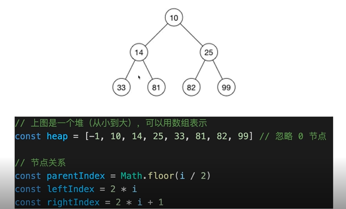 

!> **堆 vs BST**<br/>
 查找比BST慢 <br/>
 增删比BST快，维持平衡更快 <br/>
 但是整体时间复杂度都在O(logn)级别，即树的高度 <br/>
 应用：堆栈模型 <br/>
 堆的数据都是在栈中引用的，不需要从root遍历 <br/>
 堆恰巧是数组形式，根据栈的地址，可用O(1)找到目标<br/>

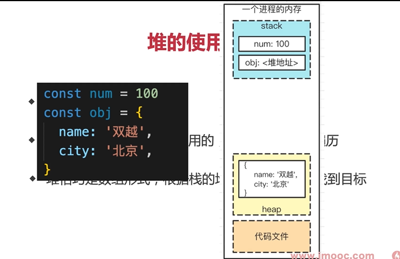 

## 8.求斐波那契数列的第n值-递归算法会导致运行崩溃

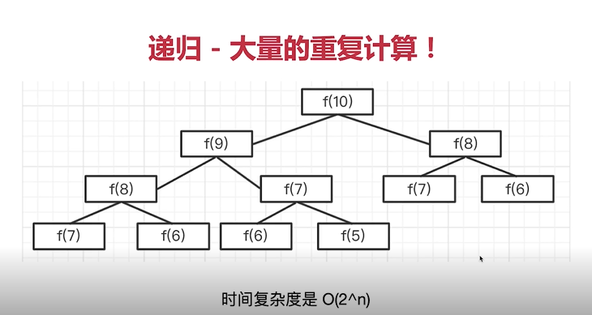 

```js
// @斐波那契数列


/**
 * @param {number} n
 * @return {number}
 */
//递归实现 时间复杂度非常高O(2^n)
 function fibonacci(n:number):number { 
  if(n<=0)return 0
  if(n==1) return 1
  return fibonacci(n-1)+fibonacci(n-2)
};
//循环实现
 function fibonacci(n:number):number { 
  if(n<=0)return 0
  if(n==1) return 1
  let n1=0 //记录n-1的结果
  let n2=1 //记录n-2的结果
  let res=0
  for(let i=2;i<=n;i++){
    res= n1+n2
    //记录 n1,n2数据
    n1=n2
    n2=res
  }
  return res
};
```


!>jest进行单元测试

```js
//测试一些些伪代码 详见jest
import {fibonacci} from '../文件'
describe('斐波那契数列',()=>{
  //0,1,1,2,3,5,8,13,21,34
  it('正常情况',()=>{
    expect(fibonacci(0)).toBe(0)
    expect(fibonacci(1)).toBe(1)
    expect(fibonacci(2)).toBe(1)
    expect(fibonacci(3)).toBe(2)
    expect(fibonacci(9)).toBe(34)
  })
  it('n小于0',()=>{
     expect(fibonacci(-1)).toBe(0)
  })
})
```

**动态规划**

* 把一个大问题拆解成多个小问题，逐级向下拆解；
* 用递归的思路去分析问题，再改为循环来实现；
* 算法三大思维：贪心、二分、动态规划

### _青蛙跳台阶

* 一只青蛙，一次可跳1级，也可跳2级
* 问：青蛙跳到n级台阶，总共有多少种方式？
* 动态规划的方式去分析（其实质就是斐波那契数列）   
* 要是跳一级台阶，有f(1)
* 要是跳两级台阶，有f(2)
* 要是n两级台阶，有f(n-1)+f(n-2)

## 9.移动0到数组的末尾

>[]中的0放到末尾得到[]
>
>需要在原数组上进行操作

!> 传统思路 <br/>
遍历数组，遇到0则push到数组末尾 <br/>
用splice截取掉当前元素 <br/>
时间复杂度是O(n^2) ——算法不可用 <br>

!> 更优思路-双指针 <br/>
定义j指向第一个0，i指向j后面的第一个非0 <br/>
交换i和j的值，继续向后移动 <br/>
只遍历一次，时间复杂度是O(n)<br/>


!>**向面试官确认是否修改原数组？** <br/>
数组是连续存储，要慎用splice unshift 等API <br/>
`双指针思路` <br>

```js

/**
 * 移动0到数组末尾（嵌套循环）
 * @param arr
 */
 function moveZero1(arr:number[]):void { 
  const length = arr.length
  if(length === 0) return
  let zerolength= 0
  //O(n^2)
  for(let i=0;i<length-zeroLength;i++){
    if(arr[i]===0){
      arr.push(0)
      arr.splice(i,1) //本身就有O(n)
      i-- //数组截取一个元素，i要递减，否则连续0就会有错误
      zeroLength++ //累加0的长度
    }
  }
};

/**
 * 移动0到数组末尾（双指针）
 * @param arr
 */
 function moveZero2(arr:number[]):void { 
  const length = arr.length
  if(length === 0) return
  let i
  let j= -1 //指向第一个0
  //O(n^2)
  for(let i=0;i<length;i++){
    if(arr[i]===0){
       //第一个0
       if(j<0){
         j= i
       }
    }
    if(arr[i]!==0&&j>=0){
      const n =arr[i]
      arr[i] = arr[j]
      arr[j] = n
      j++
    }
  }
};

//功能测试
const arr = [1,0,3,4,0,0,11,0]
moveZero(arr)
console.log(arr)


//性能测试
const arr1 = []
for(let i = 0;i<20*10000;i++){
  if(i%10 == 0){
    arr1.push(0)
  }else{
    arr1.push(i)
  }
}
console.time('moveZero1')
moveZero1(arr1) //262ms
console.timeEnd('moveZero1')

const arr2 = []
for(let i = 0;i<20*10000;i++){
  if(i%10 == 0){
    arr2.push(0)
  }else{
    arr2.push(i)
  }
}
console.time('moveZero2')
moveZero1(arr2)     //3ms
console.timeEnd('moveZero2') 

```


!>jest进行单元测试

```js
//测试一些些伪代码 详见jest—— moveZero1 和 moveZero2 单元测试用例是一样的
import {moveZero1} from '../文件'
describe('移动0到数组末尾',()=>{
  //0,1,1,2,3,5,8,13,21,34
  it('正常情况',()=>{
    const arr = [1,0,3,4,0,0,11,0]
    expect(moveZero1(arr)).toEqual([1,3,4,11,0,0,0,0])
    
  })
  it('没有0',()=>{
    const arr=[1,3,4,11]
      expect(moveZero1(arr)).toEqual([1,3,4,11])
  })
  it('全是0',()=>{
    const arr=[0,0,0,0]
      expect(moveZero1(arr)).toEqual([0,0,0,0])
  })
})
```

## 10.获取字符串中连续最多的字符以及次数

* 输入 'abbcccddeeee1234',计算得到连续最多的字符是'e'，4次


### 传统思路_嵌套循环
>找出每个字符的连续次数，并记录
>
>看似时间复制度是O(n^2)
>
>实际时间复杂度-O(n)因为有跳步
### 思路_双指针
>定义指针i和j。j不动，i继续移动
>
>如果i和j的值一直相等，则i继续移动
>
>直到i和j的值不相等，记录处理，让j追上i。继续第一步

### 思路_正则表达式——效率极低 慎用，也徒增了空间复杂度O(n)

!>算法题尽量用低级代码， 慎用语法糖和高级API

```js
interface IRes{
  char:string
  length:number
}

/**
 * 求连续字符和次数（嵌套循环）
 * @param str
 */
 function findContinuousChar1(str:string):IRes { 
  const res:IRes={
    char:'',
    length:0
  }
  const length = str.length
  if(length===0) return res
  let tempLength=0 //临时记录当前连续字符的长度
  for(let i = 0;i<length;i++){
    tempLength=0 //重置
    for(let j=i;j<length;j++){
      if(str[i]==str[j]){
        tempLength++
      }
      //不相等或者已经到了最后一个元素，要去判断最大值
      if(str[i]!==str[j]||j===length-1){
        if(tempLength>res.length){
          res.char=str[i]
          res.length = tempLength
        }
        if(i<length-1){
          i=j-1 //跳步
        }
        break
      }
    }
  }
  return res
};

/**
 *  求连续字符和次数（双指针）
 * @param str
 */
 function findContinuousChar2(str:string):IRes{
  const res:IRes={
    char:'',
    length:0
  }
  const length = str.length
  if(length===0) return res
  let tempLength=0 //临时记录当前连续字符的长度
  let i=0;
  let j=0;
  for(;i<length;i++){
    if(str[i]===str[j]){
      tempLength++
    }
     if(str[i]!==str[j]||i===length-1){
      if(tempLength>res.length){
        res.char=str[j]
        res.length=tempLength
      }
      tempLength=0
      if(i<length - 1){
        j = i
        i--
      }
    }
  }
  return res
};

//功能测试
const str = 'aabbccceeee1234'
console.log(findContinuousChar1(str))


//性能测试
const str = ''
for(let i = 0;i<100*10000;i++){
  str+=i.toString()
}
console.time('findContinuousChar1')
findContinuousChar1(str) //219ms
console.timeEnd('findContinuousChar1')

console.time('findContinuousChar2')
findContinuousChar2(str) //228ms
console.timeEnd('findContinuousChar2')
```


!>jest进行单元测试

```js
//测试一些些伪代码 详见jest—— findContinuousChar1 和 findContinuousChar2 单元测试用例是一样的
import {findContinuousChar1,findContinuousChar2} from '../文件'
describe('连续字符和长度',()=>{
  it('正常情况',()=>{
    const str='aabbbcccdddeeee1234'
    expect(findContinuousChar1(str)).toEqual({char:'e',length:4})
    
  })
  it('空字符串',()=>{
    expect(findContinuousChar1('')).toEqual({char:'',length:0})
  })
  it('无连续字符',()=>{
   expect(findContinuousChar1('abc')).toEqual({char:'a',length:1})
  })
  it('全部连续字符',()=>{
   expect(findContinuousChar1('aaa')).toEqual({char:'a',length:3})
  })
})
```
## 11.实现快速排序并说明时间复杂度

### 固定算法固定思路
>
>找到中间位置 midValue
>
>遍历数组，小于midValue放在left,否则放在right
>
>继续递归，最后concat 拼接，返回
>

`细节`
>
>获取midValue的两种方式；
>
>使用splice,会修改原数组
>
>使用slice,不会修改原数组——更加推荐！
>
>
```js
/**
 * 快速排序（splice）
 * @param arr
 */
 function quickSort1(arr:number[]):number[] { 
   let length = arr.length
   if(length == 0) return arr
   let midIndex = Math.floor(length/2)
   let midValue = arr.splice(midIndex,1)[0]
   let left = []
   let right = []
   //注意这里不用直接用length,而是用arr.length.因为splice把数组改变了
   for(let i = 0; i<arr.length;i++){
     const n = arr[i]
     if(n<midValue){
       left.push(n)
     }else{
       right.push(n)
     }
   }
   return quickSort1(left).concat([midValue],quickSort1(right))
};

/**
 * 快速排序（slice）
 * @param arr
 * 时间复杂度 O(nlogn)
 */
 function quickSort2(arr:number[]):number[]{
   let length = arr.length
   if(length == 0) return arr
   let midIndex = Math.floor(length/2)
   let midValue = arr.slice(midIndex,midIndex+1)[0]
   let left = []
   let right = []
   for(let i = 0; i<length;i++){
      const n = arr[i]
      if(n!==midValue){ 
          if(n<midValue){
            left.push(n)
          }else{
            right.push(n)
          }
      }   
   }
   return quickSort2(left).concat([midValue],quickSort2(right))
};

//功能测试
    const arr=[6,1,8,2,4,9,5,7,3]
    quickSort1(arr)
//性能测试
const arr1 = []
for(let i = 0;i<10*10000;i++){
    arr1.push(Math.floor(Math.random()*1000))
}
console.time('quickSort1')
quickSort1(arr1) //74ms
console.timeEnd('quickSort1')

const arr2 = []
for(let i = 0;i<10*10000;i++){
    arr2.push(Math.floor(Math.random()*1000))
}
console.time('quickSort2')
quickSort1(arr2) //82ms
console.timeEnd('quickSort2')
//算法本身时间复杂度就够高O(n*logn)
//外加，splice 是逐步二分之后执行得，二分会快速削减数量级
//如果单独比较splice和slice效果就会非常明显；

//单独比较splice和slice
const arr1 = []
for(let i = 0;i<10*10000;i++){
    arr1.push(Math.floor(Math.random()*1000))
}
console.time('splice')
arr.splice(5*10000,1) //0.01220ms
console.timeEnd('splice')

const arr2 = []
for(let i = 0;i<10*10000;i++){
    arr2.push(Math.floor(Math.random()*1000))
}
console.time('slice')
arr.slice(5*10000,5*10000+1) //0.00805ms
console.timeEnd('slice')
```

!>jest进行单元测试

```js
//测试一些些伪代码 详见jest—— quickSort1 和 quickSort2 单元测试用例是一样的
import {quickSort1,quickSort2} from '../文件'
describe('快速排序',()=>{
  it('正常情况',()=>{
    const arr=[6,1,8,2,4,9,5,7,3]
    expect(quickSort1(arr)).toEqual([1,2,3,4,5,6,7,8,9])
  })
  it('有负数',()=>{
    const arr=[-2,1,4,-1,3,2]
    expect(quickSort1(arr)).toEqual([-2,-1,1,2,3,4])
  })
  it('数组元素一样',()=>{
    const arr=[1,1,1,1,1]
    expect(quickSort1(arr)).toEqual([1,1,1,1,1])
  })
  it('空数组',()=>{
    expect(quickSort1([])).toEqual([])
  })
})
```

## 12.获取1-10000之前所有的对称数（回文数）

`思路一：使用数组反转、比较`
>
>数字转换为字符串，再转换为数组
>
>数组reverse,再join为字符串
>
>前后字符串比较


`思路二：字符串头尾比较`
>
>数字转换为字符串
>
>字符串头尾字符比较
>
>也可以用栈，像括号匹配，但是要注意奇偶数
>

`思路三：生成反转数`
>
>使用%和Math.floor 生成反转数
>
>前后数字进行比较
>

!>**性能分析** <br/>
思路1-看似是O(n)，但数组转换、操作都是需要时间，所以很慢； <br/>
思路2vs思路3，操作数字更快，电脑原型就是计算器 <br/>
思路2 要用栈来实现不合适，因为栈一般也是数组实现的会慢 <br/>


```js
/**
 * 查找回文数（数组反转比较）
 * @param max查找最大范围值
 */
 function findPalindromeNumbers1(max:number):number[] { 
    const res :number[]=[]
    if(max<=0)return res
    for(let i=1;i<=max;i++){
      const str=i.toString()
      //转换成字符串之后 再对字符串进行反转比较，（需要将其转换成数组反转数组在拼接成字符串）
      if(str== str.split('').reverse().join('')){
        res.push(i)
      }
    }
    return res
  };


  /**
 * 查找回文数（字符串头尾比较）
 * @param max查找最大范围值
 */
 function findPalindromeNumbers2(max:number):number[] { 
    const res :number[]=[]
    if(max<=0)return res
    for(let i=1;i<=max;i++){
      const str=i.toString()
      const length = str.length
      let flag = true
      let startIndex = 0
      let endIndex = length-1
      while(startIndex<endIndex){
        if(s[startIndex]!==s[endIndex]){
          flag=false
          break
        }else{
          startIndex++
          endIndex--
        }
      }
      if(flag) res.push(i)
    }
    return res
  };

  /**
 * 查找回文数（生成反转数）
 * @param max查找最大范围值
 */
 function findPalindromeNumbers3(max:number):number[] { 
    const res :number[]=[]
    if(max<=0)return res
    for(let i=1;i<=max;i++){
       let n=i
       let rev= 0
       while(n>0){
         rev = rev*10+n%10
         n=Math.floor(n/10)
       }
       if(i===rev)res.push(i)
    }
    return res
  };
  
  //性能测试
console.time('findPalindromeNumbers1')
findPalindromeNumbers1(100*10000) //408ms
console.timeEnd('findPalindromeNumbers1')

console.time('findPalindromeNumbers2')
findPalindromeNumbers2(100*10000) //53ms
console.timeEnd('findPalindromeNumbers2')

console.time('findPalindromeNumbers3')
findPalindromeNumbers3(100*10000) //42ms
console.timeEnd('findPalindromeNumbers3')
```


!>jest进行单元测试

```js
//测试一些些伪代码 详见jest—— findPalindromeNumbers1单元测试用例是一样的
import {findPalindromeNumbers1,findPalindromeNumbers2,findPalindromeNumbers3} from '../文件'
describe('查找回文数',()=>{
  it('正常情况',()=>{
    expect(findPalindromeNumbers1(200).length).toBe(28)
  })
  it('max小于0',()=>{
  expect(findPalindromeNumbers1(0)).toEqual([])
  })
})
```

?>**划重点** <br/>
尽量不要转换数据结构，尤其是转换成数组这种有序结构 <br/>
尽量不要使用内置的API (reverse), 不好识别复杂度 <br/>
数字操作最快，其次是字符串 <br/>


## 13.高效的字符串前缀匹配

* 有一个人英文单词库（数组），里面有几十万个英文单词
* 输入一个字符串，快速判断是不是某一个单词的前缀
* 说明思路，不需要写代码

`常规思路`
>
>第一，遍历单词库数组
>
>第二，indexOf判断前缀
>
>实际时间复杂度超过O(n)，因为要考虑indexOf的计算量
>
`优化`
>
>英文字母一共26个，可以提前把单词库数组拆分为26个
>
>既然第一层拆分为26个，第二层、第三层，还可以继续拆分
>
>最后单词库拆分为一棵树

`性能分析`
>
>如遍历数组，时间复杂度至少O(n)起步（n是数组长度）
>
>而改为树，时间复杂度降低到O(m)(m是单词的长度)
>
>PS：哈希表（对象）通过key查询，时间复杂度是O(1)

`划重点`
>
>考虑优化原始数据结构（需和面试官沟通确认）
>
>有明确范围的数据（如26个英文字母），考虑使用哈希表（对象）
>
>以空间换时间，定义数据结构最重要
>

## 14.数字千分位格式化

* 将数字千分位格式化，输出字符串
* 如输入数字12050100，输出字符串12，050，100
* （注意：逆序判断）

`常规思路`

* 转化为数组，reverse，每3位拆分
* 使用正则表达式 性能极差
* 使用字符串拆分 推荐！！

```js
/**
 * 千分位格式化（使用数组）
 * @param n
 */
 function format1(n:number):string { 
    n = Math.floor(n) //只考虑整数
    const s= n.toString()
    const arr=s.split('').reverse()
    return arr.reduce((prev,val,index)=>{
        if(index % 3 === 0){
          if(prev){
            return val+ ','+prev
          }else{
            return val
          }
        }else{s
          return val + prev
        }
    },'')
  };

/**
 * 千分位格式化（字符串）
 * @param n
 */
 function format2(n:number):string { 
    n = Math.floor(n) //只考虑整数
    let res = ''

    const s= n.toString()
    const length = s.length
    for(let i=length-1;i>=0;i--){
      const j = length - i
      if(j %3 ===0){
         if(i === 0){
           res = s[i] + res
         }else{
           res = ',' + s[i] + res
         }
      }else{
        res=s[i] + res
      }

    }
    return res
  };
  //功能测试
  const n = 10201004050
  format1(n)
  ```

!> jest进行单元测试

```js
//测试一些些伪代码 详见jest—— format1单元测试用例是一样的
import {format1,format2} from '../文件'
describe('数字千分位格式化',()=>{
  it('正常情况',()=>{
    const n = 10201004050
    const res = format1(n)
    expect(res).toBe('10,201,004,050')
  })
  it('小于1000',()=>{
  expect(format1(0)).toBe('0')
  })
})
```

## 15.切换字母大小写

* 输入一个字符串，切换其中字母大小写
* 如输入字符串12aBc34，输出字符串12AbC34

`常规思路`

* 使用正则表达式 性能极差
* 通过ASCII码判断 推荐！！

```js
/**
 * 切换字母大小写（正则表达式）
 * @param s
 */
 function switchLetterCase1(s:string):string { 
    const res = ''
    const length = s.length
    if(length == 0) return res
    const reg1 = /[a-z]/
    const reg2 = /[A-Z]/
    for (let i = 0;i<length;i++){
      const c = s[i]
      if(reg1.test(c)){
        res += c.toUpperCase()
      }else if (reg2.test(c)){
        res += c.toLowerCase()
      }else{
        res += c
      }
    }
    return res
 }

/**
 * 切换字母大小写（ASCII码）
 * @param s
 */
 function switchLetterCase2(s:string):string { 
    const res = ''
    const length = s.length
    if(length == 0) return res
    for (let i = 0;i<length;i++){
       const c = s[i]
       const code = c.charCodeAt(0)
       if (code >= 65 && code <= 90){
         res += c.toLowerCase()
       }else if (code >= 97 && code <= 122){
          res += c.toUpperCase()
       }else{
          res += c
       }
    }
    return res

 }

  //功能测试
  const s = '12aBc34'
  switchLetterCase1(s)

  //性能测试
  const s = '12aBc3412aBc3412aBc3412aBc3412aBc3412aBc3412aBc3412aBc3412aBc3412aBc3412aBc3412aBc34'
  console.time('switchLetterCase1')
  for (let i = 0; i<10*10000;i++){
      switchLetterCase1(s) //436ms
  }
  console.timeEnd('switchLetterCase1')

  console.time('switchLetterCase2')
  for (let i = 0; i<10*10000;i++){
      switchLetterCase2(s) //210ms
  }
  console.timeEnd('switchLetterCase2')
```

!>jest进行单元测试

```js
//测试一些些伪代码 详见jest—— switchLetterCase1单元测试用例是一样的
import {switchLetterCase1,switchLetterCase2} from '../文件'
describe('切换字母大小写',()=>{
  it('正常情况',()=>{
    const s = '12aBc34'
    const res = switchLetterCase1(s)
    expect(res).toBe('12AbC34')
  })
  it('空字符串',()=>{
    expect( switchLetterCase1('')).toBe('')
  })
  it('非字母',()=>{
    expect( switchLetterCase1('100%%你好')).toBe('100%%你好')
  })
})
```

## 16.0.1+0.2 !== 0.3

**计算机使用二进制存储数据**
* 整数转换二进制没有误差，如9 转换为二进制是 1001，而小数可能无法用二进制准确表达，如 0.2转换为 1.1001100 ..
* （不光JS，其他编程语言也都一样）
* 可用第三方库 https://www.npmjs.com/package/mathjs

