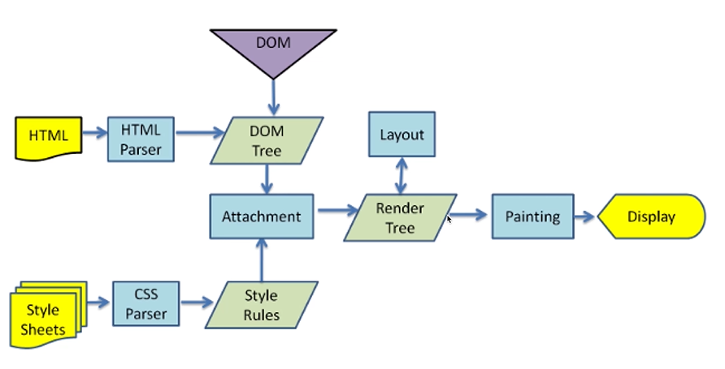

#
# 基础篇

## 1.Ajax-Fetch-Axios三者有什么区别?

> 三者都是用于网络请求，只不过维度不同
> 
> Ajax(Asynchronous Javascript and XML),一种技术统称；
> 
> Fetch,一个具体的API
> 
> Axios(阿克硕死)，第三方库https://axios-http.com/
> 

```js
 function ajax1(method,url){
    const xhr = new XMLHttpRequest()
    xhr.open(method,url);
    xhr.onreadystatechange= () => {
        if(xhr.readystate !==4) return;
        if(xhr.status > 200 && xhr.status < 300){
            console.log("获取成功的数据=",xhr.response);
        }
    }
    xhr.send()
 }
 function ajax2(url){
    fetch(url).then((response)=>{
        console.log("获取成功的数据=",response)
    })
 }
```

## 2.防抖和节流有什么区别，分别用于什么场景-防抖

!> debounce和throttling 各有特点，在不同 的场景要根据需求合理的选择策略。<br>
如果事件触发是高频但是有停顿时，可以选择debounce； <br>
在事件连续不断高频触发时，只能选择throttling，因为debounce可能会导致动作只被执行一次，界面出现跳跃。

>防抖：限制执行次数，多次执行次数，只执行一次；
>
>代码实现重在清零 clearTimeout。防抖可以比作等电梯，只要有一个人进来，就需要再等一会儿。
>
>业务场景: 
>
>避免登录按钮多次点击的重复提交;
>
>调整浏览器窗口大小时，resize 次数太多，造成计算太多，此时需要——防抖

```js
function debounce (fn,wait=200){
 let timer
 return ()=>{
      clearTimeout(timer)
      timer= setTimeout(()=>{
            fn.apply(this, arguments)
       },wait)
     }
   }    
```
>节流：限制执行频率，有节奏的执行；
>
>代码实现重在开锁关锁 timer=timeout; timer=null。节流可以比作过红绿灯，每等一个红灯时间就可以过一批。
>
>业务场景：
>
>scoll事件，每隔一秒计算一下位置信息等；
>
>浏览器播放事件，每个一秒计算下进度信息等;
>

```js
function throttle (fn,wait=100){
 let timer
 return ()=>{
     if(timer) return 
      timer= setTimeout(()=>{
            fn.apply(this, arguments)
            timer=null
       },wait)
     }
   }    
```

## 3.什么时候不能使用箭头函数

>有什么缺点？
>
>什么时候不能用箭头函数？

### 1.箭头函数有什么缺点？
>没有arguments
>
>无法通过apply,call,bind 来改变this;(因为箭头函数的this都是父级作用域的this)
>

### 2.不适用的情况

>1.对象方法

```js
const obj = {
  name:'test',
  getName:()=>{
    return this.name
  }
}
console.log(obj.getName()) //报错
```
>2.原型方法

```js
const obj = {
  name:'test',
}
obj._proto_.getName=()=>{
  return this.name
}
console.log(obj.getName()) //报错
```

>3.构造函数
```js
const Foo=(name,city)=>{
  this.name=name
  this.city=city
}
const f=new Foo('test','北京')
```
>4.动态上下文的回调函数

```js
const btn1=document.getElementById('btn1')
btn1.addEventListener('click',()=>{
  //console.log(this==window)
  this.innerHTML='clicked'
})
```
>5.Vue生命周期和method
>
>因为vue本质其实是对象
>
>class里面可以使用箭头函数

## 4.请描述TCP三次握手和四次挥手

> 握手就是TCP连接
> 
> 三次握手就是建立TCP连接
> 
> client 发-> server 收
> 
> server 发-> client 收
> 
> client 发-> server 收
> 
> 挥手就是TCP断开
> 
> 四次挥手就是关闭连接
>
> client 发-> server 收
> 
> server 发-> client 收
>
> server 发-> client 收
>
> client 发-> server 收

## 5.JS中for-in和for-of有什么区别

>区别一
>for...in遍历得到key
>
>for...of遍历得到value

```js
const arr=[10,20,30]
for(let key in arr){
  console.log(key) //0,1,2
}
function foo(){
  for(let arg of arguments){
    console.log(arg)//100，200，'aaa'
  }
}
foo(100,200,'aaa')
```
>区别二
>
>遍历对象：for...in可以，for...of不可以(会报错！)
>
>遍历Map Set:for...of可以，for...in不可以（没有结果！）
>
>遍历generator：for...of可以，for...in不可以（没有结果！）
```js
const set = new Set([10,20,30])
for(let item of set){
  console.log(item)//10,20,30
}

const map=new Map([[0,'aa'],[1,'bb']])
for(let item of map){
  console.log(item)
  // [0, 'aa']
  // [1, 'bb']
  }
```

?> **可枚举vs可迭代**<br/>
 for...in用于可枚举数据，如对象、数组、字符串<br/>
 for...of用于可迭代数据，如数组、字符串、Map、Set;

## 6.连环问for await...of 有什么作用？
>用于遍历多个promise对象，相当于Promise.all的替代品

```js
function createPromise(data) {
  return new Promise((resolve,reject)=>{
    setTimeout(()=>{
      resolve(data)
    },1000)
  })
}
(async function () {
  const p1 = createPromise(100)
  const p2 = createPromise(200)
  const p3 = createPromise(300)
  const res1 = await p1
  const res2 = await p2
  const res3 = await p3
  const list=[p1,p2,p3]
  Promise.all(list).then=>(
    res=>console.log(res)
  )
  for await(let res of list){
    console.log(res)
  }
  //上部分是并发，想要一个一个串行，就是什么时候用什么时候去创建
  const res1=await createPromise(100)
  const res2=await createPromise(200)
  const res3=await createPromise(300)
})()
```
>业务场景：
>用户批量上传图片，一次性并发上传就用上面的，一个一个上传就用下面的

## 7.offsetHeight-scrollHeight-clientHeight 盒子模型概念

>**盒子模型概念**
>
>width/height/padding/border/margin/box-sizing:border-box
>设置了box-sizing 实际内容content width=初始设置的-border*2-padding*2
>
>计算规则：
>
>offsetHeight/offsetWidth border+padding+content
>
>clientHeight/clientWidth padding+content
>
>scrollHeight/scrollWidth padding+实际的内容尺寸


## 8.HTMLCollection和NodeList有什么区别？

> HTMLCollection是Element的集合；
>
> NodeList是Node的集合；
>
>两者不是数组而是类数组；
>
 
>

?>类数组转换成数组<br>
const arr1=Array.from(list);<br>
const arr2=Array.prototype.slice.call(list)<br>
const arr3=[...list]

## 9.Vue中computed和watch有什么区别?

!> 两者用途不同<br>
computed 用于计算产出新的数据；<br>
watch 用于监听现有的数据；<br>
computed有缓存而watch是没有的；<br>

## 10.Vue组件通讯方式

### 1.通讯汇总：
>props和$emit
>
>自定义事件
>
>$attrs 是props和$emit的候补 dom上挂载属性跟是不是唯一节点有关系；可以用 v-bind="$attrs" 来实现层级透传；
>
>$parent 需要在mounted 去进行调用
>
>$refs 需要在mounted 去进行调用
>
>provide/inject  动态获取 provide需要用computed声明函数并且返回想要传递的数据
>
>```js
> //传递静态数据
> provide:{info:'aaa'}
> //传递响应式数据
> provide(){
>  return {
>    info: computed(()=>this.name)
>   }
> }
>```
>
>vuex

### 2.不同场景

* 父子组件
* 上下级组件（跨多级）通讯
* 全局组件

## 11.action和mutation有什么区别

>mutation 原子操作；必须同步代码
>
>action 可包含多个mutation;可包含异步代码；

## 12.JS严格模式有什么特点？

>'use strict' 全局或者函数引入
>
>全局变量必须先声明
>
>禁止使用with
>
>禁止this指向window
>
>创建eval作用域
>
>函数参数不能重名


## 13.HTTP跨域时为何要发送options请求?

### 跨域请求

* 浏览器同源策略
* 同源策略一般限制Ajax网络请求，不能跨域请求server
* 不会限制 `<link><scrip><iframe>` 加载第三方资源

### 浏览器发送options预检请求的前提：
* 在非简单请求且跨域的情况下，浏览器会发送options预检请求；
* `简单请求`
*  1.请求方法：get post
*  2.http请求头信息不超过以下字段
*    Accept
*    Accept-Language
*    Content-Language
*    Last-Event-ID
*    Content-Type：只限于（application/x-www-form-urlencoded、multipart/form-data、text/plain）
* `复杂请求`
* 非简单请求即为复杂请求，常见复杂请求有：
*    1.请求方法：put delete
*    2.Content-Type字段类型胃：application/json
*    3.添加额外的http header 比如：access_token
*    在跨域的情况下，非简单请求会先发起一次空body的OPTIONS预检请求用于向服务器请求权限信息，等预检请求被成功响应后，才会发起真正的http请求；
*    浏览器的预检请求可以通过设置：Access-Control-Max-Age进行缓存
### 解决跨域的方法

#### I.JSONP -script 标签去请求

#### II.CORS（靠丝） -设置请求头允许跨域

!>总结
options请求，是跨域请求之前的预检查；<br>
浏览器自行发起的，无需我们干预；<br>
不会影响实际功能；<br>

# 深度篇——原理

## 1.JS内存垃圾回收用什么算法
>
>垃圾回收：函数已经执行完了 再也用不到的一些对象和数据
>
>引用计数（之前） 循环引用出现一些缺陷， 引用次数为0则被清除
>
>标记清除（现代）从js的根（window）下逐步遍历，只要能找到的就保留，没有找到就清除

### I.【连环问】JS闭包是内存泄漏吗
>
>闭包不是内存泄漏，但是闭包的数据不会被垃圾回收

### II.如何检测JS内存泄漏
>
>泄漏的情况就是一直上升，正常的情况是锯齿上升下降高低形状
>
>可使用 Chrome devTools 的Performance 和 Memory 工具来检测 js 内存

 


### III.JS内存泄漏的场景有哪些(Vue为例) 
>
>被全局变量、函数引用，组件销毁时未清除 (window定义的变量和函数 要去销毁 赋值为 null)
>
>被全局事件、定时器引用，组件销毁时未清除 (setInterval ,clearInterval,window.addEventListen,window.removeEventListener)
>
>被自定义事件引用，组件销毁时未清除 (event)

### IV.WeakMap WeakSet 
> 弱引用 ，weakMap的key 只能是引用类型
> 
> 没有length,size ,也不能用foreach 只能用get去控制；
> 
> 不会影响垃圾回收，也不会带来内存泄漏的风险

## 2.浏览器和nodejs事件循环（EventLoop）有什么
> js 是单线程的（无论在浏览器还是nodejs）
> 
> 浏览器中js执行和DOM渲染共用一个线程
> 
>异步

`浏览器异步——宏任务和微任务`

* 宏任务，如 setTimeout setInterval 网络请求
* 微任务，如 promise async/await
* 微任务在下一轮`DOM渲染`之前执行，宏任务在之后执行

```js
console.log('start')
setTimeout(()=>{
  console.log('timeout')
})
Promise.resolve().then(()=>{
  console.log('Promise then')
})
console.log('end')
//start end  Promise then  timeout
//队列先进先出，宏任务队列（MarcoTask Queue） 微任务队列（MicroTask Queue）
```
`nodejs异步——宏任务和微任务`
* Nodejs同样使用ES语法，也是单线程，也需要异步
* 异步任务也分：宏任务 + 微任务
* 但是，它的宏任务和微任务，分不同`类型`，有`不同优先级


>nodejs `宏任务`类型和优先级(高到低)
>
>Timers - setTimeout setInterval
>
>V/O callbacks - 处理网络、流、TCP 的错误回调
>
>Idle, prepare- 闲置状态（nodejs 内部使用）
>
>Poll 轮询 -执行 poll 中的I/0队列
>
>Check 检查 - 存储 setimmediate 回调
>
>Close callbacks - 关闭回调，如 socket.on('close' )


>nodejs `微任务`类型和优先级
>
>包括：promise, async/await, process.nextTick
>
>注意，process.nextTick 优先级最高
>

?>`nodejs event loop` <br/>
• 执行同步代码 <br/>
• 执行微任务（process.nextTick 优先级更高）<br/>
• 按顺序执行 6 个类型的宏任务（ 每个结束时都执行当前的微任务）<br/>

!>`注意事项` <br/>
• 推荐使用 setImmediate 代替 process.nextTick* <br/>
• 本文基于nodejs 最新版本。nodejs 低版本可能会有不同 <br/>
```js
    console.info('start')
    setImmediate(() => {
      console.info("setImmediate')
    })
    setTimeout(()=>
      console.info("timeout)
    })
    Promise.resolve().then(()=> 
      console.info("promise then')
    })
    process.nextTick(()=>{
      console.info(nextTick)
    })
    console.info("end" )

//start end nextTick  promise then timeout setImmediate
```
## 3.vdom真的很快？

* Virtual DOM ，虚拟DOM
* 用JS对象模拟DOM节点数据
* 由React最先推广的
* Vue React 数据驱动视图这是比较核心的;只关注业务数据，而不用再关心DOM的变化

>vdom 并不快，js直接操作DOM才是最快的
>
>但“数据驱动视图”要有合适的技术方案，不能全部DOM重建
>
>vdom就是目前最合适的技术方案（并不是因为它快，而是合适）
>
>svelte 组件编译更准确，像外科手术式操作DOM,像JQuery那样操作Dom,但没有Vue、React稳定

## 4.遍历数组，for 和 forEach 哪个快？

>时间复杂度都是O(n)
>
>但是for比forEach更快一些
>
>forEach 每次都要创建一个函数来调用，而for不会创建函数
>
>函数需要独立的作用域，会有额外的开销

!>越`低级`的代码，性能往往越好 <br/>
日常开发别只考虑性能，forEach 代码可读性更好

## 5.nodejs如何开启多进程，进程如何通讯-进程和线程的,使用child_process或者cluster(集群)

!>`进程`**process** vs `线程` **thread** <br/>
• 进程，OS(操作系统) 进行资源分配和调度的最小单位，有独立内存空间；线程，OS 进行运算调度的最小单位，共享进程内存空间 <br/>
• 一个进程包含多个线程，进程之间是独立的
• JS是单线程的，但可以开启多进程执行，如 WebWorker <br/>

!>`为何需要多进程？`  <br/>
• 多核CPU，更适合处理多进程，内存较大，多个进程才能更好的利用（单进程有内存上限,内存利用不高，资源浪费），总之，“压榨〞机器资源，更快，更节省！ <br/>

>**nodejs**开启多进程可以使用开启子进程 child_process.fork 和 cluster.fork,使用send和on传递消息 
>
>实际工作中可以使用PM2插件帮助我们做进程守护

?>**使用 child_process 的方式**
```js
//主进程-process-fork
const http = require('http')
const fork = require('child_process').fork

const server = http.createServer((req,res)=>{
  if(req.url === 'get_sum'){
    console.info('主进程 id',process.pid)

    //开启子进程
    const computeProcess = fork('./compute.js')
    computeProcess.send('开始计算')

    computeProcess.on('message',data=>{
      console.info('主进程接受到的信息：',data)
      res.send('sum is '+data)
    })

     computeProcess.on('close',data=>{
      console.info('子进程因报错而退出')
      computeProcess.kill()
      res.send('error ')
    })
  }
})
server.listen(3000,()=>{
  console.info('localhost:3000')
})
```

```js
  //子进程-compute
  function getSum(){
    let sum = 0
    for(let i = 0;i < 10000;i++){
      sum += i
    }
    return sum
  }

  process.on('message',data=>{
      console.info('子进程 id',process.pid)
      console.info('子进程接受到的信息：',data)

      const sum = getSum()
      //发送消息给主进程
      process.send(sum)
    })
```
?>`打印的结果` <br/>
>localhost:3000
>
>主进程 id 80780
>
>子进程 id 80781
>
>子进程接受到的信息：开始计算
>
>主进程接受到的信息：49995000
>
?>**使用 cluster 的方式** <br/>

```js
  const http = require('http')
  const cpuCoreLength = require('os').cpus().length
  const cluster = require('cluster')

  if(cluster.isMaster){
    for(let i=0;i<cpuCoreLength;i++){
      cluster.fork() //开启子进程
    }
  cluster.on('exit',worker=>{
    console.log('子进程退出')
    cluster.fork() //进程守护
  })
  }else{
    //多个进程会共享一个TCP连接，提供一份网络服务
    const server =  http.createServer((req,res)=>{
    res.writeHead(200)
    res.end('done')
    })
    server.listen(3000)
  }

```
## 6.js-bridge的实现原理

?>小游戏： chrome://dino/
`JS Bridge常用的实现方式`
* 注册全局API (简单的封装)
* URL Scheme (推荐)

```js
//封装JS-bridge
const sdk = {
    invoke(url, data = {}, onSuccess, onError) {
      const iframe = document.createElement("iframe") 
      iframe.style.visibility ='hidden'
      document.body.appendChild(iframe)
      iframe.onload = () => {
          const content = iframel.contentWindow.document.body.innerHTML
          onSuccess(JSON.parse(content))
          iframe.remove()
      }
      iframe.onerror = () => {
      onError()
      iframe.remove()
      iframe.src= `my-app-name://$(url}?data=${JSON.stringify(data)}`
      }
    }
    fn1(data, onSuccess, onError) {this. invoke('api/fn1', data, onSuccess, onError)}
    fn2(data, onSuccess, onError) {this.invoke('api/fn2', data,onSuccess, onError)}
}
  sdk.fn1()

```
## 7.requestIdleCallback  和 requestAnimationFrame 区别
> requestAnimationFrame 每次渲染完都会执行，高优
> requestIdleCallback 空闲时才会执行，低优 
> 都是宏任务
> 

```html
<html>
<body>
  <button id='btn1'>change</button>
  <div id="box"></div>
<script>
    const box = document.getElementById( 'box' )
    
    document.getElementById('btn1').addEventListener('click',()=>{
        let curWidth = 100
        const maxwidth= 400
        function addwidth(){
        curWidth = curWidth + 3
        box.style.width =
        `${curwidth}px`
            if (curwidth < maxWidth) {
              //requestIdleCallback实现效果一样
            window.requestAnimationFrame(addwidth)//时间不用自己控制
            }
        }
        addwidth()
    })
</script>
</body>
</html>
```

?>执行先后顺序


```js
//执行顺序：start end timeout requestAnimationFrame requestIdleCallback 
    window.onload = () => {
      console.info("start')
      setTimeout(() => {
      console.info('timeout )
      })
      window.requestIdleCallback(()=>
      {
        console.info('requestIdleCallback")
      })
      window.requestAnimationFrame(()=>
      {
        console.info('requestAnimationFrame")
      })
      console.info("end')
    }
```
## 8.vue生命周期

?>`beforeCreate` <br/>* 创建一个空白的Vue实例<br/>* data method 尚未被初始化，不可使用<br/>`create` <br/>* Vue实例初始化完成，完成响应式绑定<br/>* data method 都已经初始化完成，可调用<br/>* 尚未开始渲染模板`beforeMount` <br/>* 编译模板，调用render 生成vdom<br/>* 还没有开始渲染DOM<br/>`mounted` <br/>* 完成DOM渲染<br/>* 组件创建完成<br/>* 开始由“创建阶段”进入“运行阶段”<br/>`beforeUpdate` <br/>* data发生变化之后<br/>* 准备更新DOM(尚未更新DOM)<br/>
`updated` <br/>* data发生变化,且DOM更新完成<br/>* （不要在updated中修改data,可能会导致死循环）<br/>
`beforeUnmount` <br/>* 组件进入销毁阶段（尚未销毁，可正常使用）<br/>* 可移除、解绑一些全局事件、自定义事件<br/>
`unmounted` <br/>* 组件被销毁了<br/>* 所有子组件也都被销毁了<br/>
`补充说明——keep-alive组件`<br/>* onActivated缓存组件被激活<br/>* onDeactivated缓存组件被隐藏<br/>

!>Vue什么时候操作DOM比较合适
* mounted和updated都不能保证子组件全部挂载完成
* 使用$nextTick渲染DOM

```js
mounted(){
  this.$nextTick(function(){
    //仅在整个试图都被渲染之后才会运行的代码
  })
}
```
!>Ajax应该在哪个生命周期？
* created和mounted
* 推荐mounted
## 9.Vue2 Vue3 React 三者diff算法有什么区别？

?>Vue2-双端比较<br/> <br/>Vue3-最长递增子序列<br/> <br/>React-仅右移<br/> 


`Vue React 为何循环时必须使用 key?`
* vdom diff 算法会根据 key 判断元素是否要删除
* 匹配了 key ，则只移动元素 -性能较好
* 未匹配key ，则删除重建-性能较差

 

 

`介绍diff 算法`
* diff 算法很早就有
* diff 算法应用广泛，例如 github 的Pull Request 中的代码 diff
* 如果要严格 diff 两棵树 ，时间复杂度 O（n^3)，不可用

`Tree diff 的优化——时间复杂度降到O(n)`
* 只比较同一层级，不跨级比较tag 不同则删掉重建（不再去比较内部的细节）
* 子节点通过 key 区分（key 的重要性）
## 10.Vue-router-MemoryHistory(abstract')？

?>Vue-router 三种模式<br/>`Hash` <br/>* location.hash->带 # <br/>`WebHistory`<br/> * history. pushState<br/> * window. onpopstate<br>`MemoryHistor`（ V4 之前叫做 abstract history)<br/> * 页面渲染正常，没有路由映射（就是IP+端口号），没有前进和后退<br/>`扩展：React-router 也有相同的 3 种模式`


# 广度篇 #
## 1.移动端H5点击有300ms延迟，该如何解决
> 背景：double tap to zoom (轻点两下缩放)
> fastclick (初期解决方案)
> width = device-width (标准协议解决，要做响应式 所以没有必要做300ms延迟)

fastclick实现及原理

```js
window.addEventListener('load',function(){
  FastClick.attach(document.body)
},false)

//FastClick原理
//监听touchend事件（touchstart touchend 会先于click 触发）
//使用自定义DOM事件模拟一个click事件
//把默认的click事件（300ms之后触发）禁止掉

```
## 2.HTTP请求中token和cookie有什么区别
>
>cookie:HTTP标准，跨域限制，配合session使用
>
>token:无标准，无跨域限制，用于JWT

?>**cookie**<br>
HTTP无状态，每次请求都要带cookie,以帮助识别身份<br>
服务端也可以向客户端set-cookie,cookie大小限制4kb<br>
默认有跨域限制：不可跨域共享、传递cookie(withCredentials允许跨域传递)<br>
HTML5之前cookie常被用于本地存储<br>
HTML5之后推荐使用localStorage和sessionStorage<br>
现代浏览器开始禁止第三方cookie,打击第三方广告，保护个人隐私，新增SameSite:Strict/Lax/none<br/>
cookie+session是常用的登录验证解决方案；


?>**token**<br>
cookie是HTTP规范，而token是自定义传递<br>
cookie会默认被浏览器存储，而token需自己存储<br>
token默认没有跨域限制<br>
`JWT(JSON Web TOken)`<br>
请求头带着token信息<br>

!>如有严格管理用户信息的需求（保密、快速封禁）推荐Session<br/>
如没有特殊要求，则使用JWT(如创业初期的网站)


`实现单点登录（SSO）`

1.cookie (主域名相同，可实现cookie传递，校验ticket)
2.OAuth 2.0 (第三方授权) 

## 3.HTTP协议和UDP协议有什么区别
>
>HTTP协议在应用层
>
>TCP UDP协议在传输层
>
>TCP有连接，有断开，稳定传输
>
>UDP无连接，无断开，不稳定传输，但效率高
>
>严格来说，应该拿TCP和UDP进行比较

>TCP协议
* 有连接（三次握手）
* 有断开（四次挥手）
* 稳定传输

>TCP协议
* 无连接无断开
* 不稳定传输，但效率高
* 如视频会议，语音通话

>HTTP协议1.0 1.1 2.0有什么区别
* HTTP协议1.0: 最基础的HTTP协议，支持基本的GET、POST方法
* HTTP协议1.1：缓存策略cache-control E-tag等；支持长连接Connection:keep-alive,一次TCP连接多次请求；支持断点续传，状态码206；支持新的方法PUT DELETE等，可用Restful API
* HTTP协议2.0：可压缩header,减少体积；多路复用，一次TCP连接中可以多个HTTP并行请求；服务端推送；

## 4.HTTPS中间人攻击，如何预防？

> HTTPS加密传输

* HTTP明文传输
* HTTPS加密传输，HTTPS+TLS/SSL;对称加密和非对称加密

 

 

## 5.script标签的defer和async有什么区别?

 

>无：HTML暂停解析，下载JS,执行JS,再继续解析HTML
>
>defer：HTML继续解析，并行下载JS,HTML解析完再执行JS
>
>async：HTML继续解析，并行下载JS,执行JS,再解析HTML
>
>执行JS不能并行但是下载JS支持并行
>

?>prefetch和dns-prefetch <br/>
* prefetch 是资源预获取（和preload相关）
* dns-prefetch是DNS预查询（和preconnect相关）

>preload 资源在当前页面使用，会优先加载
>
>prefetch 资源在末来页面使用，空闲时加载
>
```html
<head>
<!--preload -->
<link rel="preload" href="style.css" as="style">
<link rel="preload" href="main.js" as="script">
<!--prefetch -->
<link rel="prefetch" href="other.js" as="script">
<!--引用 css-->
<link rel="stylesheet" href="style.css">
</head>
<body>
<!--引用 css-->
<script src="main.js" defer></script>
</body>
```

>dns-prefetch 即 DNS 预查询
>
>preconnect 即 DNS 预连接
>
```html
<html>
  <head>
      <link rel="dns-prefetch" href="https://fonts.gstatic.com/">
      <link rel="preconnect" href="https://fonts.gstatic.com/" crossorigin>
  </head>
  <body>
  </body>
</html>
```
## 6.前端攻击手段有哪些，该如何预防?
>XSS
* Cross Site Script跨站脚本攻击
* 手段：黑客将JS代码插入到网页内容中，渲染时执行JS代码
* 预防：特殊字符替换（前端或者后端）
* vue中用v-html会发生XSS攻击，其他的vue不会

>CSRF
* Cross Site Request Forgery 跨站请求伪造
* 手段：黑客诱导用户去访问另一个网站的接口，伪造请求
* 预防：严格的跨域限制+验证码机制

>点击劫持
* Click jacking
* 手段：诱导界面上蒙一个透明的iframe,诱导用户点击
* 预防：让iframe不能跨域加载（X-frame-options:sameorigin）

>DDoS
* Distribute denial-of-service 分布式拒绝服务
* 手段：分布式的、大规模的流量访问，使服务器瘫痪
* 预防：软件层不好做，需要硬件预防（如阿里云WAF）

>SQL注入
* 手段：黑客提交内容时写入SQL语句，破坏数据库
* 预防：处理输入的内容，替换特殊字符看，

## 7.WebSocket和HTTP协议的区别?

>webSocket
* 支持端对端通讯
* 可以由client发起，也可以由server发起
* 用于：消息通知，直播间讨论区，聊天室，协同编辑

>WebSocket连接过程
* 先发送一个HTTP请求
* 成功之后再升级到WebSocket协议，再通讯

>WebSocket和HTTP协议的区别
* WebSocket协议名是ws://，可双端发起请求
* WebSocket没有跨域限制
* 通过send和onmessage通讯（HTTP通过req和res）

 

 

 

 

 

>WebSocket和HTTP长轮询的区别
* HTTP长轮询：客户端发起请求，服务端阻塞，不会立即返回，需要处理timeout机制，处理完timeout之后重新发送请求；
* WebSocket:客户端可发起请求，服务端也可发起请求

## 8.从输入URL 到网页显示的完整过程

>关键点：网络请求，解析,渲染
>
>DNS查询（得到IP）,建立TCP连接（三次握手）
>
>浏览器发起HTTP请求
>
>收到请求响应，得到HTML源代码
>
>解析HTML过程中，遇到静态资源还会继续发起网络请求，JS、CSS图片 视频等（静态资源有可能强缓存，此时不必请求）
>
>HTML构建DOM树
>
>CSS构建CSSOM树（style tree）
>
>两者结合，形成render tree
>
>解析优化有：CSS放在Head中，不要异步加载CSS,JS放在body最下面（或合理使用defer async）,img提前定义width height；
>
>Render Tree绘制到页面，计算各个DOM的尺寸、定位最后绘制到页面,遇到JS可能会执行（参考defer async因为html和js共用一个线程），异步CSS、图片加载，可能会触发重新渲染；
>
>网络请求：DNS解析，HTTP请求
>
>解析：DOM树，CSSOM树，Render Tree
>
>渲染：计算、绘制，同时执行JS
>
 

## 9.网页重绘repaint和重排reflow有什么区别

* 网页只要有变化就会有重绘和重排；
* 重排比重绘影响更大，消耗也更大，所以进行减少无意义的重排；
* 减少重排：集中修改样式，或直接切换css class,修改前先设置display:none,脱离文件流，使用BFC特性不影响其他元素的位置，频繁触发（resize scroll）使用节流和防抖,使用createDocumentFragement批量操作DOM,优化动画使用CSS3和requestAnimationFrame


?>`重绘repaint`<br>元素外观改变，如颜色、背景色，但元素的尺寸、定位不变，不会影响其他元素的位置；<br>`重排reflow`<br>重新计算尺寸和布局，可能会影响其他元素的位置<br>如元素高度增加，可能会使相邻元素位置下移；

?>BFC（Block Format Context块级格式化上下文）特性：内部的元素无论如何改动，都不会影响其他元素的位置<br>触发BFC条件：<br>* 根节点<html> <br> * float:left/right <br> * overflow:auto/scroll/hidden <br> * display:inline-block/table/table-row/table-cell <br> * display:flex/grid 的直接子元素 <br> * position:absolute/fixed;


## 10.如何实现网页多标签通讯

?>`WebSocket`<br>无跨域限制，需要服务端支持，成本高；<br>`localStorage通讯`<br>同域的A和B两个页面，A页面设置localstorage,B页面可监听到localstorage值的修改（addEventListener监听storage事件）<br>`SharedWorker通讯`<br>SharedWorker是WebWorker的一种，WebWorker可开启子进程执行JS,但不能操作DOM,SharedWOrker可单独开启一个进程，用于同域页面通讯(chrome隐私模式开启调试，不支持IE11)

## 11.如何实现网页和iframe通讯
>postmessage 发送消息,第一参数是发送消息，第二个参数就是目标域名信息，不跨域用*表示，监听事件message，接受也可以判断域名合法性；

## 12.Koa2洋葱圈模型

>Koa2
* 一个简约、流行nodejs框架
* 通过中间件组织代码
* 多个中间件以洋葱圈模型执行

!>await 和 async,异步编程原理；


# 工作经验篇 #

## 1.H5页面如何进行首屏优化

* **移动端H5要结合App能力去优化**
* `路由懒加载`
*  适用于SPA(不适用MPA)
*  路由拆分，优先保证首页加载
*  `服务端渲染SSR`
*  传统前后分离（SPA）渲染页面过程复杂
*  SSR渲染页面过程简单，所以性能好
*  如果是纯H5页面，SSR是性能优化的终极方案(但成本也高)
*  Nuxt.js(vue) Next.js(React)
*  `App预取`
*  如果H5在APP WebView中展示，可使用APP预取
*  比如用户访问列表页时，App预加载文章首屏内容
*  用户进入H5页，直接从App中获取内容，瞬间展示首屏
*  `分页`
*  针对列表页
*  默认只展示第一页内容
*  上划加载更多
*  `图片懒加载lazyLoad`
*  针对详情页
*  默认只展示文本内容，然后触发图片懒加载
*  注意：提前设置图片尺寸，尽量只重绘不重排
*  `Hybrid`
*  提前将HTML JS CSS 下载到APP内部
*  在APP webview 中使用file://协议加载页面文件
*  再在Ajax获取内容并展示（也结合App预取）

?> 性能优化要配合分析、统计、评分等，做了事情要有结果<br>性能优化要配合体验，如骨架屏、loading动画等

## 2.后端一次性返回10w条数据，你该如何渲染

* `设计不合理`
*  后端返回10w本身技术方案设计就不合理；
*  可以先主动说明，查明面试官意向，非要这么做，提供解决方案；
*  `1.自定义中间件`
*  自定义nodejs中间层，获取并拆分这10w条数据
*  前端对接nodejs中间层，而不是服务端
*  成本较高
*  `2.虚拟列表`
*  只渲染可视区域DOM
*  其他隐藏区域不显示，只用div撑起高度
*  随着浏览器滚动，创建和销毁DOM
*  虚拟列表实现起来非常复杂，可借用第三方lib
*  Vue-virtual-scroll-list
*  React-virtualiszed

!>主动沟通，表达观点；<br>后端问题首要用后端思维去解决——中间层；<br>虚拟列表无奈选择，实现复杂而效果不一定好（低配手机）

## 3.前端的常用的设计模式和使用场景？
> 设计原则：开放封闭原则，对扩展开发，对修改封闭；
>
> `工厂模式`：用一个工厂函数创建实例，隐藏new；jQuery &函数
>
> `单例模式`：全局唯一的实例（无法生成第二个）；如vuex redux的store,全局唯一的dialog modal
> 
> JS是单线程，创建单例很简单；Java是支持多线程的，创建单例要考虑锁死线程，否则多个线程同时创建，单例就重复了（多线程共享进程内存）
> 
> `代理模式`:使用者不能直接访问对象，而是访问一个代理层，在代理层可以监听get set 做很多事情，如ES6 Proxy 实现Vue3的响应式；
> 
> `观察者模式`：window.addEventListener('click',()=>{...})
> 
> `发布订阅`：event.on('event-key',()=>{...}) 绑定事件要记得解绑，防止内存泄漏
> 
> `装饰器模式`：nest.js

?>`观察者模式` VS `发布订阅` <br>Subject 和 Observer直接绑定，没有中间媒介； <br>PUblisher 和 Observer互不认识，需要中间媒介 Event channel,如 EventBus自定义事件

## 3.实际工作中，做过的vue优化？
> `V-if 和 v-show`
> 
> v-if 销毁组件，v-show 使用css隐藏组件
> 
> 大部分使用v-if更好，不要过度优化
> 
> `v-for使用key`
> 
> `使用computed缓存`
> 
> `keep-alive缓存组件`
> 
> `异步组件` 体积比较大的组件
> 
> `路由懒加载`
> 
> `服务端渲染 SSR` 可使用Nuxt.js 按需加载
> 
  
## 4.使用vue遇到哪些坑？ 

> 1.内存泄漏——越来越慢
> 
>  * 全局变量，全局事件，全局定时器，自定义事件
> 
> 2.Vue2响应式的缺陷(vue3不再有)
> 
>  * data新增属性Vue.set
> 
>  * data删除属性用Vue.delete
> 
>  * 无法直接修改数据 arr[index]=value
> 
> 3.路由切换时scroll到顶部
> 
>  * 列表页缓存数据和scrollTop的值
> 
>  * 当再次返回列表页时，渲染组件，执行scrollTo(xxx)
> 
>  * 终极方案：MPA+App WebView

?> 形成日常记录的好习惯，为了你自己！！！

## 5.如何统一监听Vue组件报错？
> 1.window.onerror
> 
>  * 全局监听所有JS错误
> 
>  * 但它是JS级别的，识别不了Vue组件信息
> 
>  * 捕捉一些Vue监听不到的错误,比如异步的报错
> 
> 2.errorCaptured 生命周期 （App.vue）
> 
>  * 监听所有**下级**组件的错误
> 
>  * 返回false会阻止向上传播 
> 
>  * 监听要重要的、有风险的组件错误
> 
> 3.errorHandler配置 (main.js)
> 
>  * Vue 全局错误监听，所有组件错误都会汇总到这里
> 
>  * 但是errorCaptured 返回false，就不会传播到这里
> 
>  * 和window.onerror 互斥
> 
>  * **异步错误** 无法捕获需要用window.onerror
> 
>  `Promise 未处理的catch需要 onunhandledrejection`
> 

## 6.如果一个H5很慢，如何排查性能问题

* `前端性能指标`
* First Paint(FP)
* Fist Contentful Paint(FCP)
* Fist Meaningful Paint(FMP) ——已弃之，改用LCP
* DomContentLoaded(DCL)
* Largest Contentfull Paint(LCP)
* Load(L)

> Chrome devTools
* Performance 可查看上述性能指标，并有网页快照
* Nework可以查看各个资源加载时间

> Lighthouse 测试报告
* npm install lighthouse

> **如果是网页加载慢**
* 优化服务端硬件配置，使用CDN
* 路由懒加载，大组件异步加载——减少主包的体积
* 优化HTTP缓存策略

> **如果是网页渲染慢**
* 优化服务端接口（如Ajax获取数据慢）
* 继续分析，优化前端组件内部的逻辑（参考Vue React 优化）
* 服务端渲染SSR

> **持续跟进**
* 性能优化是一个循序渐进的过程，不像bug一次性解决
* 持续跟进统计结果，再逐步分析性能瓶颈，持续优化
* 可使用第三方统计服务，如阿里云ARMS、百度统计

?> 要有`监控`，`持续跟进`的思维，解决了问题，还得保持住！！！

## 7.工作中遇到过哪些项目难点，如何解决的？

> **遇见问题要注意积累**
* 每个人都会遇到难题，总有几个问题让你抓耳挠腮
* 日常要注意积累，解决了问题就自己写文章复盘一下
* `如果之前没有积累`，就回顾一下半年之内你遇到的一个难题（肯定会有的）
* 想一下当时的解决方案，以及解决之后的效果
* 写一篇文章记录一下

!> `话术模板`<br/> 描述问题：背景+现象+造成的影响<br/>问题如何被解决：分析+解决 <br/>自己的成长：学到了什么+以后如何避免

# 手写篇 #
!> 高质量代码特点：编码规范性，功能完整性，鲁棒性<br>

## 1.手写一个JS函数，实现数组扁平化，只减少一级嵌套
>如 输入[1,[2,[3]],4],输出[1,2,[3],4]

```js
/**
 * 数组扁平化，使用push
 * @param arr
 * */
function flatten1(arr:any[]): any[] {
  const res: any[] = []
  arr.forEach(item => {
    if(Array.isArray(item)){
      item.forEach(n => res.push(n))
    }else{
      res.push(item)
    }
  })
  return res
}

/**
 * 数组扁平化，使用concat
 * @param arr
 * */
function flatten2(arr:any[]): any[] {
  let res: any[] = []
  arr.forEach(item => {
      res=res.concat(item)
  })
  return res
}
```

!>jest进行单元测试

```js
//测试一些些伪代码 详见jest
import {flatten1} from '../文件'
describe('数组扁平化',()=>{
  it('空数组',()=>{
   const res = flatten1([])
   expect(res).toEqual([])
  })
  it('非嵌套数组',()=>{
   const arr = [1,2,3]
   const res = flatten1(arr)
   expect(res).toEqual([1,2,3])
  })
  it('一级嵌套数组',()=>{
   const arr = [1,2,[10,20],3]
   const res = flatten1(arr)
   expect(res).toEqual([1,2,10,20,3])
  })
  it('二级嵌套数组',()=>{
   const arr = [1,2,[10,[100,200],20],3]
   const res = flatten1(arr)
   expect(res).toEqual([1,2,10,[100,200],20,3])
  })
})
```

## 2.手写一个JS函数，实现数组深度扁平化
>如 输入[1,[2,[3]],4],输出[1,2,3,4]

>`思路：`
* 先实现一级扁平化，然后递归调用，直到全部扁平

```js
/**
 * 数组深度扁平化，使用push
 * @param arr
 * */
function flattenDeep1(arr:any[]): any[] {
  const res: any[] = []
  arr.forEach(item => {
    if(Array.isArray(item)){
      const flatItem = flattenDeep1(item) //递归
      flatItem.forEach(n => res.push(n))
    }else{
      res.push(item)
    }
  })
  return res
}

/**
 * 数组扁平化，使用concat
 * @param arr
 * */
function flattenDeep2(arr:any[]): any[] {
  let res: any[] = []
  arr.forEach(item => {
    if(Array.isArray(item)){
      const flatItem = flattenDeep2(item) //递归
      res=res.concat(flatItem)
    }else{
      res=res.concat(item)
    }
  })
  return res
}
```

!>jest进行单元测试

```js
//测试一些些伪代码 详见jest
import {flattenDeep1} from '../文件'
describe('数组深度扁平化',()=>{
  it('空数组',()=>{
   const res = flattenDeep1([])
   expect(res).toEqual([])
  })
  it('非嵌套数组',()=>{
   const arr = [1,2,3]
   const res = flattenDeep1(arr)
   expect(res).toEqual([1,2,3])
  })
  it('一级嵌套数组',()=>{
   const arr = [1,2,[10,20],3]
   const res = flattenDeep1(arr)
   expect(res).toEqual([1,2,10,20,3])
  })
  it('二级嵌套数组',()=>{
   const arr = [1,2,[10,[100,200],20],3]
   const res = flattenDeep1(arr)
   expect(res).toEqual([1,2,10,100,200,20,3])
  })
   it('三级嵌套数组',()=>{
   const arr = [1,2,[10,[100,['a',[true],'b'],200],20],3]
   const res = flattenDeep1(arr)
   expect(res).toEqual([1,2,10,100,'a',true,'b',200,20,3])
  })
})
```

## 3.获取类型
> 手写一个getType函数，传入任意变量，可准确获取类型
> 
> 如 number string boolean 等值类型
> 
> 还有 object array map regexp等引用类型

> **常见的类型判断**
* typeof -只能判断值类型，其他就是function 和 object
* intanceof -需要两个参数来判断，而不是获取类型
* 

> 使用 Object.prototype.toString.call(x)
```js
/**
 * 获取数据类型
 * */
function getType(x:any[]):string{
  const originType = Object.prototype.toString.call(x) //'[Objec 'String']'此次有空格
  const spaceIndex = originType.indexOf(' ') //空格的index
  const type = originType.slice(spaceIndex + 1,-1) //'String'
  return type.toLowerCase() //'string'
}

```

!>jest进行单元测试

```js
//测试一些些伪代码 详见jest
import {getType} from '../文件'
describe('获取数据类型',()=>{
  it('null',()=>{
   expect(getType(null)).toBe('null')
  })
  it('undefined',()=>{
   expect(getType(undefined)).toBe('undefined')
  })
   it('number',()=>{
   expect(getType(100)).toBe('number')
   expect(getType(NaN)).toBe('number')
   expect(getType(Infinity)).toBe('number')
   expect(getType(-Infinity)).toBe('number')
  })
  it('string',()=>{
   expect(getType('abc')).toBe('string')
  })
  it('boolean',()=>{
   expect(getType(true)).toBe('boolean')
  })
  it('symbol',()=>{
   expect(getType(Symbol())).toBe('symbol')
  })
  it('bigint',()=>{
   expect(getType(BigInt(100))).toBe('bigint')
  })
  it('object',()=>{
   expect(getType({})).toBe('object')
  })
  it('array',()=>{
   expect(getType([])).toBe('array')
  })
  it('function',()=>{
   expect(getType(()=>{})).toBe('function')
   expect(getType(class Foo {})).toBe('function')
  })
  it('map',()=>{
   expect(getType(new Map())).toBe('map')
  })
  it('weakmap',()=>{
   expect(getType(new WeakMap())).toBe('weakmap')
  })
  it('set',()=>{
   expect(getType(new Set())).toBe('set')
  })
  it('weakset',()=>{
   expect(getType(new WeakSet())).toBe('weakset')
  })
  it('date',()=>{
   expect(getType(new Date())).toBe('date')
  })
  it('regexp',()=>{
   expect(getType(new RegExp(''))).toBe('regexp')
  })
  it('error',()=>{
   expect(getType(new Error())).toBe('error')
  })
  it('promise',()=>{
   expect(getType(Promise.resolve('ok'))).toBe('promise')
  })
})
```

## 4.new一个对象的过程是什么？手写代码表示

>创建对象
```js
function Foo(name){
  this.name = name
  this.city = 'beijing'
}
Foo.prototype.getName = function() { return this.name}
const f = new Foo('test')
f.getName() //'test'
class Foo1 {}
typeof Foo1 //'function'
```
### new一个对象的过程

* 创建一个空对象obj,继承构造函数的原型
* 执行构造函数（将obj作为this）
* 返回obj

```js
function customNew<T>(constructor:Function,...args:any[]):T{
  //1.创建一个空对象，继承构造函数的原型
  const obj = Object.create(constructor.prototype)
  //2.将obj作为this,执行constructor，传入参数
  constructor.apply(obj,args)
  //3.返回obj
  return obj
}

class Foo{
  name:string
  city:string
  constructor(name:string,n:number){
    this.name = name
    this.city = 'beijing'
    this.n = n
  }
  getName(){
    return this.name
  }
}

const f = customNew<Foo>(Foo,'test',100)

```


!>jest进行单元测试

```js
//测试一些些伪代码 详见jest
import {customNew} from '../文件'
describe('自定义new',()=>{
  it('new',()=>{
     class Foo{
      name:string
      city:string
      constructor(name:string,n:number){
        this.name = name
        this.city = 'beijing'
        this.n = n
      }
      getName(){
        return this.name
      }
    }

    const f = customNew<Foo>(Foo,'test',100)
    expect(f.name).toBe('test')
    expect(f.city).toBe('beijing')
    expect(f.n).toBe(100)
    expect(f.getName()).toBe('test')
  })
})
```
**object.create 和 {} 区别**

* {}创建空对象，原型指向 Object.prototype
* Object.create 创建空对象，原型指向传入的参数
  
>
> const obj1 = {}
> 
> obj1.__proto__ === Object.prototype //true 
> 
> const obj2 = Object.create({x:100})
> 
> obj2.__proto__ === Object.prototype//false
> 
> obj2 //'{}'
> 
> obj2.__proto__  //{x:100}
> 

## 5.遍历DOM树

* 给你一个DOM树
* 深度优先遍历，结果会输出什么？
* 广度优先遍历，结果会输出什么？

```js
//遍历Dom tree
/**
 * 访问节点
 * @param n node
 * */
function visitNode(n: Node){
  if (n instanceof Comment){
    //注释
    console.info('Comment node ---',n.textContent)
  }
  if (n instanceof Text){
    //文本
    const t = n.textContent?.trim()
    if (t){
      console.info('Text node ----',t)  
    }
    
  }
  if (n instanceof HTMLElement){
    //element
    console.info('Element node ---',`<${n.tagName.toLowerCase()}>`)
  }
}

/**
 * 深度优先遍历——递归
 * @param root dom node
 * */
function depthFirstTraverse(root:Node){
  visitNode(root)
  const childNodes = root.childNodes //.childNodes(比children 多了一些文本 和 注释) 和 .children 不一样
  if (childNodes.length){
    childNodes.forEach(child => {
      depthFirstTraverse(child)
    })
  }
} 

/**
 * 深度优先遍历——栈
 * @param root dom node
 * */
function depthFirstTraverse1(root:Node){
   const stack:Node[] = []
   //根节点压栈
   stack.push(root)

   while (stack.length > 0){
     const curNode = stack.pop() // 出栈
     if(curNode == null) break

     visitNode(curNode)

     //子节点压栈
     const childNodes = curNode.childNodes
     if (childNodes.length > 0){
       //reverse 反顺序压栈
       Array.from(childNodes).reverse().forEach(child => stack.push(child))
     }
   }
} 
/**
 * 广度优先遍历
 * @param root dom node
 * */
function breadthFirstTraverse(root:Node){
   //定义一个队列
   const queue:Node[] = [] //数组 vs 链表
   //根节点入队列
   queue.unshift(root)

   while (queue.length > 0){
     const curNode = queue.pop()
     if (curNode == null) break

     visitNode(curNode)

     //子节点入队
     const childNodes = curNode.childNodes
     if (childNodes.length){
       childNodes.forEach(child => queue.unshift(child))
     }
   }
} 

const box = document.getElementById('box')
if(box == null) throw new Error('box is null')
//深度功能测试-递归、贪心,可以不用递归来实现，可以使用栈来实现
depthFirstTraverse(box)
//广度功能测试-使用队列（数组 vs 链表）
breadthFirstTraverse(box)
```

## 6.手写LazyMan,实现sleep机制

* 支持sleep和eat两种方法
* 支持***链式调用**

> **示例：**
> 
>  const me = new LazyMan('test')
> 
>  me.eat('苹果').eat('香蕉').sleep(5).eat('葡萄')
> 
>  // 'test eat 苹果'
> 
>  // 'test eat 香蕉'
> 
>  // (等待 5s)
> 
>  // 'test eat 葡萄'
> 
> **代码设计：**
> 
> 由于有sleep功能,函数不能直接在调用时触发
> 
> 初始化一个列表，把函数注册进去
> 
> 由每个item 触发 next 执行（遇到sleep则异步触发）
> 


```js

class LazyMan {
  private name:string
  private tasks:Function [] = [] //任务列表

  constructor(name:string){
    this.name = name
    setTimeout(()=>{
      this.next()
    })
  }

  private next() {
    const task = this.tasks.shift() //取出当前 tasks 的第一个任务
    if(task) task()
  }
  eat(food:string){
    const task = () =>{
      console.info(`${this.name} eat ${food}`)
      this.next() //立刻执行下一个任务
    }
    this.tasks.push(task)

    return this //链式调用
  }
  sleep(second:number){
    console.info(`${this.name}开始进入睡眠状态，请耐心等待`)
    const task = () =>{
      setTimeout(()=>{
        console.info(`${this.name}已经睡完 ${second}s,开始执行下一个任务！`)
        this.next()    
      },second*1000)
    }
    this.tasks.push(task)

    return this //链式调用
  }
} 

//功能测试
const me = new LazyMan('test')
me.eat('苹果').eat('葡萄').sleep(2).eat('香蕉').eat('西瓜')

//输出结果
//test eat 苹果
//test eat 葡萄
//test已经睡完 2s,开始执行下一个任务！
//test eat 香蕉
//test eat 西瓜

```
**划重点**
* 任务队列
* 触发next
* sleep 异步触发
  
## 7.手写curry函数，实现函数柯里化

**分析**
> curry返回的是一个函数fn
>
> 执行fn,中间状态返回函数，如 add(1)或者 add(1)(2)
>
> 最后返回执行结果，如add(1)(2)(3)

```js
function curry(fn: Function){
  const fnArgsLength = fn.length //传入函数的参数长度
  let args:ary[] = []

  //ts中，独立函数，this需要声明类型
  function calc(this:any,...newArgs:any[]){
    //积累函数
    args=[
      ...args,
      ...newArgs
    ]
    if(args.length < fnArgsLength) {
      //参数不够，返回函数
      return calc
    }else{
      //参数够了，返回执行结果
      return fn.apply(this,args.slice(0,fnArgsLength))
    }

  }
  return calc
}

//功能测试
function add(a:number,b:number,c:number):number{
  return a + b + c
}
//add(10,20,30) //60

const curryAdd = curry(add)
const res = curryAdd(10)(20)(30) //60
console.info(res)
```

!>jest进行单元测试

```js
//测试一些些伪代码 详见jest
import {curry} from '../文件'
describe('curry',()=>{
  it('curry',()=>{
    function add(a:number,b:number,c:number):number{
      return a + b + c
    }
    const res1 = add(10,20,30)
    const curryAdd = curry(add)
    const res2 = curryAdd(10)(20)(30) //60
    expect(res1).toBe(res2)
  })
})
```

## 8.instanceof原理是什么，请用代码表示
?>原型链相关的知识点

```js
/**
 * 自定义 instanceof
 * @param instance instance
 * @param origin class or function
 * */
function myInstanceof(instance:any,origin:any):boolean{
    if (instance == null) return false //null undefined

    const type = typeof instance
    if(type !== 'object' && type !== 'function'){
      //值类型
      return false
    }

    let tempInstance = instance //为了防止修改 instance
    while (tempInstance){
      if(tempInstance.__proto__ === origin.prototype){
         return true //配上了        
      }
      //未匹配上
      tempInstance = tempInstance.__proto__ //顺着原型链往上找
    }
    return false
}

//功能测试
console.info(myInstanceof({},Object))
```

!>jest进行单元测试

```js
//测试一些些伪代码 详见jest
import {myInstanceof} from '../文件'
describe('自定义 myInstanceof',()=>{
  it('null undefined',()=>{
      expect(myInstanceof(null,Object)).toBe(false)
      expect(myInstanceof(undefined,Object)).toBe(false)
  })
  it('值类型',()=>{
    expect(myInstanceof(100,Number)).toBe(false)
    expect(myInstanceof('abc',String)).toBe(false)
  })
  it('引用类型',()=>{
    expect(myInstanceof([],Array)).toBe(true)
    expect(myInstanceof({},Object)).toBe(true)
    expect(myInstanceof({},Array)).toBe(false)
  })
  it('函数',()=>{
    function fn(){}
    const res = myInstanceof(fn,Function)
    expect(res).toBe(true)
  })
  it('自定义',()=>{
    class Foo {}
    const f = new Foo()
    const res1 = myInstanceof(f,Foo)
    expect(res1).toBe(true)
    const res2 = myInstanceof(f,Object)
    expect(res2).toBe(true)
  })
})
```

## 9.手写函数bind

**bind应用**
* 返回一个新函数，但不执行
* 绑定this和部分参数
* 如是箭头函数，无法改变this，只能改变参数

**bind分析**
* 返回一个新函数
* 绑定this
* 同时绑定执行时的参数（apply或者call）

```js
Function.prototype.customBind = function(context:any,...bindArgs:any[]){
  //context 是 bind 传入的this 
  //bindArgs 是 bind 传入的各个参数

  const self = this //当前的函数本身

  return function (...args:any[]){
     //拼接参数
     const newArgs = bindArgs.concat(args)
     return self.apply(context,newArgs)
  }
}
//功能测试
function fn(this:any,a:any,b:any,c:any){
   console.info(this,a,b,c)
}
// fn(10,20,30)
const fn1=fn.customBind({x:100},10)
fn1(20,30)
```
!>jest进行单元测试

```js
//测试一些些伪代码 详见jest
import from '../文件'
describe('自定义bind',()=>{
  it('绑定 this',()=>{
    function fn(this:any){
      return this
    }
    const fn1 = fn.customBind({x:100})
    expect(fn1()).toEqual({x:100})
  })
   it('绑定 参数',()=>{
    function fn(a:number,b:number,c:number){
      return a+b+c
    }
    const fn1 = fn.customBind(null,10,20)
    expect(fn1(30)).toBe(60)
  })
})
```
## 10.手写函数call和apply

**call和apply应用**
* bind返回一个新函数（不执行），call和apply会立即执行函数
* 绑定this
* 传入执行参数

**call和apply分析**
* 如何在函数执行时绑定this
* 如：const obj = {x:100,fn(){this.x}}
* 执行obj.fn() ,此时fn内部的this 就指向 obj
* 可借此来实现函数绑定this

```js
//call
Function.prototype.customCall = function (context:any,...args:any[]){
  if (context ==null) context = globalThis //指向window
  if (typeof context !== 'object') context = new Object(context) //值类型，变为对象

  const fnKey = Symbol() //不会出现属性名称的污染或者覆盖
  context[fnKey] = this // this 就是当前的函数

  const res = context[fnKey](...args) //绑定了 this

  delete context[fnKey] //清理掉 fn ，防止污染

  return res
}

//apply
Function.prototype.customApply = function (context:any,args:any[] = []){
  if (context ==null) context = globalThis //指向window
  if (typeof context !== 'object') context = new Object(context) //值类型，变为对象

  const fnKey = Symbol() //不会出现属性名称的污染或者覆盖
  context[fnKey] = this // this 就是当前的函数

  const res = context[fnKey](...args) //绑定了 this

  delete context[fnKey] //清理掉 fn ，防止污染

  return res
}

//功能测试

function fn (this:any,a:any,b:any,c:any){
  console.info(this,a,b,c)
}
fn.customCall({x:100},10,20,30)
fn.customApply({x:200},[10,20,30])
```

!>jest进行单元测试

```js
//测试一些些伪代码 详见jest
import from '../文件'
describe('自定义call',()=>{
  it('绑定 this - 对象',()=>{
    function fn(this:any){
      return this
    }
    const fn1 = fn.customCall({x:100})
    expect(fn1).toEqual({x:100})
  })
  it('绑定 this - 值类型',()=>{
    function fn(this:any){
      return this
    }
    const fn1 = fn.customCall('abc')
    expect(fn1.toString()).toBe('abc')

    const fn2 = fn.customCall(null)
    expect(fn2).not.toBeNull()
  })
   it('绑定 参数',()=>{
    function fn(a:number,b:number,c:number){
      return a+b+c
    }
    const fn1 = fn.customCall(null,10,20，30)
    expect(fn1).toBe(60)
  })
})

describe('自定义apply',()=>{
  it('绑定 this - 对象',()=>{
    function fn(this:any){
      return this
    }
    const fn1 = fn.customApply({x:100})
    expect(fn1).toEqual({x:100})
  })
  it('绑定 this - 值类型',()=>{
    function fn(this:any){
      return this
    }
    const fn1 = fn.customApply('abc')
    expect(fn1.toString()).toBe('abc')

    const fn2 = fn.customApply(null)
    expect(fn2).not.toBeNull()
  })
   it('绑定 参数',()=>{
    function fn(a:number,b:number,c:number){
      return a+b+c
    }
    const fn1 = fn.customApply(null,[10,20，30])
    expect(fn1).toBe(60)
  })
})
```


## 11.手写EventBus自定义事件——包括on和once

**EventBus分析**
* on和once注册函数，存储起来
* emit时找到对应的函数执行
* off找到对应的函数，从存储中（对象）删除
* `区分on和once`
* on绑定的事件可以连续执行，除非off
* once绑定的函数emit一次即删除，也可以未执行而被off
* 数据结构上标识出on和once

```js
class EventBus {
  /**
   * 'key1':[
   * {fn: fn1,isOnce: false},
   * {fn: fn2,isOnce: false},
   * {fn: fn3,isOnce: true},
   * ]
   * 'key2':[]//有序
   * 'key3':[]
   * */
  private events:{
    [key:string]:Array<{fn: Function; isOnce: boolean}>
  }

  constructor(){
    this.events = {}
  }

  on(type:string,fn:Function,isOnce:boolean=false){
    const events = this.events
    if(events[type] == null){
      events[type] = [] //初始化key 的 fn 数组
    }
    events[type].push({fn,isOnce})
  }
  once(type:string,fn:Function){
    this.on(type,fn,true)
  }
  off(type:string,fn?:Function){
    if(!fn){
    //解绑所有的type函数
    this.events[type] = []
    }else{
      //解绑单个fn
      const fnList = this.events[type]
      if(fnList){
        this.events[type] = fnList.filter(item => item.fn !== fn)
      }
    }
  }
  emit(type:string,...args:any[]){
    const fnList = this.events[type]
    if(fnList ==null) return

    //注意
    this.events[type] = fnList.filter(item =>{
      const {fn, isOnce} = item
      fn(...args)
      
      //once 执行一次就要过滤掉
      if(!isOnce) return true
      return false     
    })
  }
}
  
const e = new EventBus()

function fn1(a:any,b:any){console.log('fn1',a,b)}
function fn2(a:any,b:any){console.log('fn2',a,b)}
function fn3(a:any,b:any){console.log('fn3',a,b)}

e.on('key1',fn1)
e.on('key1',fn2)
e.once('key1',fn3)

e.emit('key1',10,20) //触发fn1 fn2 fn3

e.off('key1',fn1)

e.emit('key1',10,20) //触发fn2 

```
>数据结构简单化方式实现EventBus

```js
class EventBus2{
    private events:{[key:string]:Array<Function>}// {key1:[fn1,fn2]}
    private onceEvents:{[key:string]:Array<Function>}

    constructor(){
      this.events = {}
      this.onceEvents = {}
    }

    on(type:string,fn:Function){
      const events = this.events
      if(events[type] == null){
        events[type] = [] //初始化key 的 fn 数组
      }
      events[type].push({fn})
  }

   once(type:string,fn:Function){
      const onceEvents = this.onceEvents
      if(onceEvents[type] == null){
        onceEvents[type] = [] //初始化key 的 fn 数组
      }
      onceEvents[type].push({fn})
  }

   off(type:string,fn?:Function){
    if(!fn){
    //解绑所有的type函数
    this.events[type] = []
    this.onceEvents[type] = []
    }else{
      //解绑单个fn
      const fnList = this.events[type]
      const onceFnList = this.onceEvents[type]
      if(fnList){
        this.events[type] = fnList.filter(curFn => curFn !== fn)
      }
      if(onceFnList){
         this.onceEvents[type] = onceFnList.filter(curFn => curFn !== fn)
      }
    }
  }
  emit(type:string,...args:any[]){
    const fnList = this.events[type]
    const onceFnList = this.onceEvents[type]
    if(fnList) {
      fnList.forEach(f => f(...args))
    }
    
    if(onceFnList) {
      onceFnList.forEach(f => f(...args))
      this.onceEvents[type] = []
    }
    
  }
}

const e = new EventBus2()

function fn1(a:any,b:any){console.log('fn1',a,b)}
function fn2(a:any,b:any){console.log('fn2',a,b)}
function fn3(a:any,b:any){console.log('fn3',a,b)}

e.on('key1',fn1)
e.on('key1',fn2)
e.once('key1',fn3)

e.emit('key1',10,20) //触发fn1 fn2 fn3

e.off('key1',fn1)

e.emit('key1',10,20) //触发fn2 
```

!>jest进行单元测试

```js
//测试一些些伪代码 详见jest
import EventBus from '../文件'

describe('EventBus 自定义事件',()=>{
  it('绑定事件，触发事件',()=>{
    const event = new EventBus()

    //注意
    const fn1 = jest.fn() //jest mock function 
    const fn2 = jest.fn() 
    const fn3 = jest.fn() 

    event.on('key1',fn1)
    event.on('key1',fn2)
    event.on('xxxx',fn3)

    event.emit('key1',10,20)

    expect(fn1).toBeCalledWith(10,20) 
    expect(fn2).toBeCalledWith(10,20) 
    expect(fn3).not.toBeCalled() 
  })

  it('解绑单个事件',()=>{
    const event = new EventBus()

    //注意
    const fn1 = jest.fn() //jest mock function 
    const fn2 = jest.fn() 

    event.on('key1',fn1)
    event.on('key1',fn2)

    event.off("key1",fn1)

    event.emit('key1',10,20)

    expect(fn1).not.toBeCalled() 
    expect(fn2).toBeCalledWith(10,20) 
  })  

  it('解绑所有事件',()=>{
   const event = new EventBus()

    const fn1 = jest.fn() //jest mock function 
    const fn2 = jest.fn() 

    event.on('key1',fn1)
    event.on('key1',fn2)

    event.off("key1")

    event.emit('key1',10,20)

    expect(fn1).not.toBeCalled() 
    expect(fn2).not.toBeCalled() 
  })

  it('once',()=>{
    const event = new EventBus()

    let n = 1 //jest 中 toBeCalled 函数只能用一次，多次则没法使用 一直是最初的状态
    const fn1 = jest.fn(()=> n++) //jest mock function 
    const fn2 = jest.fn(()=> n++) 

    event.once('key1',fn1)
    event.once('key1',fn2)

    event.emit('key1')
    event.emit('key1')
    event.emit('key1')
    event.emit('key1')
    expect(n).toBe(3) 
  })
})

```

## 12.用JS实现一个LRU缓存

**什么是LRU缓存**
>LRU - Least Recently Used 最近使用
>
>如果内存优先，只缓存最近使用的，删除‘沉水’数据
>
>核心API两个：get set
>

**分析**
> 用哈希存储数据，这样get set 才够快O(1)
> 必须是有序的，常用数据放在前面，‘沉水’数据放在后面
> 哈希表+有序，就是Map——其他都不行

```js
class LRUCache {
  private length: number
  private data:Map<any,any> = new Map()

  constructor(length: number){
    if(length<1) throw new Error('invalid length')
    this.length = length
  }

  set(key:any,value:any){
    const data = this.data

    if(data.has(key)){
      data.delete(key)
    }
    data.set(key,value)

    if(data.size > this.length){
      //如果超出了容量，则删除Map最老的元素
      const delKey = data.keys().next().value
      data.delete(delKey)
    }
  }

  get(key:any):any{
  const data = this.data
  if(!data.has(key)) return null

  const value = data.get(key)

  data.delete(key)
  data.set(key,value)
  return value
  }
}

//功能测试
const lruCache = new LRUCache(2)
lruCache.set(1,1) //{1=1}
lruCache.set(2,2) //{1=1,2=2}
lruCache.get(1) //1 {2=2,1=1}
lruCache.set(3,3) //{1=1,3=3}
lruCache.get(2) //null
lruCache.set(4,4) //{3=3,4=4}
lruCache.get(1) //null
lruCache.get(3) //3 {4=4,3=3}
lruCache.get(4) //4 {3=3,4=4}
```
!>jest进行单元测试

```js
//测试一些些伪代码 详见jest
import LRUCache from '../文件'

describe('LRU cache',()=>{
  it('set get',()=>{
    const lru = new LRUCache(2)
    lru.set('1',100) 
    lru.set('2',200) 
    expect(lru.get('1')).toBe(100) 
    expect(lru.get('2')).toBe(200) 
  })
  it('set 超出容量',()=>{
    const lru = new LRUCache(2)   
    lru.set('1',100) 
    lru.set('2',200) 
    lru.set('1',101) //重新set
    lru.set('3',300) 
    expect(lru.get('1')).toBe(101) 
    expect(lru.get('2')).toBeNull() 
    expect(lru.get('3')).toBe(300) 
  })

   it('get 超出容量',()=>{
    const lru = new LRUCache(2)
    lru.set('1',100) 
    lru.set('2',200) 
    lru.get('1') 
    lru.set('3',300) 
    expect(lru.get('1')).toBe(100) 
    expect(lru.get('2')).toBeNull() 
    expect(lru.get('3')).toBe(300) 
  })
})
```

**LRU使用Map基于两个特点：**
* 哈希表（get set 速度快）
* 有序
* 可结合Object+Array
* > 数据结构如下：
> 
> //执行 lru.set('a',1) lru.set('b',2) lru.set('c',3) 后数据
> 
> const obj = {key:'a',value:1}
> 
> const obj = {key:'b',value:2}
> 
> const obj = {key:'c',value:3}
> 
> const data = [obj1,obj2,obj3]
> 
> const map = {'a':obj1,'b':obj2,'c':obj3}
>  
* 但是还是会存在性能问题，Array操作慢
>移除‘沉水’数据，用数组shift效率太低
>
>get set 时移动数据，用数组splice 效率太低
* 可使用`双向链表`去实现（感觉有点点难呢有next pre head tail）

```js
interface IListNode {
  value:any
  key:string //存储key，方便删除（否则删除时就需要遍历对象）
  prev?:IListNode
  next?:IListNode
}

export default class LRUCache {
  private length: number
  private data: { [key: string]: IListNode } = {}
  private dataLength: number = 0
  private listHead: IListNode | null = null
  private listTail: IListNode | null = null

  constructor(length: number){
    if(length < 1) throw new Error('invalid length')
    this.length =length
  }

  private moveToTail(curNode: IListNode){
    const tail = this.listTail
    if(tail == curNode) return

    //-----1.让prevNode nextNode 断绝与 curNode 的关系 同时和前后再建立连接----------
    const prevNode = curNode.prev
    const nextNode = curNode.next
    if(prevNode){
      if(nextNode){
        prevNode.next = nextNode
      }else{
        delete prevNode.next
      }
    }
    if(nextNode){
      if(prevNode){
        nextNode.prev = prevNode
      }else{
        delete nextNode.prev
      }
      if(this.listHead === curNode) this.listHead = nextNode
    }
    //-----2.让curNode 断绝与 prevNode nextNode 的关系----------
    delete curNode.prev
    delete curNode.next
    //-----3.在list 末尾重新建立  curNode 的新关系----------
    if(tail){
      tail.next = curNode
      curNode.prev = tail
    }
    this.listTail = curNode
  }
  private tryClean(){
    while (this.dataLength > this.length){
      const head =this.listHead
      if(head == null) throw new Error('head is null')
      const headNext = head.next
      if(headNext == null) throw new Error('headNext is null')

      //1.断绝 head 和 next 的关系
      delete headNext.prev
      delete head.next

      //2.重新赋值 listHead
      this.listHead = headNext

      //3.清理data,重新计数
      delete this.data[head.key]
      this.dataLength = this.dataLength - 1

    }
  }
  get(key: string): any {
    const data = this.data
    const curNode = data[key]

    if(curNode == null) return null
    
    if(this.listTail == curNode){
      //本身就在末尾（最新鲜的位置），直接返回value即可
      return curNode.value
    }
    //移动到末尾
    this.moveToTail(curNode)
    return curNode.value
  }

  set(key: any,value: any){
    const data = this.data
    const curNode = data[key]

    if(curNode == null){
      //新增数据
      const newNode：IListNode = {key,value}
      //移动到末尾
      this.moveToTail(newNode)

      data[key] = newNode
      this.dataLength++

      if(this.dataLength == 1) this.listHead=newNode
    }else{
     //修改现有数据
     curNOde.value = value
     //移动到末尾
     this.moveToTail(curNode)

    }
    //尝试清理长度
    this.tryClean()
  }
}

//功能测试
const lruCache = new LRUCache(2)
lruCache.set('1',1) //{1=1}
lruCache.set('2',2) //{1=1,2=2}
lruCache.get('1') //'1' {2=2,1=1}
lruCache.set('3',3) //{1=1,3=3}
lruCache.get('2') //null
lruCache.set('4',4) //{3=3,4=4}
lruCache.get('1') //null
lruCache.get('3') //'3' {4=4,3=3}
lruCache.get('4') //'4' {3=3,4=4}

//单元测试同上
```

## 13.手写深拷贝——考虑各种数据类型和循环引用
**使用JSON.stringify和parse**
* 无法转换函数
* 无法转换Map和Set
* 无法转换循环引用

**普通深拷贝**
* 只考虑Object Array
* 无法转换Map 和 Set 和 循环引用
* 只能应对初级要求的技术一面

```js
/**
 * 普通的深拷贝——简单的数组、对象
 * @param obj obj
 * */
function easyDeepclone(obj:any){
  if(typeof obj !=='object' || obj ==null) return obj

  let result: any
  if(obj instanceof Array){
    result = []
  }else{
    result = {}
  }

  for(let key in obj){
    if(obj.hasOwnProperty(key)){
      result[key] = easyDeepclone(obj[key]) //递归调用
    }
  }
  return result
}
//功能测试
const a: any = {
  set:new Set([10,20,30]),
  map:new Map([['x',10],['y',20]])
}
a.self=a //会报错
console.log(easyDeepclone(a)) //无法处理 Map Set 和 循环引用
```

**深拷贝**
* 考虑多种数据结构
* 考虑循环引用


```js
/**
 * 深拷贝
 * @param obj obj
 * @param map WeakMap 为了避免循环引用，弱引用可以防止内存泄漏 
 **/
export function deepClone(obj:any,map = new WeakMap()):any{
   if(typeof obj !=='object' || obj ==null) return obj

   //避免循环引用
  const objFromMap = map.get(obj)
  if(objFromMap) return objFromMap

  let target:any = {}
  map.set(obj,target)
  
  //Map
  if(obj instanceof Map){
    target = new Map()
    obj.forEach((v,k)=>{
      const v1 = deepClone(v,map)
      const k1 = deepClone(k,map)
      target.set(k1,v1)
    })
  }

  //Set
  if(obj instanceof Set){
    target = new Set()
    obj.forEach(v=>{
      const v1 = deepClone(v,map)
      target.add(v1)
    })
  }
  
  //Array
  if(obj instanceof Array){
    target = obj.map(item => deepClone(item,map))
  }

  //Object
  for(const key in obj){
    const val = obj[key]
    const val1= deepClone(val,map)
    target[key] = val1
  }

  return target
}

//功能测试
const a: any = {
  set:new Set([10,20,30]),
  map:new Map([['x',10],['y',20]]),
  info:{
    city:'北京'
  },
  fn:()=>{console.info(100)}
}
a.self=a 
console.log(deepClone(a))
```
!>jest进行单元测试

```js
//测试一些些伪代码 详见jest
import deepClone from '../文件'

describe('深拷贝',()=>{
  it('值类型',()=>{
    expect(deepClone(100)).toBe(100)
    expect(deepClone('abc')).toBe('abc')
    expect(deepClone(null)).toBe(null)
  })
  it('普通对象和数组',()=>{
    const obj = {
      name:'test',
      info:{
        city:'北京'
      },
      arr:[10,20,30]
    }
    const obj1 = deepClone(obj)
    onj.info.city = '上海'

    expect(obj1.info.city).toBe('北京')
    expect(obj1.arr).toEqual([10,20,30])
  })
  it('Map',()=>{
    const m1 = new Map([['x',10],['y',20]])
    const m2 = deepClone(m1)
    expect(m2.size).toBe(2)

    const obj = {
      map:new Map([['x',10],['y',20]])

    }
    const obj1 = deepClone(obj)
    expect(obj1.map.size).toBe(2)
  })
  it('Set',()=>{
    const s1 = new Set([10,20,30])
    const s2 = deepClone(s1)
    expect(s2.size).toBe(3)

    const obj = {
      s: new Set([10,20,30])
    }
    const obj1 = deepClone(obj)
    expect(obj1.size).toBe(3)
  })
  it('循环引用',()=>{
    const a:any ={}
    a.self = a
    const b = deepClone(a)
    expect(b.self).toBe(b)
  })
})

```


# 分析解决问题篇 #

* 看懂代码，分析逻辑
* 能识别代码中的一些坑

## 1.["1","2","3"].map(parseInt)输出什么

> parseInt(str,radix)
> 
> 解析一个字符串，并返回十进制整数
> 
> 第一个参数str,即要解析的字符串
> 
> 第二个参数radix,基数（进制），范围2-36
> 
> 没有radix
> 
> 当str以 `0x`开头，则按照16进制处理
> 
> 当str以`0`开头，则按8进制处理（但ES5取消了）
> 
> 其他情况是按照10进制的
> 


```js
//拆解代码，语义一样
const nums = ['1','2','3']
const res = nums.map((item,index)=>{
  //item:'1',index:0
  //item:'2',index:1
  //item:'3',index:2
  return parseInt(item,index)

  //parseInt(1,0) //1
  //parseInt(2,1) //NaN
  //parseInt(3,2) //NaN
})
```


# 算法篇 #

!> 算法复杂度-程序执行时需要的计算量和内存空间，复杂度是数量级（颗粒度粗） <br>前端通常`重时间轻空间`<br>
 
>**时间复杂度数量级**：
>
>O(1) 一次就够
>
>O(logn)数据量的对数(二分的思想)
>
>O(n)和传输的数量级一样(循环)
>
>O(nlogn)数据量*数据量的对数 (循环嵌套二分)
>
>O(n^2)数据量的平方 (嵌套循环)


>**空间复杂度数量级**:
>O(1) (定义简单数据类型？？？)
>O(n) (定义复杂数据类型？？？)

## 1.把一个数组旋转k步

>题目：
>
>输入一个数组[1,2,3,4,5,6,7]
>
>k=3 即旋转3步
>
>输出[5,6,7,1,2,3,4]
>
>思路一：末尾元素pop,再unshift放到数组前面来
>
>思路二：数组切分后拼接concat到一起
>

`方法一：pop/unshift`
```js
function rotate1(arr:number[],k:number):number[]{
  const length=arr.length
  if(!k||length === 0)return arr
  const step = Math.abs(k%length) //abs 取绝对值
  //O(n^2)
  for(let i=0;i<step;i++){
    const n  = arr.pop()
    console.log(n)
    if(n){
      arr.unshift(n)//O(n)
    }
  }
  return arr
}
```
`方法二：concat`

```js
function rotate2(arr:number[],k:number):number[]{
  const length=arr.length
  if(!k||length===0)return arr
  const leftArr=arr.slice(0,length-k)
  const rightArr=arr.slice(-k)
  //O(1)
  const newArr=rightArr.concat(leftArr)
  return newArr
}
```

!>jest进行单元测试

```js
//测试一些些伪代码 详见jest
import {rotate1} from '../文件'
describe('数组旋转',()=>{
  it('正常情况',()=>{
    const arr=[1,2,3,4,5,6,7]
    const k=3
    const res=rotate1(arr,k)
    expect(res).toEqual([5,6,7,1,2,3,4])//断言 测试结果是否符合
  })
})
```
!>思路1：时间复杂度O(n^2),空间复杂度O(1) <br>
思路2：时间复杂度O(1),空间复杂度O(n) <br>

>**性能测试**
```js
const arr1=[]
for(let i=0;i<100000;i++){
  arr1.push(i)
}
console.time('rotate1')
rotate1(arr1,9*10000)  //800多ms
console.timeEnd('rotate1')

const arr2=[]
for(let i=0;i<100000;i++){
  arr2.push(i)
}
console.time('rotate2')
rotate2(arr2,9*10000) //1ms
console.timeEnd('rotate2')

```

!>**因为时间复杂度方案二更快一些，所以最优解为方案二**

## 2.判断一个字符串是否括号匹配

###　**知识点**　

>先进后出
>
>API:push pop length
>

 

>栈VS数组
>

 


**解题思路：**

>1.遇到左括号{([就压栈
>
>2.遇到右括号})]就判断栈顶，匹配则出栈
>
>最后判断length是否为0
>

```js
/**
 * @description 括号匹配
 * 
 * */
/**
 * 判断左右括号是否匹配
 * @param left 左括号
 * @param right 右括号
 * */
function isMatch(left:string,right:string):boolean{
  if(left==='{'&&right==='}') return true
  if(left==='['&&right===']') return true
  if(left==='('&&right===')') return true
  return false
}
/**
 * 判断是否括号匹配
 * @param str str
 * */
function matchBracket(str:string):boolean{
  const length=str.length
  if(length === 0) return true;
  const stack= [] 
  const leftSymbols='{[('
  const rightSymbols='}])'
  for(let i of str){
    if(leftSymbols.includes(i)){
      stack.push(i)
    }else if(rightSymbols.includes(s)){
      const top=stack[stack.length-1]
      if(isMatch(top,s)){
        stack.pop()
      }else{
        return false
      }
    }
  }
  return stack.lenght==0
}

//功能测试
const str= '{a[b(c)d]e}f'
console.info(matchBracket(str))
```
!>jest进行单元测试

```js
//测试一些些伪代码 详见jest
import {matchBracket} from '../文件'
describe('括号匹配',()=>{
  it('正常情况',()=>{
    const str='{a[b(c)d]e}f'
    const res=matchBracket(arr,k)
    expect(res).toBe(false)
  })
})
```

**性能分析：**
>时间复杂度O(n)
>
>空间复杂度O(n)
>

## 3.用两个栈实现一个队列

>栈先进后出 队列先进先出
>
>API都是add delete length
>

 


```js
/**
 * 两个栈 - 一个队列
 * 
 * */
class MyQueue{
  private stack1:number[]=[]
  private stack2:number[]=[]
  /*
  *入队
  */
 add(n:number){
   this.stack1.push(n)
 }
 /*
 *出队
 **/
delete():number||null{
   let res
   const stack1=this.stack1
   const stack2=this.stack2
   //将stack1所有元素移动到stack2中
   while(stack1.length){
     const n=stack1.pop()
     if(n !=null){
       stack2.push(n)
     }
   }
   //stack pop
   res=stack2.pop()
   //将stack2所有元素还给stack1
    while(stack2.length){
     const n=stack2.pop()
     if(n !=null){
       stack1.push(n)
     }
   }
   return res||null
}
get length():number{
return this.stack1.length
}
}
```

!>jest进行单元测试

```js
//测试一些些伪代码 详见jest
import {MyQueue} from '../文件'
describe('两个栈一个队列',()=>{
  it('add and length',()=>{
    const q=new MyQueue()
    expect(q.length).toBe(0)
    q.add(100)
    q.add(200)
    q.add(300)
    expect(q.length).toBe(3)
  })
  it('delete',()=>{
    const q=new MyQueue()
    expect(q.delete()).toBe(null)
    q.add(100)
    q.add(200)
    q.add(300)
    expect(q.delete()).toBe(100)
    expect(q.length).toBe(2)
    expect(q.delete()).toBe(200)
    expect(q.length).toBe(1)
  })
})
```


**性能分析：**
>时间复杂度:add O(1);delete O(n)
>
>空间复杂度,整体是O(n)
>

## 4.使用JS反转单向链表-什么是链表

 

>链表vs数组

 

>解题思路：
* 反转，即节点next指向前一个节点
* 但这很容易造成nextNode 的丢失
* 需要三个指针prevNode curNode nextNode

```js
interface ILinkListNode{
  value:number
  next?:ILinkListNode
}
/**
 * 、反转单向链表，并返回反转之后的head node
 * @param listNode list head node
 * 
 * */
function reverseLinkList(listNode:ILinkListNode):ILinkListNode{
  //定义三个指针
  let prevNode:ILinkListNode | undefined = undefined
  let curNode:ILinkListNode | undefined = undefined
  let nextNode:ILinkListNode | undefined = undefined

  //以nextNode 为主遍历链表
  while(nextNode){
    //第一个元素，删除 next 防止循环引用
    if(curNode && !prevNode){
      delete curNode.next
    }
    //反转指针
    if(curNode&&prevNode){
      curNode.next=prevNode
    }
    //整体向后移动指针
    prevNode = curNode
    curNode = nextNode
    nextNode = nextNode?.next
  }
  //最后一个的补充：当nextNode 空时，此时 curNode 尚未设置 next
  curNode!.next=prevNode
  return curNode!
}
/**
 * 根据数组创建单向链表
 * @param arr number arr
 * 
 * */

function createLinkList(arr:number[]):ILinkListNode{
  const length = arr.length
  if(length===0)throw new Error('arr is empty')
  let curNode:ILinkListNode = {
    value:arr[length-1]
  }
  if(length === 1)return curNode
  for(let i=length -2;i>=0;i++){
    curNode= {
      value:arr[i],
      next:curNode
    }
  }
  return curNode
}

const arr = [100,200,300,400,500]
const list = createLinkList(arr)
console.info('list:',list)

const linst1= reverseLinkList(list)
console.info() 
```

!>jest进行单元测试

```js
//测试一些些伪代码 详见jest
import {ILinkListNode,createLinkList,reverseLinkList} from '../文件'
describe('反转单向链表',()=>{
  it('单个元素',()=>{
  const node:ILinkListNode={value:100}
  const node1=reverseLinkList(node)
  expect(node1).toEqual({value:100})
  })
  it('多个元素',()=>{
  const node=createLinkList([100,200,300])
  const node1=reverseLinkList(node)
  expect(node1).toEqual({
    value:300,
    next:{
      value:200,
      next:{
        value:100
      }
    }
  })
  })
 
})
```
### _链表和数组哪个实现队列更快
>链表和数组都是物理结构，队列则是逻辑结构
>
>数组是连续存储，push很快 shift很慢
>
>链表是非连续存储，add和delete都很快但是查询很慢
>
>结论：链表实现队列更快；
>

**链表实现队列**
* 单向链表，但是同时记录head和tail(头和尾)；
* 要从tail入队，从head出队，否则出队时tail不好定位；
* length要实时记录，不可遍历链表获取；

```js
/***
 * 链表实现队列
 * 
 * */
interface IListNode{
  value:number,
  next:IListNode|null
}

class MyQueue{
  private head:IListNode | null = null
  private tail:IListNode | null = null
  private len = 0
  /**
   * 入队，在tail入
   * @ param n number
   * */
  add(n:number){
    const newNode:IListNode={
     value:n,
     next:null
    }
    //处理head边界
    if(this.head==null){
      this.head=newNode
    }
    //处理tail
    const tailNode =this.tail
    if(tailNode){
      tailNode.next=newNode
    }
    this.tail=newNode
    this.len++
  }
    /**
   * 出队，在head出
   * @ param n number
   * */
  delete():number|null{
     const headNode = this.head
     if(headNode == null|| this.len <= 0)return null
     //取值
     const value=headNode.value
     //处理head
     this.head=headNode.next
     //记录长度
     this.len--
  }
  get length():number{
    return this.len
  }
}

//功能测试
const q= new MyQueue()
q.add(100)
q.add(200)
q.add(300)
console.info('length1',q.length)
console.info(q.delete())
console.info('length2',q.length)
console.info(q.delete())
console.info('length3',q.length)
console.info(q.delete())
console.info('length4',q.length)
console.info(q.delete())
console.info('length5',q.length)

//性能测试
const q1 = new MyQueue()
console.time('queue with list')
for(let i=0;i<10*10000;i++){
  q1.add(i)
}
for(let ii=0;i<10*10000;i++){
  q1.delete()
}
console.timeEnd('queue with list') //17ms

const q2 =[]
console.time('queue with array')
for(let i=0;i<10*10000;i++){
  q2.push(i)  //入队
}
for(let ii=0;i<10*10000;i++){
  q2.shift()  //出队
}
console.timeEnd('queue with array') //431ms
```

!>jest进行单元测试

```js
//测试一些些伪代码 详见jest
import {MyQueue} from '../文件'
describe('链表实现一个队列',()=>{
  it('add and length',()=>{
    const q=new MyQueue()
    expect(q.length).toBe(0)
    q.add(100)
    q.add(200)
    q.add(300)
    expect(q.length).toBe(3)
  })
  it('delete',()=>{
    const q=new MyQueue()
    expect(q.delete()).toBeNull()//toBe(null)
    q.add(100)
    q.add(200)
    q.add(300)
    expect(q.delete()).toBe(100)
    expect(q.length).toBe(2)
    expect(q.delete()).toBe(200)
    expect(q.length).toBe(1)
    expect(q.delete()).toBe(300)
    expect(q.length).toBe(0)
    expect(q.delete()).toBeNull()
  })
})
```

**性能分析：**
>时间复杂度:
>
>* 数组：add O(1);delete O(n)
>* 链表：add O(1);delete O(1)
>
>空间复杂度,整体是O(n)
>

## 5.实现二分查找

>
>二分查找 
>
>时间复杂度：O(logn)
>
>思路：1.递归2.循环（更快）

```js
/**
* 二分查找（循环）
* @param arr arr
* @param target target
* */
function binarySearch1(arr:number[],target:number):number{
const length = arr.length
if(length ===0)return -1;

let startIndex=0//开始位置
let endIndex=length-1 //结束位置

while(startIndex<=endIndex){
    const midIndex=Math.floor((startIndex+endIndex)/2)
    const midValue=arr[midIndex]
    if(target<midValue){
      //目标值较小，则继续在左侧查找
      endIndex=midIndex-1
    }else if(target>midValue){
      //目标值较大，则继续在右侧查找
      startIndex=midIndex+1
    }else{
     return midIndex
    }
}
return -1
}

//功能测试
const arr=[10,20,30,40,50,60]
const target=20;
console.info(binarySearch1(arr,target))

/**
* 二分查找（循环）
* @param arr arr
* @param target target
* @param startIndex startIndex
* @param endIndex endIndex
* */
function binarySearch2(arr:number[],target:number,startIndex?:number,endIndex?:number):number{
const length = arr.length
if(length ===0)return -1;
//开始和结束范围
if(startIndex==null)startIndex=0//开始位置
if(endIndex==null)endIndex=length-1 //结束位置

if(startIndex>endIndex)return -1

//中间位置
const midIndex=Math.floor((startIndex+endIndex)/2)
const midValue=arr[midIndex]
   if(target<midValue){
      //目标值较小，则继续在左侧查找
      return binarySearch2(arr,target,startIndex,midIndex-1)
    }else if(target>midValue){
      //目标值较大，则继续在右侧查找
     return binarySearch2(arr,target,midIndex+1,endIndex)
    }else{
     return midIndex
    }
}

//功能测试
const arr=[10,20,30,40,50,60]
const target=20;
console.info(binarySearch2(arr,target))

```

!>jest进行单元测试

```js
//测试一些些伪代码 详见jest
import {binarySearch1,binarySearch2} from '../文件'
describe('二分查找',()=>{
  it('正常情况',()=>{
    const arr=[10,20,30,40,50,60]
    const target=20;
    const index=binarySearch1(arr,target)
    expect(index).toBe(1)
  })
  it('空数组',()=>{
    expect(binarySearch1([],100)).toBe(-1)
  })
  it('找不到target',()=>{
    expect(binarySearch1([10,20,30,40,50],500)).toBe(-1)
  })
})
```

## 6.一个数组中和为n的两个数

>嵌套循环(不是最优解，双指针！！！)
>
>时间复杂度（O(n^2)）,不可用(数据量大且复杂！！)
>
>双指针
>
>概念其主要就是引用
>
>时间复杂度（O(n)）
>
>凡有序，必二分
>
>优化嵌套循环，可以用双指针来优化！！！
>
```js

// @嵌套循环
/**
 * @param {number[]} nums
 * @param {number} target
 * @return {number[]}
 */
 function findeTwoSum(nums:number[], target:number):number[] { 
   const res:number[]=[]
   let len=nums.length
   if(len==0) return res
    for (let i = 0; i < nums.length; i++) { 
        for (let j = i+1; j < nums.length; j++) { 
            let sum=nums[i]+nums[j]
            if (sum == target) { 
                return res=[i,j]
            }
        }
    }
};

// @双指针
/**
 * @param {number[]} nums
 * @param {number} target
 * @return {number[]}
 */
 function findeTwoSum1(nums:number[], target:number):number[] { 
   const res:number[]=[]
   let len=nums.length
   if(len==0) return res
   let i=0 //头
   let j=len-1 //尾
   while(i<j){
     const sum=nums[i]+nums[j]
     if(sum<target){
       i++
     }else if(sum>target){
       j--
     }else{
       return [i,j]
     }
   }
};
```


!>jest进行单元测试

```js
//测试一些些伪代码 详见jest
import {findeTwoSum，findeTwoSum1} from '../文件'
describe('两数之和',()=>{
  it('正常情况',()=>{
     const nums = [2,7,11,15]
     const target = 9
     const res=findeTwoSum(nums,target)
    expect(res).toEqual([0,1])
  })
  it('空数组',()=>{
     const res=findeTwoSum([],9)
    expect(res).toEqual([])
  })
 it('找不到结果',()=>{
     const nums = [2,7,11,15]
     const res=findeTwoSum(nums,100)
    expect(res).toEqual([])
  })
})
```

## 7.求二叉搜索树的第K小值-二叉树和三种遍历

### I.二叉树概念
>
>是一棵树
>
>每个节点，最多只能有2个子节点
>
>数据结构，value,left,right
### II.二叉树遍历
>
> 前序遍历  root->left->right
>
> 中序遍历  left->root->right
>
> 后序遍历  left->right->root

```js
interface ITreeNode{
  value:number,
  left:ITreeNode|null
  right:ITreeNode|null
}

/**
 * 二叉树前序遍历
 * @param node tree node
 */
function preOrderTraverse(node:ITreeNode|null){
    if(node == null) return
      console.log(node.value)
    preOrderTraverse(node.left)
    preOrderTraverse(node.right)
}//5,3,2,4,7,6,8

/**
 * 二叉树中序遍历
 * @param node tree node
 */
function inOrderTraverse(node:ITreeNode|null){
    if(node == null) return
    inOrderTraverse(node.left)
    console.log(node.value)
    inOrderTraverse(node.right)
}//2,3,4,5,6,7,8

/**
 * 二叉树后序遍历
 * @param node tree node
 */
function postOrderTraverse(node:ITreeNode|null){
    if(node == null) return
    postOrderTraverse(node.left)
    postOrderTraverse(node.right)
    console.log(node.value)
}//2,4,3,6,8,7,5

const tree:ITreeNode ={
  value:5,
  left:{
    value:3,
    left:{
      value:2,
      left:null,
      right:null
    },
     right:{
      value:4,
      left:null,
      right:null
    }
  },
  right:{
    value:7,
    left:{
      value:6,
      left:null,
      right:null
    },
    right:{
      value:8,
      left:null,
      right:null
    }
  }
}


```

### III.二叉搜索树

>
>left(包括其后代) value<=root value
>
>right(包括其后代) value>=root value
>
> 可使用二分法进行快速查找
>
>左比右大，从小到大递增

**解题思路**
* BST中序遍历，即从小到大的排序
* 找到排序后的第K值即可

```js

export interface ITreeNode{
  value:number,
  left:ITreeNode|null
  right:ITreeNode|null
}

arr:number[]=[]
/**
 * 二叉树中序遍历
 * @param node tree node
 */
function inOrderTraverse(node:ITreeNode|null){
    if(node == null) return
    inOrderTraverse(node.left)
    arr.push(node.value)
    inOrderTraverse(node.right)
}//2,3,4,5,6,7,8
/**
 * 寻找BST里最小值
 * @param node tree node
 * @param k 第几个值
 */
export function getKthValue(node:ITreeNode,k:number):number|null{
    inOrderTraverse(node)
    return arr[k]||null
}//getKthValue(bstTree,3) //5

const bstTree:ITreeNode ={
  value:5,
  left:{
    value:3,
    left:{
      value:2,
      left:null,
      right:null
    },
     right:{
      value:4,
      left:null,
      right:null
    }
  },
  right:{
    value:7,
    left:{
      value:6,
      left:null,
      right:null
    },
    right:{
      value:8,
      left:null,
      right:null
    }
  }
}
```

!>jest进行单元测试

```js
//测试一些些伪代码 详见jest
import {ITreeNode,getKthValue} from '../文件'

describe('二叉搜索树',()=>{
  const bstTree:ITreeNode ={
  value:5,
  left:{
    value:3,
    left:{
      value:2,
      left:null,
      right:null
    },
     right:{
      value:4,
      left:null,
      right:null
    }
  },
  right:{
    value:7,
    left:{
      value:6,
      left:null,
      right:null
    },
    right:{
      value:8,
      left:null,
      right:null
    }
  }
}
  it('正常情况',()=>{
    const res=getKthValue(bstTree,3)
    expect(res).toBe(5)
  })
  it('k不在正常范围',()=>{
    const res1=getKthValue(bstTree,0)
    expect(res1).toBeNull()
    const res2=getKthValue(bstTree,1000)
    expect(res2).toBeNull()
  })
})
```

### IV.平衡二叉树

* BST如果不平衡，那就又成了链表了
* 所有要尽量平衡：平衡二叉搜素树BBST
* BBST增删查，时间复杂度都是O(logn),即树的高度

#### V.红黑树

>本质是一种自平衡二叉树；
>
>分为 红/黑 两种颜色，通过颜色转换来维持树的平衡；
>
>相对普通的平衡二叉树，它维持的平衡效率更高；
>

#### VI.B树

>物理上是多叉树，但逻辑上是二叉树；
>
>一般用于高效I/O,关系型数据库常用B树来组织数据；
>

?>堆有什么特点，和二叉树有什么关系

**堆栈模型**
>
>js代码执行时
>
>值类型变量，存储在栈
>
>引用类型变量，存储在堆

**堆**

* 完全二叉树
* 最大堆：父节点>=子节点
* 最小堆：父节点<=子节点

>
>堆 逻辑结构是一颗二叉树
>
>但物理结构是一个数组
>
>数组：适合连续存储+节省空间（回顾堆栈模型）


 

!> **堆 vs BST**<br/>
 查找比BST慢 <br/>
 增删比BST快，维持平衡更快 <br/>
 但是整体时间复杂度都在O(logn)级别，即树的高度 <br/>
 应用：堆栈模型 <br/>
 堆的数据都是在栈中引用的，不需要从root遍历 <br/>
 堆恰巧是数组形式，根据栈的地址，可用O(1)找到目标<br/>

 

## 8.求斐波那契数列的第n值-递归算法会导致运行崩溃

 

```js
// @斐波那契数列


/**
 * @param {number} n
 * @return {number}
 */
//递归实现 时间复杂度非常高O(2^n)
 function fibonacci(n:number):number { 
  if(n<=0)return 0
  if(n==1) return 1
  return fibonacci(n-1)+fibonacci(n-2)
};
//循环实现
 function fibonacci(n:number):number { 
  if(n<=0)return 0
  if(n==1) return 1
  let n1=0 //记录n-1的结果
  let n2=1 //记录n-2的结果
  let res=0
  for(let i=2;i<=n;i++){
    res= n1+n2
    //记录 n1,n2数据
    n1=n2
    n2=res
  }
  return res
};
```


!>jest进行单元测试

```js
//测试一些些伪代码 详见jest
import {fibonacci} from '../文件'
describe('斐波那契数列',()=>{
  //0,1,1,2,3,5,8,13,21,34
  it('正常情况',()=>{
    expect(fibonacci(0)).toBe(0)
    expect(fibonacci(1)).toBe(1)
    expect(fibonacci(2)).toBe(1)
    expect(fibonacci(3)).toBe(2)
    expect(fibonacci(9)).toBe(34)
  })
  it('n小于0',()=>{
     expect(fibonacci(-1)).toBe(0)
  })
})
```

**动态规划**

* 把一个大问题拆解成多个小问题，逐级向下拆解；
* 用递归的思路去分析问题，再改为循环来实现；
* 算法三大思维：贪心、二分、动态规划

### _青蛙跳台阶

* 一只青蛙，一次可跳1级，也可跳2级
* 问：青蛙跳到n级台阶，总共有多少种方式？
* 动态规划的方式去分析（其实质就是斐波那契数列）   
* 要是跳一级台阶，有f(1)
* 要是跳两级台阶，有f(2)
* 要是n两级台阶，有f(n-1)+f(n-2)

## 9.移动0到数组的末尾

>[]中的0放到末尾得到[]
>
>需要在原数组上进行操作

!> 传统思路 <br/>
遍历数组，遇到0则push到数组末尾 <br/>
用splice截取掉当前元素 <br/>
时间复杂度是O(n^2) ——算法不可用 <br>

!> 更优思路-双指针 <br/>
定义j指向第一个0，i指向j后面的第一个非0 <br/>
交换i和j的值，继续向后移动 <br/>
只遍历一次，时间复杂度是O(n)<br/>


!>**向面试官确认是否修改原数组？** <br/>
数组是连续存储，要慎用splice unshift 等API <br/>
`双指针思路` <br>

```js

/**
 * 移动0到数组末尾（嵌套循环）
 * @param arr
 */
 function moveZero1(arr:number[]):void { 
  const length = arr.length
  if(length === 0) return
  let zerolength= 0
  //O(n^2)
  for(let i=0;i<length-zeroLength;i++){
    if(arr[i]===0){
      arr.push(0)
      arr.splice(i,1) //本身就有O(n)
      i-- //数组截取一个元素，i要递减，否则连续0就会有错误
      zeroLength++ //累加0的长度
    }
  }
};

/**
 * 移动0到数组末尾（双指针）
 * @param arr
 */
 function moveZero2(arr:number[]):void { 
  const length = arr.length
  if(length === 0) return
  let i
  let j= -1 //指向第一个0
  //O(n^2)
  for(let i=0;i<length;i++){
    if(arr[i]===0){
       //第一个0
       if(j<0){
         j= i
       }
    }
    if(arr[i]!==0&&j>=0){
      const n =arr[i]
      arr[i] = arr[j]
      arr[j] = n
      j++
    }
  }
};

//功能测试
const arr = [1,0,3,4,0,0,11,0]
moveZero(arr)
console.log(arr)


//性能测试
const arr1 = []
for(let i = 0;i<20*10000;i++){
  if(i%10 == 0){
    arr1.push(0)
  }else{
    arr1.push(i)
  }
}
console.time('moveZero1')
moveZero1(arr1) //262ms
console.timeEnd('moveZero1')

const arr2 = []
for(let i = 0;i<20*10000;i++){
  if(i%10 == 0){
    arr2.push(0)
  }else{
    arr2.push(i)
  }
}
console.time('moveZero2')
moveZero1(arr2)     //3ms
console.timeEnd('moveZero2') 

```


!>jest进行单元测试

```js
//测试一些些伪代码 详见jest—— moveZero1 和 moveZero2 单元测试用例是一样的
import {moveZero1} from '../文件'
describe('移动0到数组末尾',()=>{
  //0,1,1,2,3,5,8,13,21,34
  it('正常情况',()=>{
    const arr = [1,0,3,4,0,0,11,0]
    expect(moveZero1(arr)).toEqual([1,3,4,11,0,0,0,0])
    
  })
  it('没有0',()=>{
    const arr=[1,3,4,11]
      expect(moveZero1(arr)).toEqual([1,3,4,11])
  })
  it('全是0',()=>{
    const arr=[0,0,0,0]
      expect(moveZero1(arr)).toEqual([0,0,0,0])
  })
})
```

## 10.获取字符串中连续最多的字符以及次数

* 输入 'abbcccddeeee1234',计算得到连续最多的字符是'e'，4次


### 传统思路_嵌套循环
>找出每个字符的连续次数，并记录
>
>看似时间复制度是O(n^2)
>
>实际时间复杂度-O(n)因为有跳步
### 思路_双指针
>定义指针i和j。j不动，i继续移动
>
>如果i和j的值一直相等，则i继续移动
>
>直到i和j的值不相等，记录处理，让j追上i。继续第一步

### 思路_正则表达式——效率极低 慎用，也徒增了空间复杂度O(n)

!>算法题尽量用低级代码， 慎用语法糖和高级API

```js
interface IRes{
  char:string
  length:number
}

/**
 * 求连续字符和次数（嵌套循环）
 * @param str
 */
 function findContinuousChar1(str:string):IRes { 
  const res:IRes={
    char:'',
    length:0
  }
  const length = str.length
  if(length===0) return res
  let tempLength=0 //临时记录当前连续字符的长度
  for(let i = 0;i<length;i++){
    tempLength=0 //重置
    for(let j=i;j<length;j++){
      if(str[i]==str[j]){
        tempLength++
      }
      //不相等或者已经到了最后一个元素，要去判断最大值
      if(str[i]!==str[j]||j===length-1){
        if(tempLength>res.length){
          res.char=str[i]
          res.length = tempLength
        }
        if(i<length-1){
          i=j-1 //跳步
        }
        break
      }
    }
  }
  return res
};

/**
 *  求连续字符和次数（双指针）
 * @param str
 */
 function findContinuousChar2(str:string):IRes{
  const res:IRes={
    char:'',
    length:0
  }
  const length = str.length
  if(length===0) return res
  let tempLength=0 //临时记录当前连续字符的长度
  let i=0;
  let j=0;
  for(;i<length;i++){
    if(str[i]===str[j]){
      tempLength++
    }
     if(str[i]!==str[j]||i===length-1){
      if(tempLength>res.length){
        res.char=str[j]
        res.length=tempLength
      }
      tempLength=0
      if(i<length - 1){
        j = i
        i--
      }
    }
  }
  return res
};

//功能测试
const str = 'aabbccceeee1234'
console.log(findContinuousChar1(str))


//性能测试
const str = ''
for(let i = 0;i<100*10000;i++){
  str+=i.toString()
}
console.time('findContinuousChar1')
findContinuousChar1(str) //219ms
console.timeEnd('findContinuousChar1')

console.time('findContinuousChar2')
findContinuousChar2(str) //228ms
console.timeEnd('findContinuousChar2')
```


!>jest进行单元测试

```js
//测试一些些伪代码 详见jest—— findContinuousChar1 和 findContinuousChar2 单元测试用例是一样的
import {findContinuousChar1,findContinuousChar2} from '../文件'
describe('连续字符和长度',()=>{
  it('正常情况',()=>{
    const str='aabbbcccdddeeee1234'
    expect(findContinuousChar1(str)).toEqual({char:'e',length:4})
    
  })
  it('空字符串',()=>{
    expect(findContinuousChar1('')).toEqual({char:'',length:0})
  })
  it('无连续字符',()=>{
   expect(findContinuousChar1('abc')).toEqual({char:'a',length:1})
  })
  it('全部连续字符',()=>{
   expect(findContinuousChar1('aaa')).toEqual({char:'a',length:3})
  })
})
```
## 11.实现快速排序并说明时间复杂度

### 固定算法固定思路
>
>找到中间位置 midValue
>
>遍历数组，小于midValue放在left,否则放在right
>
>继续递归，最后concat 拼接，返回
>

`细节`
>
>获取midValue的两种方式；
>
>使用splice,会修改原数组
>
>使用slice,不会修改原数组——更加推荐！
>
>
```js
/**
 * 快速排序（splice）
 * @param arr
 */
 function quickSort1(arr:number[]):number[] { 
   let length = arr.length
   if(length == 0) return arr
   let midIndex = Math.floor(length/2)
   let midValue = arr.splice(midIndex,1)[0]
   let left = []
   let right = []
   //注意这里不用直接用length,而是用arr.length.因为splice把数组改变了
   for(let i = 0; i<arr.length;i++){
     const n = arr[i]
     if(n<midValue){
       left.push(n)
     }else{
       right.push(n)
     }
   }
   return quickSort1(left).concat([midValue],quickSort1(right))
};

/**
 * 快速排序（slice）
 * @param arr
 * 时间复杂度 O(nlogn)
 */
 function quickSort2(arr:number[]):number[]{
   let length = arr.length
   if(length == 0) return arr
   let midIndex = Math.floor(length/2)
   let midValue = arr.slice(midIndex,midIndex+1)[0]
   let left = []
   let right = []
   for(let i = 0; i<length;i++){
      const n = arr[i]
      if(n!==midValue){ 
          if(n<midValue){
            left.push(n)
          }else{
            right.push(n)
          }
      }   
   }
   return quickSort2(left).concat([midValue],quickSort2(right))
};

//功能测试
    const arr=[6,1,8,2,4,9,5,7,3]
    quickSort1(arr)
//性能测试
const arr1 = []
for(let i = 0;i<10*10000;i++){
    arr1.push(Math.floor(Math.random()*1000))
}
console.time('quickSort1')
quickSort1(arr1) //74ms
console.timeEnd('quickSort1')

const arr2 = []
for(let i = 0;i<10*10000;i++){
    arr2.push(Math.floor(Math.random()*1000))
}
console.time('quickSort2')
quickSort1(arr2) //82ms
console.timeEnd('quickSort2')
//算法本身时间复杂度就够高O(n*logn)
//外加，splice 是逐步二分之后执行得，二分会快速削减数量级
//如果单独比较splice和slice效果就会非常明显；

//单独比较splice和slice
const arr1 = []
for(let i = 0;i<10*10000;i++){
    arr1.push(Math.floor(Math.random()*1000))
}
console.time('splice')
arr.splice(5*10000,1) //0.01220ms
console.timeEnd('splice')

const arr2 = []
for(let i = 0;i<10*10000;i++){
    arr2.push(Math.floor(Math.random()*1000))
}
console.time('slice')
arr.slice(5*10000,5*10000+1) //0.00805ms
console.timeEnd('slice')
```

!>jest进行单元测试

```js
//测试一些些伪代码 详见jest—— quickSort1 和 quickSort2 单元测试用例是一样的
import {quickSort1,quickSort2} from '../文件'
describe('快速排序',()=>{
  it('正常情况',()=>{
    const arr=[6,1,8,2,4,9,5,7,3]
    expect(quickSort1(arr)).toEqual([1,2,3,4,5,6,7,8,9])
  })
  it('有负数',()=>{
    const arr=[-2,1,4,-1,3,2]
    expect(quickSort1(arr)).toEqual([-2,-1,1,2,3,4])
  })
  it('数组元素一样',()=>{
    const arr=[1,1,1,1,1]
    expect(quickSort1(arr)).toEqual([1,1,1,1,1])
  })
  it('空数组',()=>{
    expect(quickSort1([])).toEqual([])
  })
})
```

## 12.获取1-10000之前所有的对称数（回文数）

`思路一：使用数组反转、比较`
>
>数字转换为字符串，再转换为数组
>
>数组reverse,再join为字符串
>
>前后字符串比较


`思路二：字符串头尾比较`
>
>数字转换为字符串
>
>字符串头尾字符比较
>
>也可以用栈，像括号匹配，但是要注意奇偶数
>

`思路三：生成反转数`
>
>使用%和Math.floor 生成反转数
>
>前后数字进行比较
>

!>**性能分析** <br/>
思路1-看似是O(n)，但数组转换、操作都是需要时间，所以很慢； <br/>
思路2vs思路3，操作数字更快，电脑原型就是计算器 <br/>
思路2 要用栈来实现不合适，因为栈一般也是数组实现的会慢 <br/>


```js
/**
 * 查找回文数（数组反转比较）
 * @param max查找最大范围值
 */
 function findPalindromeNumbers1(max:number):number[] { 
    const res :number[]=[]
    if(max<=0)return res
    for(let i=1;i<=max;i++){
      const str=i.toString()
      //转换成字符串之后 再对字符串进行反转比较，（需要将其转换成数组反转数组在拼接成字符串）
      if(str== str.split('').reverse().join('')){
        res.push(i)
      }
    }
    return res
  };


  /**
 * 查找回文数（字符串头尾比较）
 * @param max查找最大范围值
 */
 function findPalindromeNumbers2(max:number):number[] { 
    const res :number[]=[]
    if(max<=0)return res
    for(let i=1;i<=max;i++){
      const str=i.toString()
      const length = str.length
      let flag = true
      let startIndex = 0
      let endIndex = length-1
      while(startIndex<endIndex){
        if(s[startIndex]!==s[endIndex]){
          flag=false
          break
        }else{
          startIndex++
          endIndex--
        }
      }
      if(flag) res.push(i)
    }
    return res
  };

  /**
 * 查找回文数（生成反转数）
 * @param max查找最大范围值
 */
 function findPalindromeNumbers3(max:number):number[] { 
    const res :number[]=[]
    if(max<=0)return res
    for(let i=1;i<=max;i++){
       let n=i
       let rev= 0
       while(n>0){
         rev = rev*10+n%10
         n=Math.floor(n/10)
       }
       if(i===rev)res.push(i)
    }
    return res
  };
  
  //性能测试
console.time('findPalindromeNumbers1')
findPalindromeNumbers1(100*10000) //408ms
console.timeEnd('findPalindromeNumbers1')

console.time('findPalindromeNumbers2')
findPalindromeNumbers2(100*10000) //53ms
console.timeEnd('findPalindromeNumbers2')

console.time('findPalindromeNumbers3')
findPalindromeNumbers3(100*10000) //42ms
console.timeEnd('findPalindromeNumbers3')
```


!>jest进行单元测试

```js
//测试一些些伪代码 详见jest—— findPalindromeNumbers1单元测试用例是一样的
import {findPalindromeNumbers1,findPalindromeNumbers2,findPalindromeNumbers3} from '../文件'
describe('查找回文数',()=>{
  it('正常情况',()=>{
    expect(findPalindromeNumbers1(200).length).toBe(28)
  })
  it('max小于0',()=>{
  expect(findPalindromeNumbers1(0)).toEqual([])
  })
})
```

?>**划重点** <br/>
尽量不要转换数据结构，尤其是转换成数组这种有序结构 <br/>
尽量不要使用内置的API (reverse), 不好识别复杂度 <br/>
数字操作最快，其次是字符串 <br/>


## 13.高效的字符串前缀匹配

* 有一个人英文单词库（数组），里面有几十万个英文单词
* 输入一个字符串，快速判断是不是某一个单词的前缀
* 说明思路，不需要写代码

`常规思路`
>
>第一，遍历单词库数组
>
>第二，indexOf判断前缀
>
>实际时间复杂度超过O(n)，因为要考虑indexOf的计算量
>
`优化`
>
>英文字母一共26个，可以提前把单词库数组拆分为26个
>
>既然第一层拆分为26个，第二层、第三层，还可以继续拆分
>
>最后单词库拆分为一棵树

`性能分析`
>
>如遍历数组，时间复杂度至少O(n)起步（n是数组长度）
>
>而改为树，时间复杂度降低到O(m)(m是单词的长度)
>
>PS：哈希表（对象）通过key查询，时间复杂度是O(1)

`划重点`
>
>考虑优化原始数据结构（需和面试官沟通确认）
>
>有明确范围的数据（如26个英文字母），考虑使用哈希表（对象）
>
>以空间换时间，定义数据结构最重要
>

## 14.数字千分位格式化

* 将数字千分位格式化，输出字符串
* 如输入数字12050100，输出字符串12，050，100
* （注意：逆序判断）

`常规思路`

* 转化为数组，reverse，每3位拆分
* 使用正则表达式 性能极差
* 使用字符串拆分 推荐！！

```js
/**
 * 千分位格式化（使用数组）
 * @param n
 */
 function format1(n:number):string { 
    n = Math.floor(n) //只考虑整数
    const s= n.toString()
    const arr=s.split('').reverse()
    return arr.reduce((prev,val,index)=>{
        if(index % 3 === 0){
          if(prev){
            return val+ ','+prev
          }else{
            return val
          }
        }else{s
          return val + prev
        }
    },'')
  };

/**
 * 千分位格式化（字符串）
 * @param n
 */
 function format2(n:number):string { 
    n = Math.floor(n) //只考虑整数
    let res = ''

    const s= n.toString()
    const length = s.length
    for(let i=length-1;i>=0;i--){
      const j = length - i
      if(j %3 ===0){
         if(i === 0){
           res = s[i] + res
         }else{
           res = ',' + s[i] + res
         }
      }else{
        res=s[i] + res
      }

    }
    return res
  };
  //功能测试
  const n = 10201004050
  format1(n)
  ```

!> jest进行单元测试

```js
//测试一些些伪代码 详见jest—— format1单元测试用例是一样的
import {format1,format2} from '../文件'
describe('数字千分位格式化',()=>{
  it('正常情况',()=>{
    const n = 10201004050
    const res = format1(n)
    expect(res).toBe('10,201,004,050')
  })
  it('小于1000',()=>{
  expect(format1(0)).toBe('0')
  })
})
```

## 15.切换字母大小写

* 输入一个字符串，切换其中字母大小写
* 如输入字符串12aBc34，输出字符串12AbC34

`常规思路`

* 使用正则表达式 性能极差
* 通过ASCII码判断 推荐！！

```js
/**
 * 切换字母大小写（正则表达式）
 * @param s
 */
 function switchLetterCase1(s:string):string { 
    const res = ''
    const length = s.length
    if(length == 0) return res
    const reg1 = /[a-z]/
    const reg2 = /[A-Z]/
    for (let i = 0;i<length;i++){
      const c = s[i]
      if(reg1.test(c)){
        res += c.toUpperCase()
      }else if (reg2.test(c)){
        res += c.toLowerCase()
      }else{
        res += c
      }
    }
    return res
 }

/**
 * 切换字母大小写（ASCII码）
 * @param s
 */
 function switchLetterCase2(s:string):string { 
    const res = ''
    const length = s.length
    if(length == 0) return res
    for (let i = 0;i<length;i++){
       const c = s[i]
       const code = c.charCodeAt(0)
       if (code >= 65 && code <= 90){
         res += c.toLowerCase()
       }else if (code >= 97 && code <= 122){
          res += c.toUpperCase()
       }else{
          res += c
       }
    }
    return res

 }

  //功能测试
  const s = '12aBc34'
  switchLetterCase1(s)

  //性能测试
  const s = '12aBc3412aBc3412aBc3412aBc3412aBc3412aBc3412aBc3412aBc3412aBc3412aBc3412aBc3412aBc34'
  console.time('switchLetterCase1')
  for (let i = 0; i<10*10000;i++){
      switchLetterCase1(s) //436ms
  }
  console.timeEnd('switchLetterCase1')

  console.time('switchLetterCase2')
  for (let i = 0; i<10*10000;i++){
      switchLetterCase2(s) //210ms
  }
  console.timeEnd('switchLetterCase2')
```

!>jest进行单元测试

```js
//测试一些些伪代码 详见jest—— switchLetterCase1单元测试用例是一样的
import {switchLetterCase1,switchLetterCase2} from '../文件'
describe('切换字母大小写',()=>{
  it('正常情况',()=>{
    const s = '12aBc34'
    const res = switchLetterCase1(s)
    expect(res).toBe('12AbC34')
  })
  it('空字符串',()=>{
    expect( switchLetterCase1('')).toBe('')
  })
  it('非字母',()=>{
    expect( switchLetterCase1('100%%你好')).toBe('100%%你好')
  })
})
```

## 16.0.1+0.2 !== 0.3

**计算机使用二进制存储数据**
* 整数转换二进制没有误差，如9 转换为二进制是 1001，而小数可能无法用二进制准确表达，如 0.2转换为 1.1001100 ..
* （不光JS，其他编程语言也都一样）
* 可用第三方库 https://www.npmjs.com/package/mathjs

