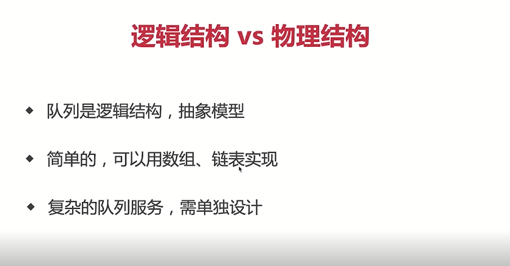

# 基础篇 #

## 1.Ajax-Fetch-Axios三者有什么区别?

> 三者都是用于网络请求，只不过维度不同
> 
> Ajax(Asynchronous Javascript and XML),一种技术统称；
> 
> Fetch,一个具体的API
> 
> Axios(阿克硕死)，第三方库https://axios-http.com/
> 

```js
 function ajax1(method,url){
    const xhr = new XMLHttpRequest()
    xhr.open(method,url);
    xhr.onreadystatechange= () => {
        if(xhr.readystate !==4) return;
        if(xhr.status > 200 && xhr.status < 300){
            console.log("获取成功的数据=",xhr.response);
        }
    }
    xhr.send()
 }
 function ajax2(url){
    fetch(url).then((response)=>{
        console.log("获取成功的数据=",response)
    })
 }
```

## 2.防抖和节流有什么区别，分别用于什么场景-防抖

!> debounce和throttling 各有特点，在不同 的场景要根据需求合理的选择策略。<br>
如果事件触发是高频但是有停顿时，可以选择debounce； <br>
在事件连续不断高频触发时，只能选择throttling，因为debounce可能会导致动作只被执行一次，界面出现跳跃。

>防抖：限制执行次数，多次执行次数，只执行一次；
>
>代码实现重在清零 clearTimeout。防抖可以比作等电梯，只要有一个人进来，就需要再等一会儿。
>
>业务场景: 
>
>避免登录按钮多次点击的重复提交;
>
>调整浏览器窗口大小时，resize 次数太多，造成计算太多，此时需要——防抖

```js
function debounce (fn,wait=200){
 let timer
 return ()=>{
      clearTimeout(timer)
      timer= setTimeout(()=>{
            fn.apply(this, arguments)
       },wait)
     }
   }    
```
>节流：限制执行频率，有节奏的执行；
>
>代码实现重在开锁关锁 timer=timeout; timer=null。节流可以比作过红绿灯，每等一个红灯时间就可以过一批。
>
>业务场景：
>
>scoll事件，每隔一秒计算一下位置信息等；
>
>浏览器播放事件，每个一秒计算下进度信息等;
>

```js
function throttle (fn,wait=100){
 let timer
 return ()=>{
     if(timer) return 
      timer= setTimeout(()=>{
            fn.apply(this, arguments)
            timer=null
       },wait)
     }
   }    
```

## 3.什么时候不能使用箭头函数

>有什么缺点？
>
>什么时候不能用箭头函数？

### 1.箭头函数有什么缺点？
>没有arguments
>
>无法通过apply,call,bind 来改变this;(因为箭头函数的this都是父级作用域的this)
>

### 2.不适用的情况

>1.对象方法

```js
const obj = {
  name:'test',
  getName:()=>{
    return this.name
  }
}
console.log(obj.getName()) //报错
```
>2.原型方法

```js
const obj = {
  name:'test',
}
obj._proto_.getName=()=>{
  return this.name
}
console.log(obj.getName()) //报错
```

>3.构造函数
```js
const Foo=(name,city)=>{
  this.name=name
  this.city=city
}
const f=new Foo('test','北京')
```
>4.动态上下文的回调函数

```js
const btn1=document.getElementById('btn1')
btn1.addEventListener('click',()=>{
  //console.log(this==window)
  this.innerHTML='clicked'
})
```
>5.Vue生命周期和method
>
>因为vue本质其实是对象
>
>class里面可以使用箭头函数

## 4.请描述TCP三次握手和四次挥手

> 握手就是TCP连接
> 
> 三次握手就是建立TCP连接
> 
> client 发-> server 收
> 
> server 发-> client 收
> 
> client 发-> server 收
> 
> 挥手就是TCP断开
> 
> 四次挥手就是关闭连接
>
> client 发-> server 收
> 
> server 发-> client 收
>
> server 发-> client 收
>
> client 发-> server 收

## 5.JS中for-in和for-of有什么区别

>区别一
>for...in遍历得到key
>
>for...of遍历得到value

```js
const arr=[10,20,30]
for(let key in arr){
  console.log(key) //0,1,2
}
function foo(){
  for(let arg of arguments){
    console.log(arg)//100，200，'aaa'
  }
}
foo(100,200,'aaa')
```
>区别二
>
>遍历对象：for...in可以，for...of不可以(会报错！)
>
>遍历Map Set:for...of可以，for...in不可以（没有结果！）
>
>遍历generator：for...of可以，for...in不可以（没有结果！）
```js
const set = new Set([10,20,30])
for(let item of set){
  console.log(item)//10,20,30
}

const map=new Map([[0,'aa'],[1,'bb']])
for(let item of map){
  console.log(item)
  // [0, 'aa']
  // [1, 'bb']
  }
```

?> **可枚举vs可迭代**<br/>
 for...in用于可枚举数据，如对象、数组、字符串<br/>
 for...of用于可迭代数据，如数组、字符串、Map、Set;

## 6.连环问for await...of 有什么作用？
>用于遍历多个promise对象，相当于Promise.all的替代品

```js
function createPromise(data) {
  return new Promise((resolve,reject)=>{
    setTimeout(()=>{
      resolve(data)
    },1000)
  })
}
(async function () {
  const p1 = createPromise(100)
  const p2 = createPromise(200)
  const p3 = createPromise(300)
  const res1 = await p1
  const res2 = await p2
  const res3 = await p3
  const list=[p1,p2,p3]
  Promise.all(list).then=>(
    res=>console.log(res)
  )
  for await(let res of list){
    console.log(res)
  }
  //上部分是并发，想要一个一个串行，就是什么时候用什么时候去创建
  const res1=await createPromise(100)
  const res2=await createPromise(200)
  const res3=await createPromise(300)
})()
```
>业务场景：
>用户批量上传图片，一次性并发上传就用上面的，一个一个上传就用下面的

## 7.offsetHeight-scrollHeight-clientHeight 盒子模型概念

>**盒子模型概念**
>
>width/height/padding/border/margin/box-sizing:border-box
>设置了box-sizing 实际内容content width=初始设置的-border*2-padding*2
>
>计算规则：
>
>offsetHeight/offsetWidth border+padding+content
>
>clientHeight/clientWidth padding+content
>
>scrollHeight/scrollWidth padding+实际的内容尺寸


## 8.HTMLCollection和NodeList有什么区别？

> HTMLCollection是Element的集合；
>
> NodeList是Node的集合；
>
>两者不是数组而是类数组；
>
 
>

?>类数组转换成数组<br>
const arr1=Array.from(list);<br>
const arr2=Array.prototype.slice.call(list)<br>
const arr3=[...list]

## 9.Vue中computed和watch有什么区别?

!> 两者用途不同<br>
computed 用于计算产出新的数据；<br>
watch 用于监听现有的数据；<br>
computed有缓存而watch是没有的；<br>

## 10.Vue组件通讯方式

### 1.通讯汇总：
>props和$emit
>
>自定义事件
>
>$attrs 是props和$emit的候补 dom上挂载属性跟是不是唯一节点有关系；可以用 v-bind="$attrs" 来实现层级透传；
>
>$parent 需要在mounted 去进行调用
>
>$refs 需要在mounted 去进行调用
>
>provide/inject  动态获取 provide需要用computed声明函数并且返回想要传递的数据
>
>```js
> //传递静态数据
> provide:{info:'aaa'}
> //传递响应式数据
> provide(){
>  return {
>    info: computed(()=>this.name)
>   }
> }
>```
>
>vuex

### 2.不同场景

* 父子组件
* 上下级组件（跨多级）通讯
* 全局组件

## 11.action和mutation有什么区别

>mutation 原子操作；必须同步代码
>
>action 可包含多个mutation;可包含异步代码；

## 12.JS严格模式有什么特点？

>'use strict' 全局或者函数引入
>
>全局变量必须先声明
>
>禁止使用with
>
>禁止this指向window
>
>创建eval作用域
>
>函数参数不能重名


## 13.HTTP跨域时为何要发送options请求?

### 跨域请求

* 浏览器同源策略
* 同源策略一般限制Ajax网络请求，不能跨域请求server
* 不会限制 `<link><scrip><iframe>` 加载第三方资源

### 解决跨域的方法

#### I.JSONP -script 标签去请求

#### II.CORS（靠丝） -设置请求头允许跨域

!>总结
options请求，是跨域请求之前的预检查；<br>
浏览器自行发起的，无需我们干预；<br>
不会影响实际功能；<br>

# 算法篇 #

!> 算法复杂度-程序执行时需要的计算量和内存空间，复杂度是数量级（颗粒度粗） <br>前端通常`重时间轻空间`<br>
 
>**时间复杂度数量级**：
>
>O(1) 一次就够
>
>O(logn)数据量的对数(二分的思想)
>
>O(n)和传输的数量级一样(循环)
>
>O(nlogn)数据量*数据量的对数 (循环嵌套二分)
>
>O(n^2)数据量的平方 (嵌套循环)


>**空间复杂度数量级**:
>O(1) (定义简单数据类型？？？)
>O(n) (定义复杂数据类型？？？)

## 1.把一个数组旋转k步

>题目：
>
>输入一个数组[1,2,3,4,5,6,7]
>
>k=3 即旋转3步
>
>输出[5,6,7,1,2,3,4]
>
>思路一：末尾元素pop,再unshift放到数组前面来
>
>思路二：数组切分后拼接concat到一起
>

`方法一：pop/unshift`
```js
function rotate1(arr:number[],k:number):number[]{
  const length=arr.length
  if(!k||length === 0)return arr
  const step = Math.abs(k%length) //abs 取绝对值
  //O(n^2)
  for(let i=0;i<step;i++){
    const n  = arr.pop()
    console.log(n)
    if(n){
      arr.unshift(n)//O(n)
    }
  }
  return arr
}
```
`方法二：concat`

```js
function rotate2(arr:number[],k:number):number[]{
  const length=arr.length
  if(!k||length===0)return arr
  const leftArr=arr.slice(0,length-k)
  const rightArr=arr.slice(-k)
  //O(1)
  const newArr=rightArr.concat(leftArr)
  return newArr
}
```

!>jest进行单元测试

```js
//测试一些些伪代码 详见jest
import {rotate1} from '../文件'
describe('数组旋转',()=>{
  it('正常情况',()=>{
    const arr=[1,2,3,4,5,6,7]
    const k=3
    const res=rotate1(arr,k)
    expect(res).toEqual([5,6,7,1,2,3,4])//断言 测试结果是否符合
  })
})
```
!>思路1：时间复杂度O(n^2),空间复杂度O(1) <br>
思路2：时间复杂度O(1),空间复杂度O(n) <br>

>**性能测试**
```js
const arr1=[]
for(let i=0;i<100000;i++){
  arr1.push(i)
}
console.time('rotate1')
rotate1(arr1,9*10000)  //800多ms
console.timeEnd('rotate1')

const arr2=[]
for(let i=0;i<100000;i++){
  arr2.push(i)
}
console.time('rotate2')
rotate2(arr2,9*10000) //1ms
console.timeEnd('rotate2')

```

!>**因为时间复杂度方案二更快一些，所以最优解为方案二**

## 2.判断一个字符串是否括号匹配

###　**知识点**　

>先进后出
>
>API:push pop length
>

 

>栈VS数组
>

 


**解题思路：**

>1.遇到左括号{([就压栈
>
>2.遇到右括号})]就判断栈顶，匹配则出栈
>
>最后判断length是否为0
>

```js
/**
 * @description 括号匹配
 * 
 * */
/**
 * 判断左右括号是否匹配
 * @param left 左括号
 * @param right 右括号
 * */
function isMatch(left:string,right:string):boolean{
  if(left==='{'&&right==='}') return true
  if(left==='['&&right===']') return true
  if(left==='('&&right===')') return true
  return false
}
/**
 * 判断是否括号匹配
 * @param str str
 * */
function matchBracket(str:string):boolean{
  const length=str.length
  if(length === 0) return true;
  const stack= [] 
  const leftSymbols='{[('
  const rightSymbols='}])'
  for(let i of str){
    if(leftSymbols.includes(i)){
      stack.push(i)
    }else if(rightSymbols.includes(s)){
      const top=stack[stack.length-1]
      if(isMatch(top,s)){
        stack.pop()
      }else{
        return false
      }
    }
  }
  return stack.lenght==0
}

//功能测试
const str= '{a[b(c)d]e}f'
console.info(matchBracket(str))
```
!>jest进行单元测试

```js
//测试一些些伪代码 详见jest
import {matchBracket} from '../文件'
describe('括号匹配',()=>{
  it('正常情况',()=>{
    const str='{a[b(c)d]e}f'
    const res=matchBracket(arr,k)
    expect(res).toBe(false)
  })
})
```

**性能分析：**
>时间复杂度O(n)
>
>空间复杂度O(n)
>

## 3.用两个栈实现一个队列

>栈先进后出 队列先进先出
>
>API都是add delete length
>

 


```js
/**
 * 两个栈 - 一个队列
 * 
 * */
class MyQueue{
  private stack1:number[]=[]
  private stack2:number[]=[]
  /*
  *入队
  */
 add(n:number){
   this.stack1.push(n)
 }
 /*
 *出队
 **/
delete():number||null{
   let res
   const stack1=this.stack1
   const stack2=this.stack2
   //将stack1所有元素移动到stack2中
   while(stack1.length){
     const n=stack1.pop()
     if(n !=null){
       stack2.push(n)
     }
   }
   //stack pop
   res=stack2.pop()
   //将stack2所有元素还给stack1
    while(stack2.length){
     const n=stack2.pop()
     if(n !=null){
       stack1.push(n)
     }
   }
   return res||null
}
get length():number{
return this.stack1.length
}
}
```

!>jest进行单元测试

```js
//测试一些些伪代码 详见jest
import {MyQueue} from '../文件'
describe('两个栈一个队列',()=>{
  it('add and length',()=>{
    const q=new MyQueue()
    expect(q.length).toBe(0)
    q.add(100)
    q.add(200)
    q.add(300)
    expect(q.length).toBe(3)
  })
  it('delete',()=>{
    const q=new MyQueue()
    expect(q.delete()).toBe(null)
    q.add(100)
    q.add(200)
    q.add(300)
    expect(q.delete()).toBe(100)
    expect(q.length).toBe(2)
    expect(q.delete()).toBe(200)
    expect(q.length).toBe(1)
  })
})
```


**性能分析：**
>时间复杂度:add O(1);delete O(n)
>
>空间复杂度,整体是O(n)
>

## 4.使用JS反转单向链表-什么是链表

 

>链表vs数组

 

>解题思路：
* 反转，即节点next指向前一个节点
* 但这很容易造成nextNode 的丢失
* 需要三个指针prevNode curNode nextNode

```js
interface ILinkListNode{
  value:number
  next?:ILinkListNode
}
/**
 * 、反转单向链表，并返回反转之后的head node
 * @param listNode list head node
 * 
 * */
function reverseLinkList(listNode:ILinkListNode):ILinkListNode{
  //定义三个指针
  let prevNode:ILinkListNode | undefined = undefined
  let curNode:ILinkListNode | undefined = undefined
  let nextNode:ILinkListNode | undefined = undefined

  //以nextNode 为主遍历链表
  while(nextNode){
    //第一个元素，删除 next 防止循环引用
    if(curNode && !prevNode){
      delete curNode.next
    }
    //反转指针
    if(curNode&&prevNode){
      curNode.next=prevNode
    }
    //整体向后移动指针
    prevNode = curNode
    curNode = nextNode
    nextNode = nextNode?.next
  }
  //最后一个的补充：当nextNode 空时，此时 curNode 尚未设置 next
  curNode!.next=prevNode
  return curNode!
}
/**
 * 根据数组创建单向链表
 * @param arr number arr
 * 
 * */

function createLinkList(arr:number[]):ILinkListNode{
  const length = arr.length
  if(length===0)throw new Error('arr is empty')
  let curNode:ILinkListNode = {
    value:arr[length-1]
  }
  if(length === 1)return curNode
  for(let i=length -2;i>=0;i++){
    curNode= {
      value:arr[i],
      next:curNode
    }
  }
  return curNode
}

const arr = [100,200,300,400,500]
const list = createLinkList(arr)
console.info('list:',list)

const linst1= reverseLinkList(list)
console.info() 
```

!>jest进行单元测试

```js
//测试一些些伪代码 详见jest
import {ILinkListNode,createLinkList,reverseLinkList} from '../文件'
describe('反转单向链表',()=>{
  it('单个元素',()=>{
  const node:ILinkListNode={value:100}
  const node1=reverseLinkList(node)
  expect(node1).toEqual({value:100})
  })
  it('多个元素',()=>{
  const node=createLinkList([100,200,300])
  const node1=reverseLinkList(node)
  expect(node1).toEqual({
    value:300,
    next:{
      value:200,
      next:{
        value:100
      }
    }
  })
  })
 
})
```
### _链表和数组哪个实现队列更快
>链表和数组都是物理结构，队列则是逻辑结构
>
>数组是连续存储，push很快 shift很慢
>
>链表是非连续存储，add和delete都很快但是查询很慢
>
>结论：链表实现队列更快；
>

**链表实现队列**
* 单向链表，但是同时记录head和tail(头和尾)；
* 要从tail入队，从head出队，否则出队时tail不好定位；
* length要实时记录，不可遍历链表获取；

```js
/***
 * 链表实现队列
 * 
 * */
interface IListNode{
  value:number,
  next:IListNode|null
}

class MyQueue{
  private head:IListNode | null = null
  private tail:IListNode | null = null
  private len = 0
  /**
   * 入队，在tail入
   * @ param n number
   * */
  add(n:number){
    const newNode:IListNode={
     value:n,
     next:null
    }
    //处理head边界
    if(this.head==null){
      this.head=newNode
    }
    //处理tail
    const tailNode =this.tail
    if(tailNode){
      tailNode.next=newNode
    }
    this.tail=newNode
    this.len++
  }
    /**
   * 出队，在head出
   * @ param n number
   * */
  delete():number|null{
     const headNode = this.head
     if(headNode == null|| this.len <= 0)return null
     //取值
     const value=headNode.value
     //处理head
     this.head=headNode.next
     //记录长度
     this.len--
  }
  get length():number{
    return this.len
  }
}

//功能测试
const q= new MyQueue()
q.add(100)
q.add(200)
q.add(300)
console.info('length1',q.length)
console.info(q.delete())
console.info('length2',q.length)
console.info(q.delete())
console.info('length3',q.length)
console.info(q.delete())
console.info('length4',q.length)
console.info(q.delete())
console.info('length5',q.length)

//性能测试
const q1 = new MyQueue()
console.time('queue with list')
for(let i=0;i<10*10000;i++){
  q1.add(i)
}
for(let ii=0;i<10*10000;i++){
  q1.delete()
}
console.timeEnd('queue with list') //17ms

const q2 =[]
console.time('queue with array')
for(let i=0;i<10*10000;i++){
  q2.push(i)  //入队
}
for(let ii=0;i<10*10000;i++){
  q2.shift()  //出队
}
console.timeEnd('queue with array') //431ms
```

!>jest进行单元测试

```js
//测试一些些伪代码 详见jest
import {MyQueue} from '../文件'
describe('链表实现一个队列',()=>{
  it('add and length',()=>{
    const q=new MyQueue()
    expect(q.length).toBe(0)
    q.add(100)
    q.add(200)
    q.add(300)
    expect(q.length).toBe(3)
  })
  it('delete',()=>{
    const q=new MyQueue()
    expect(q.delete()).toBeNull()//toBe(null)
    q.add(100)
    q.add(200)
    q.add(300)
    expect(q.delete()).toBe(100)
    expect(q.length).toBe(2)
    expect(q.delete()).toBe(200)
    expect(q.length).toBe(1)
    expect(q.delete()).toBe(300)
    expect(q.length).toBe(0)
    expect(q.delete()).toBeNull()
  })
})
```

**性能分析：**
>时间复杂度:
>
>* 数组：add O(1);delete O(n)
>* 链表：add O(1);delete O(1)
>
>空间复杂度,整体是O(n)
>

## 5.实现二分查找

>
>二分查找 
>
>时间复杂度：O(logn)
>
>思路：1.递归2.循环（更快）

```js
/**
* 二分查找（循环）
* @param arr arr
* @param target target
* */
function binarySearch1(arr:number[],target:number):number{
const length = arr.length
if(length ===0)return -1;

let startIndex=0//开始位置
let endIndex=length-1 //结束位置

while(startIndex<=endIndex){
    const midIndex=Math.floor((startIndex+endIndex)/2)
    const midValue=arr[midIndex]
    if(target<midValue){
      //目标值较小，则继续在左侧查找
      endIndex=midIndex-1
    }else if(target>midValue){
      //目标值较大，则继续在右侧查找
      startIndex=midIndex+1
    }else{
     return midIndex
    }
}
return -1
}

//功能测试
const arr=[10,20,30,40,50,60]
const target=20;
console.info(binarySearch1(arr,target))

/**
* 二分查找（循环）
* @param arr arr
* @param target target
* @param startIndex startIndex
* @param endIndex endIndex
* */
function binarySearch2(arr:number[],target:number,startIndex?:number,endIndex?:number):number{
const length = arr.length
if(length ===0)return -1;
//开始和结束范围
if(startIndex==null)startIndex=0//开始位置
if(endIndex==null)endIndex=length-1 //结束位置

if(startIndex>endIndex)return -1

//中间位置
const midIndex=Math.floor((startIndex+endIndex)/2)
const midValue=arr[midIndex]
   if(target<midValue){
      //目标值较小，则继续在左侧查找
      return binarySearch2(arr,target,startIndex,midIndex-1)
    }else if(target>midValue){
      //目标值较大，则继续在右侧查找
     return binarySearch2(arr,target,midIndex+1,endIndex)
    }else{
     return midIndex
    }
}

//功能测试
const arr=[10,20,30,40,50,60]
const target=20;
console.info(binarySearch2(arr,target))

```

!>jest进行单元测试

```js
//测试一些些伪代码 详见jest
import {binarySearch1,binarySearch2} from '../文件'
describe('二分查找',()=>{
  it('正常情况',()=>{
    const arr=[10,20,30,40,50,60]
    const target=20;
    const index=binarySearch1(arr,target)
    expect(index).toBe(1)
  })
  it('空数组',()=>{
    expect(binarySearch1([],100)).toBe(-1)
  })
  it('找不到target',()=>{
    expect(binarySearch1([10,20,30,40,50],500)).toBe(-1)
  })
})
```

## 6.一个数组中和为n的两个数

>嵌套循环(不是最优解，双指针！！！)
>
>时间复杂度（O(n^2)）,不可用(数据量大且复杂！！)
>
>双指针
>
>概念其主要就是引用
>
>时间复杂度（O(n)）
>
>凡有序，必二分
>
>优化嵌套循环，可以用双指针来优化！！！
>
```js

// @嵌套循环
/**
 * @param {number[]} nums
 * @param {number} target
 * @return {number[]}
 */
 function findeTwoSum(nums:number[], target:number):number[] { 
   const res:number[]=[]
   let len=nums.length
   if(len==0) return res
    for (let i = 0; i < nums.length; i++) { 
        for (let j = i+1; j < nums.length; j++) { 
            let sum=nums[i]+nums[j]
            if (sum == target) { 
                return res=[i,j]
            }
        }
    }
};

// @双指针
/**
 * @param {number[]} nums
 * @param {number} target
 * @return {number[]}
 */
 function findeTwoSum1(nums:number[], target:number):number[] { 
   const res:number[]=[]
   let len=nums.length
   if(len==0) return res
   let i=0 //头
   let j=len-1 //尾
   while(i<j){
     const sum=nums[i]+nums[j]
     if(sum<target){
       i++
     }else if(sum>target){
       j--
     }else{
       return [i,j]
     }
   }
};
```


!>jest进行单元测试

```js
//测试一些些伪代码 详见jest
import {findeTwoSum，findeTwoSum1} from '../文件'
describe('两数之和',()=>{
  it('正常情况',()=>{
     const nums = [2,7,11,15]
     const target = 9
     const res=findeTwoSum(nums,target)
    expect(res).toEqual([0,1])
  })
  it('空数组',()=>{
     const res=findeTwoSum([],9)
    expect(res).toEqual([])
  })
 it('找不到结果',()=>{
     const nums = [2,7,11,15]
     const res=findeTwoSum(nums,100)
    expect(res).toEqual([])
  })
})
```

## 7.求二叉搜索树的第K小值-二叉树和三种遍历

### I.二叉树概念
>
>是一棵树
>
>每个节点，最多只能有2个子节点
>
>数据结构，value,left,right
### II.二叉树遍历
>
> 前序遍历  root->left->right
>
> 中序遍历  left->root->right
>
> 后序遍历  left->right->root

```js
interface ITreeNode{
  value:number,
  left:ITreeNode|null
  right:ITreeNode|null
}

/**
 * 二叉树前序遍历
 * @param node tree node
 */
function preOrderTraverse(node:ITreeNode|null){
    if(node == null) return
      console.log(node.value)
    preOrderTraverse(node.left)
    preOrderTraverse(node.right)
}//5,3,2,4,7,6,8

/**
 * 二叉树中序遍历
 * @param node tree node
 */
function inOrderTraverse(node:ITreeNode|null){
    if(node == null) return
    inOrderTraverse(node.left)
    console.log(node.value)
    inOrderTraverse(node.right)
}//2,3,4,5,6,7,8

/**
 * 二叉树后序遍历
 * @param node tree node
 */
function postOrderTraverse(node:ITreeNode|null){
    if(node == null) return
    postOrderTraverse(node.left)
    postOrderTraverse(node.right)
    console.log(node.value)
}//2,4,3,6,8,7,5

const tree:ITreeNode ={
  value:5,
  left:{
    value:3,
    left:{
      value:2,
      left:null,
      right:null
    },
     right:{
      value:4,
      left:null,
      right:null
    }
  },
  right:{
    value:7,
    left:{
      value:6,
      left:null,
      right:null
    },
    right:{
      value:8,
      left:null,
      right:null
    }
  }
}


```

### III.二叉搜索树

>
>left(包括其后代) value<=root value
>
>right(包括其后代) value>=root value
>
> 可使用二分法进行快速查找
>
>左比右大，从小到大递增

**解题思路**
* BST中序遍历，即从小到大的排序
* 找到排序后的第K值即可

```js

export interface ITreeNode{
  value:number,
  left:ITreeNode|null
  right:ITreeNode|null
}

arr:number[]=[]
/**
 * 二叉树中序遍历
 * @param node tree node
 */
function inOrderTraverse(node:ITreeNode|null){
    if(node == null) return
    inOrderTraverse(node.left)
    arr.push(node.value)
    inOrderTraverse(node.right)
}//2,3,4,5,6,7,8
/**
 * 寻找BST里最小值
 * @param node tree node
 * @param k 第几个值
 */
export function getKthValue(node:ITreeNode,k:number):number|null{
    inOrderTraverse(node)
    return arr[k]||null
}//getKthValue(bstTree,3) //5

const bstTree:ITreeNode ={
  value:5,
  left:{
    value:3,
    left:{
      value:2,
      left:null,
      right:null
    },
     right:{
      value:4,
      left:null,
      right:null
    }
  },
  right:{
    value:7,
    left:{
      value:6,
      left:null,
      right:null
    },
    right:{
      value:8,
      left:null,
      right:null
    }
  }
}
```

!>jest进行单元测试

```js
//测试一些些伪代码 详见jest
import {ITreeNode,getKthValue} from '../文件'

describe('二叉搜索树',()=>{
  const bstTree:ITreeNode ={
  value:5,
  left:{
    value:3,
    left:{
      value:2,
      left:null,
      right:null
    },
     right:{
      value:4,
      left:null,
      right:null
    }
  },
  right:{
    value:7,
    left:{
      value:6,
      left:null,
      right:null
    },
    right:{
      value:8,
      left:null,
      right:null
    }
  }
}
  it('正常情况',()=>{
    const res=getKthValue(bstTree,3)
    expect(res).toBe(5)
  })
  it('k不在正常范围',()=>{
    const res1=getKthValue(bstTree,0)
    expect(res1).toBeNull()
    const res2=getKthValue(bstTree,1000)
    expect(res2).toBeNull()
  })
})
```

### IV.平衡二叉树

* BST如果不平衡，那就又成了链表了
* 所有要尽量平衡：平衡二叉搜素树BBST
* BBST增删查，时间复杂度都是O(logn),即树的高度

#### V.红黑树

>本质是一种自平衡二叉树；
>
>分为 红/黑 两种颜色，通过颜色转换来维持树的平衡；
>
>相对普通的平衡二叉树，它维持的平衡效率更高；
>

#### VI.B树

>物理上是多叉树，但逻辑上是二叉树；
>
>一般用于高效I/O,关系型数据库常用B树来组织数据；
>

?>堆有什么特点，和二叉树有什么关系

**堆栈模型**
>
>js代码执行时
>
>值类型变量，存储在栈
>
>引用类型变量，存储在堆

**堆**

* 完全二叉树
* 最大堆：父节点>=子节点
* 最小堆：父节点<=子节点

>
>堆 逻辑结构是一颗二叉树
>
>但物理结构是一个数组
>
>数组：适合连续存储+节省空间（回顾堆栈模型）


 

!> **堆 vs BST**<br/>
 查找比BST慢 <br/>
 增删比BST快，维持平衡更快 <br/>
 但是整体时间复杂度都在O(logn)级别，即树的高度 <br/>
 应用：堆栈模型 <br/>
 堆的数据都是在栈中引用的，不需要从root遍历 <br/>
 堆恰巧是数组形式，根据栈的地址，可用O(1)找到目标<br/>

 

## 8.求斐波那契数列的第n值-递归算法会导致运行崩溃

 

```js
// @斐波那契数列


/**
 * @param {number} n
 * @return {number}
 */
//递归实现 时间复杂度非常高O(2^n)
 function fibonacci(n:number):number { 
  if(n<=0)return 0
  if(n==1) return 1
  return fibonacci(n-1)+fibonacci(n-2)
};
//循环实现
 function fibonacci(n:number):number { 
  if(n<=0)return 0
  if(n==1) return 1
  let n1=0 //记录n-1的结果
  let n2=1 //记录n-2的结果
  let res=0
  for(let i=2;i<=n;i++){
    res= n1+n2
    //记录 n1,n2数据
    n1=n2
    n2=res
  }
  return res
};
```


!>jest进行单元测试

```js
//测试一些些伪代码 详见jest
import {fibonacci} from '../文件'
describe('斐波那契数列',()=>{
  //0,1,1,2,3,5,8,13,21,34
  it('正常情况',()=>{
    expect(fibonacci(0)).toBe(0)
    expect(fibonacci(1)).toBe(1)
    expect(fibonacci(2)).toBe(1)
    expect(fibonacci(3)).toBe(2)
    expect(fibonacci(9)).toBe(34)
  })
  it('n小于0',()=>{
     expect(fibonacci(-1)).toBe(0)
  })
})
```

**动态规划**

* 把一个大问题拆解成多个小问题，逐级向下拆解；
* 用递归的思路去分析问题，再改为循环来实现；
* 算法三大思维：贪心、二分、动态规划

### _青蛙跳台阶

* 一只青蛙，一次可跳1级，也可跳2级
* 问：青蛙跳到n级台阶，总共有多少种方式？
* 动态规划的方式去分析（其实质就是斐波那契数列）   
* 要是跳一级台阶，有f(1)
* 要是跳两级台阶，有f(2)
* 要是n两级台阶，有f(n-1)+f(n-2)

## 9.移动0到数组的末尾

>[]中的0放到末尾得到[]
>
>需要在原数组上进行操作

!> 传统思路 <br/>
遍历数组，遇到0则push到数组末尾 <br/>
用splice截取掉当前元素 <br/>
时间复杂度是O(n^2) ——算法不可用 <br>

!> 更优思路-双指针 <br/>
定义j指向第一个0，i指向j后面的第一个非0 <br/>
交换i和j的值，继续向后移动 <br/>
只遍历一次，时间复杂度是O(n)<br/>


!>**向面试官确认是否修改原数组？** <br/>
数组是连续存储，要慎用splice unshift 等API <br/>
`双指针思路` <br>

```js

/**
 * 移动0到数组末尾（嵌套循环）
 * @param arr
 */
 function moveZero1(arr:number[]):void { 
  const length = arr.length
  if(length === 0) return
  let zerolength= 0
  //O(n^2)
  for(let i=0;i<length-zeroLength;i++){
    if(arr[i]===0){
      arr.push(0)
      arr.splice(i,1) //本身就有O(n)
      i-- //数组截取一个元素，i要递减，否则连续0就会有错误
      zeroLength++ //累加0的长度
    }
  }
};

/**
 * 移动0到数组末尾（双指针）
 * @param arr
 */
 function moveZero2(arr:number[]):void { 
  const length = arr.length
  if(length === 0) return
  let i
  let j= -1 //指向第一个0
  //O(n^2)
  for(let i=0;i<length;i++){
    if(arr[i]===0){
       //第一个0
       if(j<0){
         j= i
       }
    }
    if(arr[i]!==0&&j>=0){
      const n =arr[i]
      arr[i] = arr[j]
      arr[j] = n
      j++
    }
  }
};

//功能测试
const arr = [1,0,3,4,0,0,11,0]
moveZero(arr)
console.log(arr)


//性能测试
const arr1 = []
for(let i = 0;i<20*10000;i++){
  if(i%10 == 0){
    arr1.push(0)
  }else{
    arr1.push(i)
  }
}
console.time('moveZero1')
moveZero1(arr1) //262ms
console.timeEnd('moveZero1')

const arr2 = []
for(let i = 0;i<20*10000;i++){
  if(i%10 == 0){
    arr2.push(0)
  }else{
    arr2.push(i)
  }
}
console.time('moveZero2')
moveZero1(arr2)     //3ms
console.timeEnd('moveZero2') 

```


!>jest进行单元测试

```js
//测试一些些伪代码 详见jest—— moveZero1 和 moveZero2 单元测试用例是一样的
import {moveZero1} from '../文件'
describe('移动0到数组末尾',()=>{
  //0,1,1,2,3,5,8,13,21,34
  it('正常情况',()=>{
    const arr = [1,0,3,4,0,0,11,0]
    expect(moveZero1(arr)).toEqual([1,3,4,11,0,0,0,0])
    
  })
  it('没有0',()=>{
    const arr=[1,3,4,11]
      expect(moveZero1(arr)).toEqual([1,3,4,11])
  })
  it('全是0',()=>{
    const arr=[0,0,0,0]
      expect(moveZero1(arr)).toEqual([0,0,0,0])
  })
})
```

## 10.获取字符串中连续最多的字符以及次数


