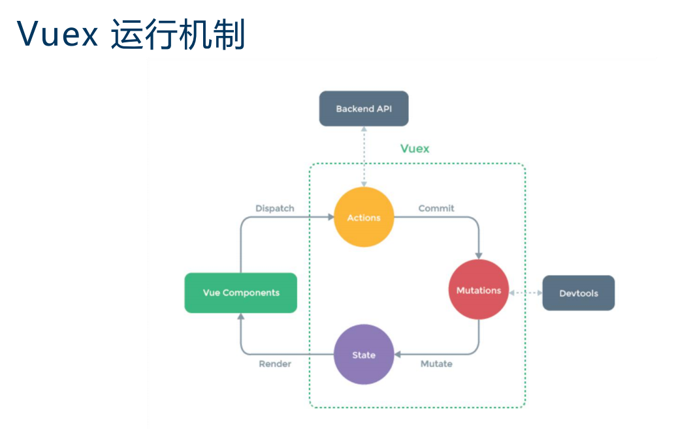
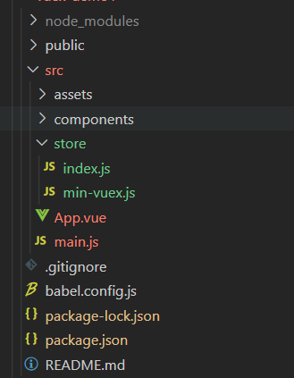

!> vue状态管理工具-Pinia/vuex

 

# **实现vuex理解核心原理**

## 一、核心原理
1. Vuex本质是一个对象
2. Vuex对象有两个属性，一个是install方法，一个是Store这个类
3. install方法的作用是将store这个实例挂载到所有的组件上，注意是同一个store实例。
4. Store这个类拥有commit，dispatch这些方法，Store类里将用户传入的state包装成data，作为new Vue的参数，从而实现了state 值的响应式。


## 二、具体实现

1.vue-cli建一个项目

 

2.主要看下App.vue,main.js,store/index.js

代码如下:
  
**App.vue**
```
<template>
  <div id="app">
    测试一下是否得到store这个值:{{ count }}
    <br />
    <p>state:{{ this.$store.state.count }}</p>
    <p>getter:{{ this.$store.getters.doubleCount }}</p>
    <button @click="$store.commit('increment', 2)">mutations</button><br />
    <button @click="$store.dispatch('increment', 2)">actions</button>
  </div>
</template>

<script>
export default {
  name: "app",
  data() {
    return {
      getData: null,
    };
  },
  computed: {
    count() {
      return this.$store.state.count;
    },
  },
  mounted() {
    this.getData = this.$store.getters.doubleCount;
  },
};
</script>

<style>
</style>

```

**store/index.js**

```js
import Vue from 'vue'
import Vuex from 'vuex'

Vue.use(Vuex)

export default new Vuex.Store({
  state: {
    count: 1,
  },
  getters: {
    getCount(state) {
      return state.count;
    },
    doubleCount(state) {
      return state.count*2;
    },
  },
  mutations: {
    increment(state, arg) {
      state.count += arg;
    },
  },
  actions: {
    increment({ commit }, arg) {
      setTimeout(() => {
        // state.count++ // 不要对state进行更改操作，应该通过commit交给mutations去处理
        commit("increment", arg);
      }, 1000);
    },
  },
});

```

**main.js**

```js
import Vue from 'vue'
import App from './App.vue'
import store from './store'

Vue.config.productionTip = false

new Vue({
  store,
  render: h => h(App)
}).$mount('#app')
```

3.创建的自定义Vuex文件
在store创建min-vuex.js文件

store/min-vuex.js

```js
let Vue;
class Store {
  constructor(options) {
    this.vm = new Vue({
      data: {
        state: options.state,
      },
    });
    //需要通过this.$store.vm.state获取
    //实现getter
    let getters = options.getters || {};
    this.getters = {};
    Object.keys(getters).forEach((getterName) => {
      Object.defineProperty(this.getters, getterName, {
        get: () => {
          return getters[getterName](this.state);
        },
      });
    });
    //实现mutations
    let mutations = options.mutations || {};
    this.mutations = {};
    Object.keys(mutations).forEach((mutationName) => {
      this.mutations[mutationName] = (arg) => {
        mutations[mutationName](this.state, arg);
      };
    });
    let actions = options.actions;
    this.actions = {};
    Object.keys(actions).forEach((actionName) => {
      this.actions[actionName] = (arg) => {
        actions[actionName](this, arg);//this代表的就是store实例本身
      };
    });
  }
  dispatch(method, arg) {
    this.actions[method](arg);
  }
  //为什么用箭头函数是因为actions中需要触发commit,但是此时并不是$store调用，而是其外出的actions作用域的this
  commit = (method, arg) => {
    this.mutations[method](arg);
  };
  //get属性处理实现直接this.$store.state
  get state() {
    return this.vm.state;
  }
}

let install = function (vue) {
  Vue = vue;
  Vue.mixin({
    beforeCreate() {
      if (this.$options && this.$options.store) {// 如果是根组件
        this.$store = this.$options.store; 
      } else { //如果是子组件
        this.$store = this.$parent && this.$parent.$store;
      }
    },
  });
};

let Vuex = {
  Store,
  install,
};
export default Vuex;

```
store/index.js
```js
import Vue from "vue";
//import Vuex from 'vuex'
import Vuex from "./min-vuex";

//引入自己的vuex,以下代码不变哦！！！

```

## 三、剖析Vuex本质

Vue项目中是怎么引入Vuex

1. 安装Vuex，再通过`import Vuex from 'vuex'`引入
2. 再通过Vue.use(Vuex) 使得每个组件都可以拥有store实例,`vue.use的一个原则就是执行对象的install这个方法`
3. 先 var store = new Vuex.Store({...}),再把store作为参数的一个属性值，new Vue({store})
4. 我们是通过new Vuex.store({})获得一个store实例，也就是说，我们引入的Vuex中有Store这个类作为Vuex对象的一个属性。因为通过import引入的，**实质上就是一个导出一个对象的引用**。


### I.Vue.use解析
Vue.use(plugin);

（1）参数


```
{ Object | Function } plugin
```


（2）用法

安装Vue.js插件。如果插件是一个对象，必须提供install方法。如果插件是一个函数，它会被作为install方法。调用install方法时，会将Vue作为参数传入。install方法被同一个插件多次调用时，插件也只会被安装一次。

关于如何上开发Vue插件，请看这篇文章，非常简单，不用两分钟就看完：[如何开发 Vue 插件？](https://mp.weixin.qq.com/s?__biz=MzU5NDM5MDg1Mw==&mid=2247483874&idx=1&sn=ac6c9cf2629068dec3e5da8aa3e29364&chksm=fe00bbc8c97732dea7be43e903a794229876d8ab6c9381f2388ba22886fba7776b7b34b7af86&token=1885963052&lang=zh_CN#rd)

（3）作用

注册插件，此时只需要调用install方法并将Vue作为参数传入即可。但在细节上有两部分逻辑要处理：

1、插件的类型，可以是install方法，也可以是一个包含install方法的对象。

2、插件只能被安装一次，保证插件列表中不能有重复的插件。

（4）实现


```js
Vue.use = function(plugin){
	const installedPlugins = (this._installedPlugins || (this._installedPlugins = []));
	if(installedPlugins.indexOf(plugin)>-1){
		return this;
	}
	<!-- 其他参数 -->
	const args = toArray(arguments,1);
	args.unshift(this);
	if(typeof plugin.install === 'function'){
		plugin.install.apply(plugin,args);
	}else if(typeof plugin === 'function'){
		plugin.apply(null,plugin,args);
	}
	installedPlugins.push(plugin);
	return this;
}
```
1、在Vue.js上新增了use方法，并接收一个参数plugin。

2、首先判断插件是不是已经别注册过，如果被注册过，则直接终止方法执行，此时只需要使用indexOf方法即可。

3、toArray方法我们在就是将类数组转成真正的数组。使用toArray方法得到arguments。除了第一个参数之外，剩余的所有参数将得到的列表赋值给args，然后将Vue添加到args列表的最前面。这样做的目的是保证install方法被执行时第一个参数是Vue，其余参数是注册插件时传入的参数。

4、由于plugin参数支持对象和函数类型，所以通过判断plugin.install和plugin哪个是函数，即可知用户使用哪种方式祖册的插件，然后执行用户编写的插件并将args作为参数传入。

5、最后，将插件添加到installedPlugins中，保证相同的插件不会反复被注册。

### II.install方法解析

1. 参数Vue，分析Vue.use的时候，再执行install的时候，将Vue作为参数传进去。
2. mixin的作用是将mixin的内容混合到Vue的初始参数options中。
3. 为什么是beforeCreate而不是created呢？因为如果是在created操作的话，`$options`已经初始化好了。
4. 如果判断当前组件是根组件的话，就将我们传入的store挂在到根组件实例上，属性名为`$store`。
5. 如果判断当前组件是子组件的话，就将我们根组件的`$store`也复制给子组件。注意是**引用的复制**，因此每个组件都拥有了同一个`$store`挂载在它身上。


**父组件和子组件的执行顺序**？

>A：父beforeCreate-> 父created -> 父beforeMount  -> 子beforeCreate ->子create ->子beforeMount ->子 mounted -> 父mounted

### III.Vuex和全局变量比有什么区别(可以实现响应式)，怎么实现响应式的？

?>其实是new 一个Vue对象来实现响应式的


### V.**为什么用getter的时候不用写括号?**

* 这个问题就像问我们平时写个变量，为什么不用括号一样。（如`num`,而不是`num()`）
* 原来就是利用了Object.defineProperty的get接口。
 

### VI.为什么用commit来多此一举呢？    

> vuex能够记录每一次state的变化记录，保存状态快照，实现时间漫游／回滚之类的操作。


# Pinia #
[官方文档](https://pinia.vuejs.org)
[官方例子](https://stackblitz.com/github/piniajs/example-vue-3-vite)

## 1.安装及使用
npm install pinia

注：vue2还需要安装composition api:@Vue/composition-api

vue3引入代码：

```js
import { createPinia } from 'pinia'

app.use(createPinia())
```

vue3引入代码：

```js
import { createPinia } from 'pinia'

app.use(createPinia())
```

vue2引入代码:

```js
import { createPinia, PiniaVuePlugin } from 'pinia'

Vue.use(PiniaVuePlugin)
const pinia = createPinia()

new Vue({
  el: '#app',
  pinia,
})
```
## 2.定义sotre

```js
import { defineStore } from 'pinia'

export const useStore = defineStore('main', {

})
```

## 3.使用setup搭配使用更简单

```js
import { useCounterStore } from '../stores/counterStore'

export default {
  setup() {
    const counterStore = useCounterStore()

    return { counterStore }
  },
  computed: {
    tripleCounter() {
      return this.counterStore.counter * 3
    },
  },
}
```

## 4.getters获取不同store实现共享

```js
import { useOtherStore } from './other-store'

export const useStore = defineStore('main', {
  state: () => ({
    // ...
  }),
  getters: {
    otherGetter(state) {
      const otherStore = useOtherStore()
      return state.localData + otherStore.data
    },
  },
})
```

## 5.actions支持同步、异步操作(vuex中 mutations是支持同步操作的，actions是异步操作)

```js
export const useStore = defineStore('main', {
  state: () => ({
    counter: 0,
  }),
  actions: {
    increment() {
      this.counter++
    },
   async randomizeCounter() {
      this.counter = Math.round(100 * Math.random())
    },
  },
})
```

?>总得来说，Pinia 就是 Vuex 的替代版，可以更好的兼容 Vue2，Vue3以及TypeScript。在Vuex的基础上去掉了 Mutation，只保留了 state, getter和action。Pinia拥有更简洁的语法， 扁平化的代码编排，符合Vue3 的 Composition api


