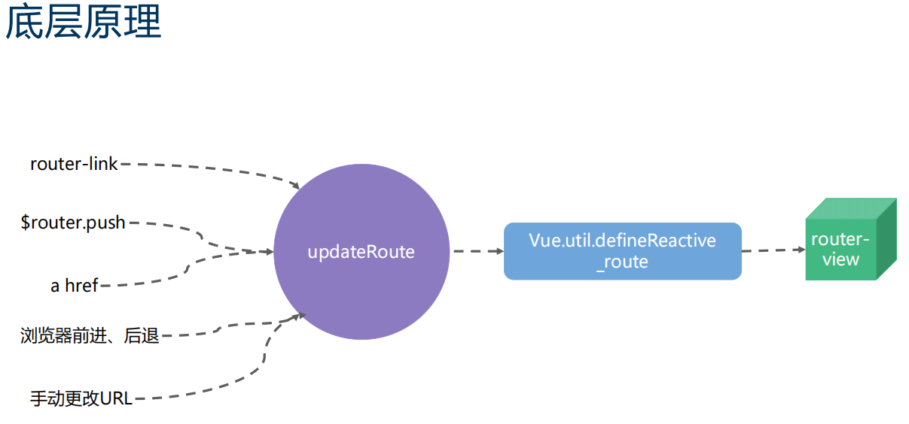

!> vueRouter实现原理及具体应用

 


```html
<router-view></router-view> <!-- 页面渲染展示 -->
<router-link to="/foo">Go to Foo</router-link>
<button @click="$router.push('foo')" >Go to Foo </button>
<a href="#/foo">Go to Foo</a>
<script>
 routerInfo() {
    const { fullPath, path, name, params, query, meta } = this.$route
        return {
            fullPath, path, name, params, query, meta
        }
 }
</script>
```