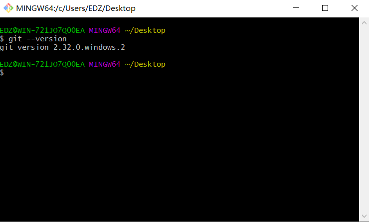
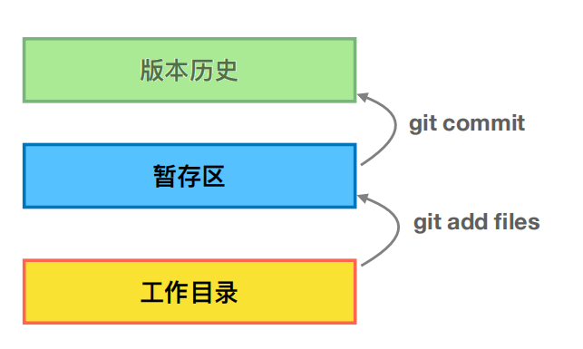
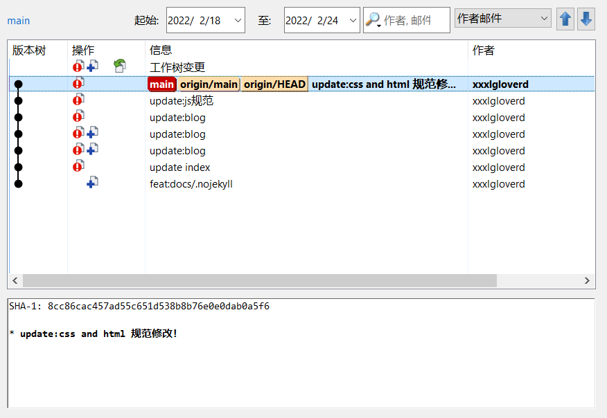

### 说明

>参考资料：玩转 Git 三剑客 课程 及 日常工作犯错！！

## 一、介绍git
>开源的版本管理工具，具有最优的存储能⼒，⾮凡的性能。

>很容易做备份，支持离线操作。

>规范工作流程；

## 二、git安装
> [git安装](https://git-scm.com/downloads)
> 
> 检查安装结果:在 bash 下执⾏下⾯的命令，看是否返回 git 的版本
> 
> $ git --version



## 三、最⼩配置

### 1、配置 user 信息

#### Ⅰ - 配置user.name和user.email
 ```bash
$ git config --global user.name ‘your_name’ 
$ git config --global user.email ‘your_email@domain.com’
 ```
* config的三个作⽤域
  
 >缺省等同于 local

  ```bash
$ git config --local   #local只对仓库有效
$ git config --global  #global对登录⽤户所有仓库有效
$ git config --system  #system对系统的所有⽤户有效
 ```
* 显示 config 的配置，加 --list

```bash
$ git config --list --local 
$ git config --list --global 
$ git config --list --system
```

#### Ⅱ - 设置与清除

* 设置，缺省等同于 local
```bash
$ git config --local 
$ git config --global 
$ git config --system
```

* 清除，--unset
```bash
$ git config --unset --local user.name 
$ git config --unset --global user.name 
$ git config --unset --system user.name
```

!> 优先级： local > global > system


## 四、基础命令

#### Ⅰ - 创建仓库

> * 两种方式
  1. ⽤ Git 之前已经有项⽬代码
  
 ```bash
      $ cd 项⽬代码所在的⽂件夹
      $ git init   
  ```


  2. ⽤ Git 之前还没有项⽬代码
  
 ```bash
    $ cd 某个⽂件夹
    $ git init your_project #会在当前路径下创建和项⽬名称同名的⽂件夹
    $ cd your_project
  ```

  #### Ⅱ - 向仓库⾥添加⽂件

  

> 将本地待提交的文件添加到缓存区
> 
> 1.git add .
> 
> 提交版本记录
> 
> 2.git commit -m  
> 
> 3.推送到远端前先将本地项目与远端最新版本保持一致,所以先**拉取下远端最新版本**
> 
> git pull
> 
> 4.将本地文件推送给远端
> 
> git push
> 
> 提交代码的时候遇到**冲突的话一定要解决冲突**之后再重新commit,pull,push;有冲突不用慌，及时反馈给自己的leader,merge分支的时候也能补救！！
> 
> 5.查看提交的日志信息
> 
> git log
> 


?>  [commit 规范](https://blog.csdn.net/qq_32944491/article/details/122840243?spm=1001.2014.3001.5502) 本人之前的规范记录仅供参考,根据团队的情况去进行commit 规范！！

## 五、git可视化工具

?> [TortoiseGit](https://tortoisegit.org/download/)




## 六、提交遇见的一些问题

>git push的时候提示"fatal: unable to access 'https://github.com/xxxxx/xxxx.git/': Failed to connect to github.com port 443: Timed out
>
>此时账户和密码框都没有进行弹出；
>
!> 解决办法：输入以下命令 **git config --global --unset http.proxy**然后就可以重新push了。


